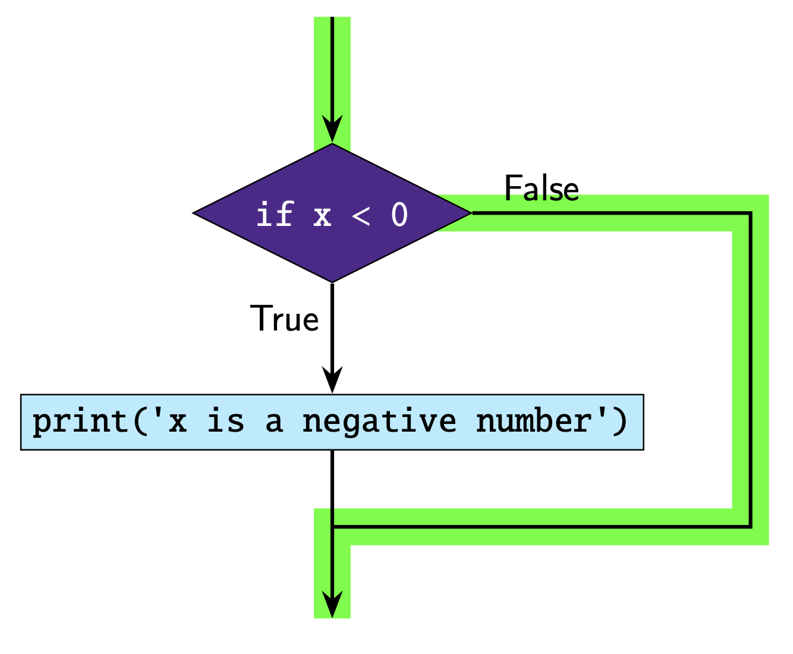
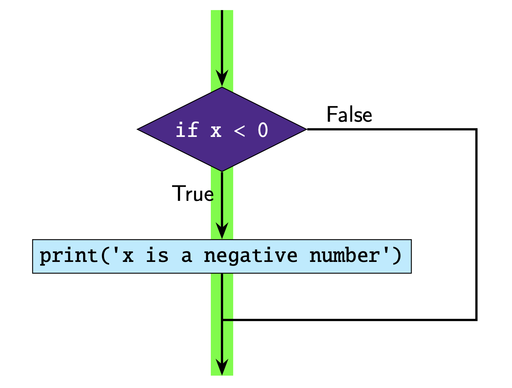

.. role:: python(code)
   :language: python

If Statements
====================

The :python:`if` statement lets us execute a section of code if a specified condition is True.

The structure of an if statement is:

.. code-block:: python

  if condition:
      # code you execute if condition is true

Take note of the following:

* :python:`if` is a keyword
* The condition must evaluate to either :python:`True` or :python:`False`
* The code inside the if statement only executes if the condition is :python:`True`
* :python:`:` is placed at the end of the condition
* The code inside the if statement must be indented. The indentation defines the
code block. This allows you to put multiple lines inside the if statement.
The indentation can be done using tab or spaces, as long as you're consistent!

Here is an example of a simple if statement.

.. exec_code::
  :language: python

  x = -2

  if x < 0:
      print('x is a negative number')

In this example the condition is :python:`True` so the print statement runs.

This is how we can represent this code diagrammatically. The green line
indicates the 'path' the code takes.

Let's look at another example.

.. exec_code::
  :language: python

  x = 1

  if x < 0:
      print('x is a negative number')

In this example the condition is :python:`False` so the print statement does not run.

