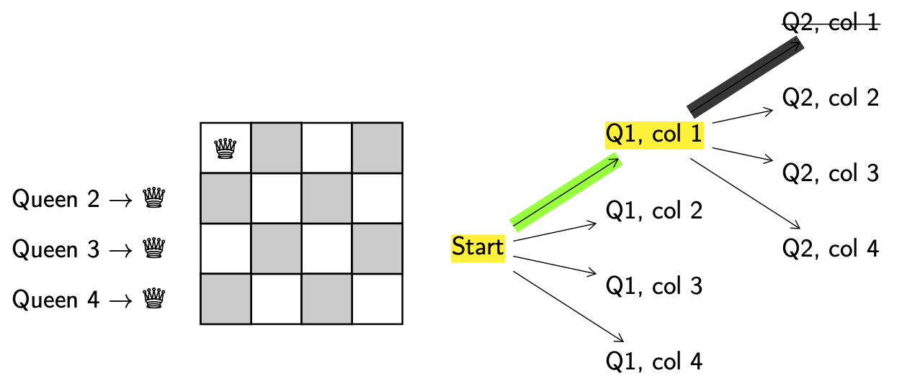

Backtracking Algorithms: 8 Queens
=================================

Problem Description
-------------------

The queen is one of the most powerful pieces on a chessboard. It can attack
anything in its row, or column, or any of its diagonals.

Here are some examples of queens placed on a chess board. The squares in red
show the squares the queen can attack.

The 8 queens problem is the problem of trying to get 8 queens on the same
chessboard without these queens attacking each other. We'll look at solving
this via **backtracking**.

4 Queens Problem
----------------

For demonstrative purposes, let's apply the backtracking approach to the '4
queens problem' i.e. can you get 4 queens on a chessboard with the queens
attacking.

Recall that backtracking algorithms require repeating the following steps until
a solution has been reached.

- **Explore.** Choose a next step towards a solution.
- **Decision.** Note if a decision has been made.
- **Validate.** Check whether the current solution (or partial solution) is
  valid or whether you've reach a complete solution.
- **Backtrack.** If the solution is not valid, backtrack to the most recent
  decision where there are still explorable options.

Let's start with a 4x4 board. Since we know that each queen has to be in a
different row, we'll simplify this problem a little bit and allocate each queen
a row. We'll use the row number to refer to each queen, i.e. queen 1, ...,
queen 4.

At each step we will carry out the 4 backtracking steps.

- **Explore.** Explore solutions by changing the board configuration.
- **Decision.** We need to decide which queen to move and where to move it to.
  For simplicity we'll always try to add the next **lowest-numbered queen** and
  always try to put them in the **left-most column**. When a decision has been
  made we'll keep track of it by **highlighting** the decision point (start) in
  yellow.
- **Valid.** This is a valid configuration since no queen is attacking another
  queen on the board.
- **Backtrack.** N/A, since configuration is valid.

This is now the state of our board.

- **Explore.** Get a new configuration.
- **Decision.** Put queen 2 (Q2) in column 1 (col 1), since we always try to
  add the next lowest queen, and put them in columns from left to right.
  **Highlight** the decision point (Q1, col 1) in yellow.

- **Valid.** No, since queen 1 and 2 are in the same column, they can attack
  each other.
- **Backtrack.** Return to the last decision point (Q1, col 1).

We keep going.

- **Explore.** Get a new configuration.
- **Decision.** Put queen 2 in column 2.

- **Valid.** No, since queen 1 and 2 are in the same diagonal, they can attack
  each other.
- **Backtrack.** Return to the last decision point (Q1, col 1).

We keep going.

- **Explore.** Get a new configuration.
- **Decision.** Put queen 2 in column 3.
- **Valid.** Yes.
- **Backtrack.** N/A.

We keep going.

- **Explore.** Get a new configuration.
- **Decision.** Put queen 3 in column 1.
- **Valid.** No, since queen 1 and 3 are in the same column, they can attack
  each other.
- **Backtrack.** Return to the last decision point (Q2, col 3).

We keep going.

What you'll probably have notices is that putting queen 3 on the board in
column 1, 2, 3 or 4 results in invalid configurations. We consider this a
metaphorical **dead end**.

This means we now need to **backtrack** further all the way back to decision
point (Q1, col 1).

We keep going.

- **Explore.** Get a new configuration.
- **Decision.** Put queen 2 in column 4.
- **Valid.** Yes.
- **Backtrack.** N/A.

We keep going.

- **Explore.** Get a new configuration.
- **Decision.** Put queen 3 in column 1.

- **Valid.** No, since queen 1 and 3 are in the same column, they can attack
  each other.
- **Backtrack.** Return to the last decision point (Q2, col 4).

We keep going.

- **Explore.** Get a new configuration.
- **Decision.** Put queen 3 in column 2.
- **Valid.** Yes.
- **Backtrack.** N/A.

We keep going.

- **Explore.** Get a new configuration.
- **Decision.** Put queen 4 in column 1.
- **Valid.** No, since queen 1 and 4 are in the same column, they can attack
  each other.
- **Backtrack.** Return to the last decision point (Q3, col 2).

We keep going.

What you'll probably have notices is that putting queen 4 on the board in
column 1, 2, 3 or 4 results in invalid configurations. We are at another dead
end. This means we now need to **backtrack** further all the way back to
decision point (Q2, col 4).

We keep going.

What you'll probably have notices is that putting queen 3 on the board in
column 3 or 4 results in invalid configurations. We are at another dead end!
This means we now need to **backtrack** further all the way back to decision
point (Q1, col 1).

From (Q1, col 1) we are out of options again!

This means we need to **backtrack** all the way to the start!

We keep going.

- **Explore.** Get a new configuration.
- **Decision.** Put queen 1 in column 2.
- **Valid.** Yes.
- **Backtrack.** N/A.

We keep going.

- **Explore.** Get a new configuration.
- **Decision.** You'll notice that the only valid position for queen 2 is in
  column 4. So skipping a few steps here, lets put queen 2 in column 4.
- **Valid.** Yes.
- **Backtrack.** N/A.

We keep going.

- **Explore.** Get a new configuration.
- **Decision.** Put queen 3 in column 1.
- **Valid.** Yes.
- **Backtrack.** N/A.

We keep going.

- **Explore.** Get a new configuration.
- **Decision.** You'll notice that the only valid position for queen 4 is in
  column 3. So skipping a few steps here, lets put queen 4 in column 3.
- **Valid.** Yes.
- **Backtrack.** N/A.

Now we've got all the queens on the board and it's valid! **This means we are
done!**

But you should double check the solution! Make sure no queens can attack by
being in the same:

- Row
- Column
- Positive diagonal (bottom left to top right)
- Negative diagonal (top left to bottom right)

Now you can try solving the 8 queens problem yourself!
