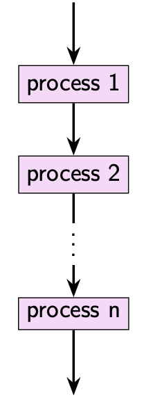
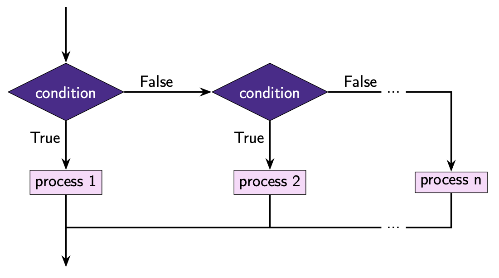
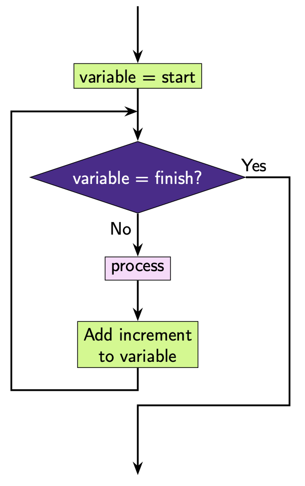
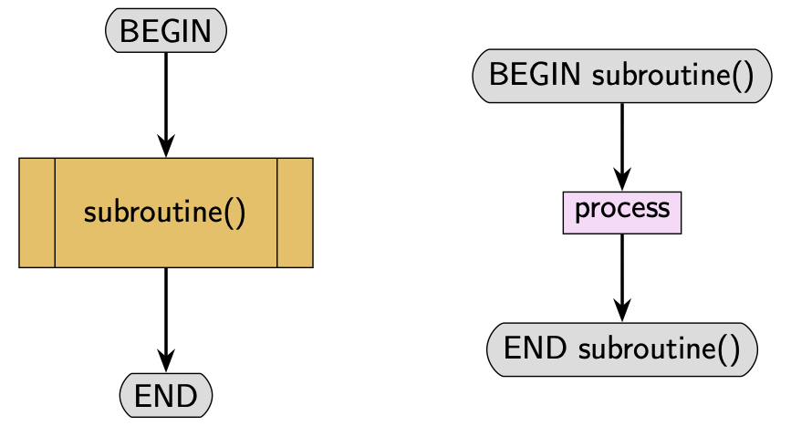

Algorithms
==========

An algorithm is a set of precise instructions that when carried out will solve a task. Any time you are solving a problem you are usually applying some approach, which could be written up as an algorithm. There are many different types of algorithms that can be applied to many different types of problems. The *effectiveness* of the algorithm can often be measured by how efficient the algorithm (how quickly it reaches a solution) and the quality of the solution it yields.

Key features of algorithms include sequence, selection and iteration.

Sequence
--------

Instructions that are carried out one after the other are **sequential**. This means the instructions are carried out in the exact order they are written. 

Selection
---------

Some algorithms can **select** different pathways to take. In this case the algorithm will check a *condition* (or sometimes multiple condition) and the evaluation of the condition (i.e. whether the condition is true or false) will control which pathway is taken.

Iteration
---------

**Iteration** allows sections of an algorithm to be repeated a fixed number of times or until a certain condition has been met.

Subroutines
-----------

**Subroutines** are algorithms that can be used in the main algorithm. They can be very useful particularly when there are aspects of the algorithm that are repetitive. They can also make it easier to write algorithms as they can be used to solve subtasks. Use of subroutines often help to make the overall algorithm easier to understand as the main algorithm can be written more concisely.

.. dropdown:: Question 1
    :open:
    :color: info
    :icon: question

    Which of the following could be used to perform **iteration**? *Select all that apply*.

    A. ``if`` statements

    B. ``if``-``elif``-``else`` statements

    C. ``print`` statements

    D. the ``time`` module

    E. ``while`` loops

    F. ``for`` loops

    G. ``def`` ining a function

    .. dropdown:: Solution
        :class-title: sd-font-weight-bold
        :color: dark

        **E. F.**

.. dropdown:: Question 2
    :open:
    :color: info
    :icon: question

    Which of the following could be used to perform **selection**? *Select all that apply*.

    A. ``if`` statements

    B. ``if``-``elif``-``else`` statements

    C. ``print`` statements

    D. the ``time`` module

    E. ``while`` loops

    F. ``for`` loops

    G. ``def`` ining a function

    .. dropdown:: :material-regular:`lock;1.5em` Solution
        :class-title: sd-font-weight-bold
        :color: dark

        *Solution is locked*

.. dropdown:: Question 3
    :open:
    :color: info
    :icon: question

    Which of the following could be used to perform **subroutine**? *Select all that apply*.

    A. ``if`` statements

    B. ``if``-``elif``-``else`` statements

    C. ``print`` statements

    D. the ``time`` module

    E. ``while`` loops

    F. ``for`` loops

    G. ``def`` ining a function

    .. dropdown:: :material-regular:`lock;1.5em` Solution
        :class-title: sd-font-weight-bold
        :color: dark

        *Solution is locked*

.. dropdown:: Question 4
    :open:
    :color: info
    :icon: question

    Consider the following flowchart. Which of the following are used in this algorithm? *Select all that apply*.

    .. image:: img/1_question3.png
        :width: 200
        :align: center

    A. Sequence

    B. Selection

    C. Iteration

    D. Subroutine

    .. dropdown:: :material-regular:`lock;1.5em` Solution
        :class-title: sd-font-weight-bold
        :color: dark

        *Solution is locked*

.. dropdown:: Question 5
    :open:
    :color: info
    :icon: question

    Consider the following flowchart. Which of the following are used in this algorithm? *Select all that apply*.

    .. code-block:: text

        Get x
        Get y
        Get operation
        IF operation == 'add' THEN
            Display x + y
        ELSEIF operation == 'subtract' THEN
            Display x - y
        ENDIF

    A. Sequence

    B. Selection

    C. Iteration

    D. Subroutine

    .. dropdown:: :material-regular:`lock;1.5em` Solution
        :class-title: sd-font-weight-bold
        :color: dark

        *Solution is locked*

.. dropdown:: Question 6
    :open:
    :color: info
    :icon: question

    Consider the following flowchart. Which of the following are used in this algorithm? *Select all that apply*.

    .. code-block:: text

        BEGIN
            FOR i = 0 TO 2 STEP 1
                doubled = add(i. i)
                Display doubled
            NEXT i
        END

        BEGIN add (x, y)
            RETURN x + y
        END add (x, y)

    A. Sequence

    B. Selection

    C. Iteration

    D. Subroutine

    .. dropdown:: :material-regular:`lock;1.5em` Solution
        :class-title: sd-font-weight-bold
        :color: dark

        *Solution is locked*