Divide and Conquer: Merge Sort
==============================

Divide and Conquer Algorithms
-----------------------------

Divide and conquer algorithms are a class of algorithms that solve problems by taking the following approach:

    Take a problem and beak it down into smaller problems of the same type. These subproblems are then solved independently, usually in parallel (i.e. at the same time), after which their solutions can be combined to solve the original problem.

Typically divide and conquer algorithms adhere to the following structure:

1. **Divide.** The problem is divided into smaller subproblems.

2. **Conquer.** Each subproblem is solved.

3. **Combine.** The results of each subproblem are combined to solve the original problem.

Merge Sort
----------

It can often be useful to sort values, i.e. take a list of numbers and rearrange them in ascending (or descending) order. For example, given the array ``[11, 59, 3, 22, 18, 47, 36, 9, 23]`` when sorted would give us ``[3, 9, 11, 18, 22, 23, 36, 47, 59]``.

There are lots of different algorithms that can do this. We'll look at **merge sort** which is a classic example of a **divide and conquer** algorithm.

Let's take a look at the algorithm. You'll see that our ``merge_sort`` algorithm makes use of the subroutine ``merge``.

.. code-block:: text

    BEGIN merge_sort(array)
        
        IF Length(array) = 1 THEN
            RETURN array
        ENDIF
        
        left = merge_sort(first half of array)
        right = merge_sort(second half of array)
        
        RETURN merge(left, right)
        
    END merge_sort(array)

For simplicity, if the array contains an odd number of items we'll put the extra value in the first half of the array. For example if we had the array ``[11, 59, 3]`` the first half of the array would be ``[11, 59]`` and the second half would be ``[3]``.

.. code-block:: text

    BEGIN merge(left, right)

        merged = an empty list
        
        WHILE left and right are not empty
            IF first value in left < first value in right THEN
                move first value in left to merged
            ELSE
                move first value in right to merged
            ENDIF        
        ENDWHILE
        
        RETURN merged
    END merge(left, right)

For simplicity, if one of the arrays are empty, we interpret that array as having a higher first value, i.e. we’ll never try to move a value from an empty list.

Merge subroutine
----------------

Before we dive into the ``merge_sort`` algorithm, let's start by understanding the ``merge`` subroutine. This algorithm takes two arrays called ``left`` and ``right`` that are pre-sorted in ascending order. ``merge`` will then combine them into a single array and return this merged array.

**Example**

Let's consider applying merge to the inputs ``[3, 11, 59]`` and ``[18, 22]``. Note that these lists are already sorted in ascending order.

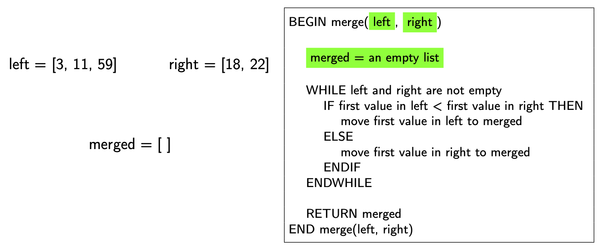

The first thing we do is check whether the arrays ``left`` and ``right`` are empty. 

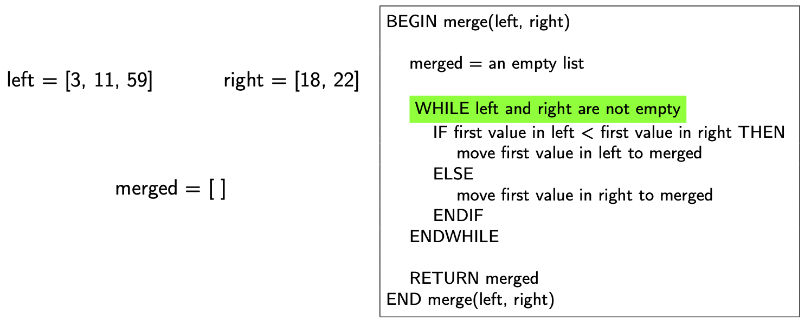

If they are not, we check the first values in each array.

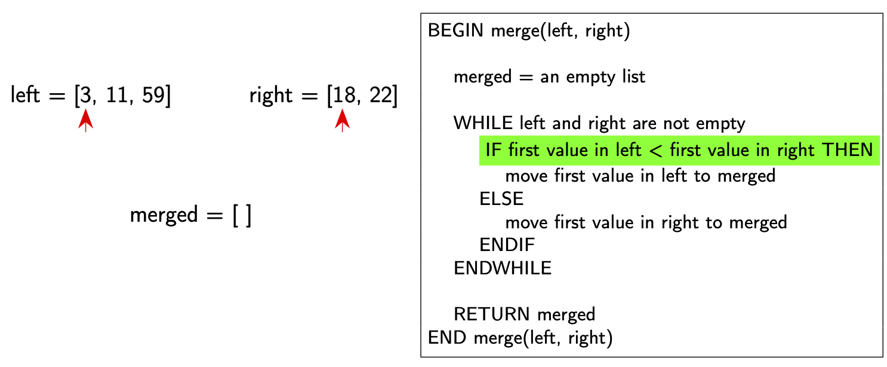

We take the smallest of these two values and add them to our ``merged`` array.

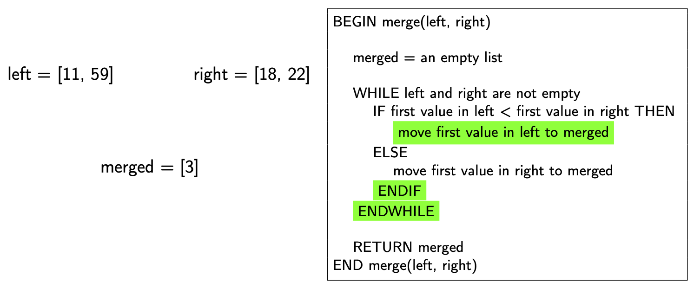

We keep doing this until both left and right are empty. Here's what this looks like:

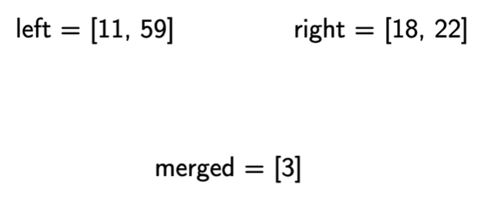

Merge Sort
----------

**Example**

Let's now see how ``merge_sort`` works by walking through the algorithm on the test array ``[11, 59, 3, 22, 18]``. The first thing we do is check whether the length of the array is 1. It is not, so we move on.

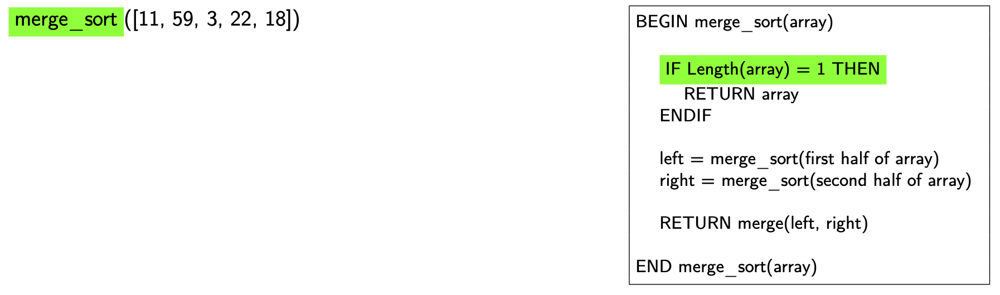

Next we see that we apply ``merge_sort`` to the first half of the array and then also to the second half of the array. It's a big weird, but we have ``merge_sort`` calling itself! This is called **recursion**, which is a programming technique used in a lot of algorithms such as divide and conquer algorithms. Now what you'll notice is that we can't finish our original ``merge_sort`` function until we finish calculating ``left`` and ``right``, which means we need to run the other ``merge_sort`` functions first.

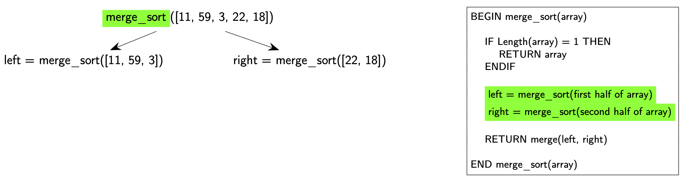

You'll notice that the length of both arrays ``[11, 59, 3]`` and ``[22, 18]`` are greater than 1, so these will also require us to call more ``merge_sort`` functions!

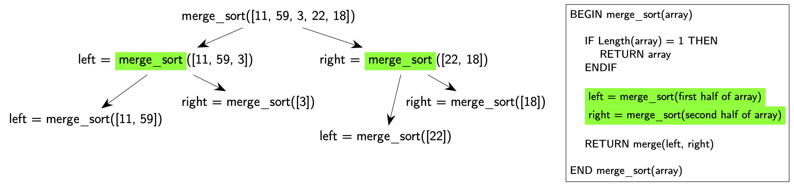

You'll see that we still have one more array, ``[11, 59]``, which has a length greater than 1, so we'll need to call ``merge_sort`` again!

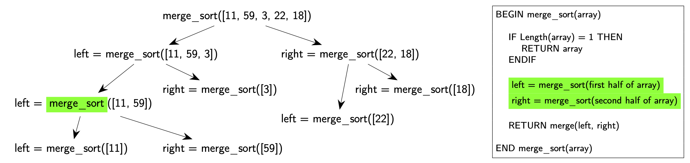

From here, you can see that ``merge_sort`` is being called on arrays of length 1. We've reached what we call the **base case**. This is the condition that stops the **recursion**, i.e. the function no longer calls itself and we can easily evaluate the results of these functions.

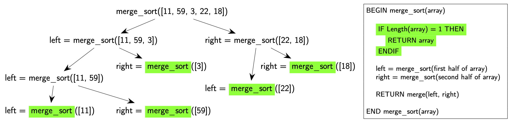

Now that we've been able to calculate some of our ``left`` and ``right`` values, we can keep going with some of our previous ``merge_sort`` function calls. Now we just have to apply the ``merge`` function, which we learnt about earlier to the ``left`` and ``right`` arrays.

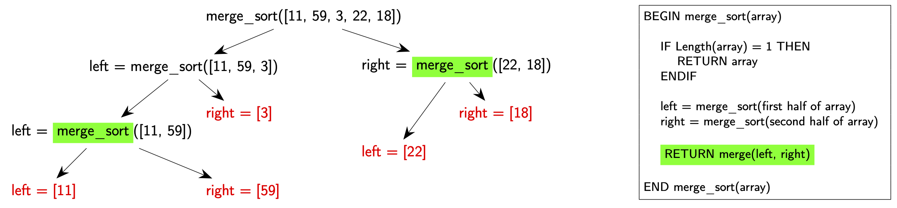

And now we just keep going...

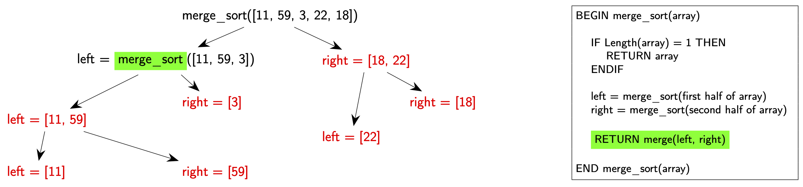

And going...

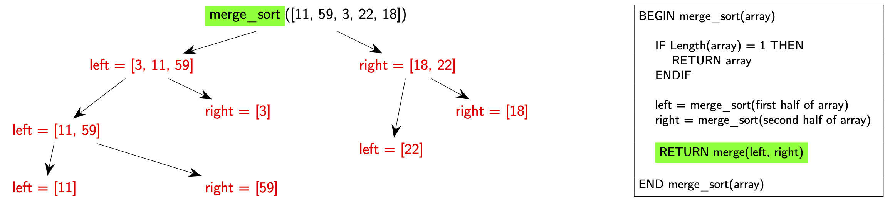

And we're done!

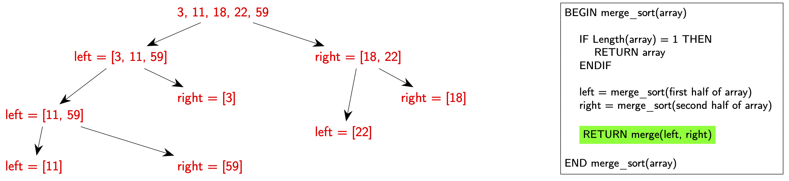

.. dropdown:: Question 1
    :open:
    :color: info
    :icon: question

    What would be the result of ``merge([9, 17, 32], [1, 2, 14, 41])``?

    A.

     .. code-block:: python

        [9, 17, 32, 1, 2, 14, 41]

    B.

     .. code-block:: python

        [1, 2, 9, 14, 17, 32, 41]

    C.

     .. code-block:: python

        [1, 9, 2, 17, 14, 32, 41]

    D.

     .. code-block:: python

        [41, 32, 17, 14, 9, 2, 1]

    .. dropdown:: Solution
        :class-title: sd-font-weight-bold
        :color: dark

        **B.**

        ``merge`` will take two arrays that are sorted in ascending order and return these values combined into a single array sorted in ascending order.

.. dropdown:: Question 2
    :open:
    :color: info
    :icon: question

    ``merge_sort`` is a divide and conquer algorithm, which is an algorithm that following these three steps: 1. divide, 2. conquer and 3 combine. Which part of the ``merge_sort`` algorithm performs the **divide** step? Line number have been included in the algorithm.

    .. code-block:: text

        1    BEGIN merge_sort(array)
        2    
        3        IF Length(array) = 1 THEN
        4            RETURN array
        5        ENDIF
        6    
        7        left = merge_sort(first half of array)
        8        right = merge_sort(second half of array)
        9  
        10        RETURN merge(left, right)
        11    
        12    END merge_sort(array)

    A.

     .. code-block:: text

        3        IF Length(array) = 1 THEN
        4            RETURN array
        5        ENDIF

    B.

     .. code-block:: text

        7        left = merge_sort(first half of array)
        8        right = merge_sort(second half of array)

    C.

     .. code-block:: text

        10        RETURN merge(left, right)

    .. dropdown:: :material-regular:`lock;1.5em` Solution
        :class-title: sd-font-weight-bold
        :color: dark

        *Solution is locked*

.. dropdown:: Question 3
    :open:
    :color: info
    :icon: question

    Which part of the ``merge_sort`` algorithm performs the **conquer** step?

    .. code-block:: text

        1    BEGIN merge_sort(array)
        2    
        3        IF Length(array) = 1 THEN
        4            RETURN array
        5        ENDIF
        6    
        7        left = merge_sort(first half of array)
        8        right = merge_sort(second half of array)
        9  
        10        RETURN merge(left, right)
        11    
        12    END merge_sort(array)

    A.

     .. code-block:: text

        3        IF Length(array) = 1 THEN
        4            RETURN array
        5        ENDIF

    B.

     .. code-block:: text

        7        left = merge_sort(first half of array)
        8        right = merge_sort(second half of array)

    C.

     .. code-block:: text

        10        RETURN merge(left, right)

    .. dropdown:: :material-regular:`lock;1.5em` Solution
        :class-title: sd-font-weight-bold
        :color: dark

        *Solution is locked*

.. dropdown:: Question 4
    :open:
    :color: info
    :icon: question

    Which part of the ``merge_sort`` algorithm performs the **combine** step?

    .. code-block:: text

        1    BEGIN merge_sort(array)
        2    
        3        IF Length(array) = 1 THEN
        4            RETURN array
        5        ENDIF
        6    
        7        left = merge_sort(first half of array)
        8        right = merge_sort(second half of array)
        9  
        10        RETURN merge(left, right)
        11    
        12    END merge_sort(array)

    A.

     .. code-block:: text

        3        IF Length(array) = 1 THEN
        4            RETURN array
        5        ENDIF

    B.

     .. code-block:: text

        7        left = merge_sort(first half of array)
        8        right = merge_sort(second half of array)

    C.

     .. code-block:: text

        10        RETURN merge(left, right)

    .. dropdown:: :material-regular:`lock;1.5em` Solution
        :class-title: sd-font-weight-bold
        :color: dark

        *Solution is locked*

.. dropdown:: Question 5
    :open:
    :color: info
    :icon: question

    An important component of **recursion** is the base case, which is when the function will stop calling itself (because if keeps calling itself you'll be there for forever!). Which part of the ``merge_sort`` algorithm contains the **base case**?

    .. code-block:: text

        1    BEGIN merge_sort(array)
        2    
        3        IF Length(array) = 1 THEN
        4            RETURN array
        5        ENDIF
        6    
        7        left = merge_sort(first half of array)
        8        right = merge_sort(second half of array)
        9  
        10        RETURN merge(left, right)
        11    
        12    END merge_sort(array)

    A.

     .. code-block:: text

        3        IF Length(array) = 1 THEN
        4            RETURN array
        5        ENDIF

    B.

     .. code-block:: text

        7        left = merge_sort(first half of array)
        8        right = merge_sort(second half of array)

    C.

     .. code-block:: text

        10        RETURN merge(left, right)

    .. dropdown:: :material-regular:`lock;1.5em` Solution
        :class-title: sd-font-weight-bold
        :color: dark

        *Solution is locked*