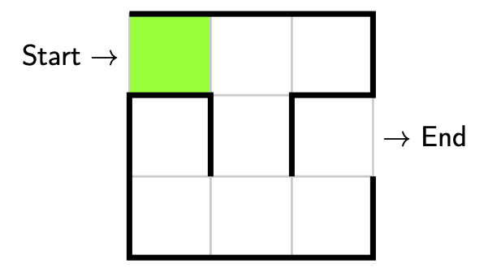
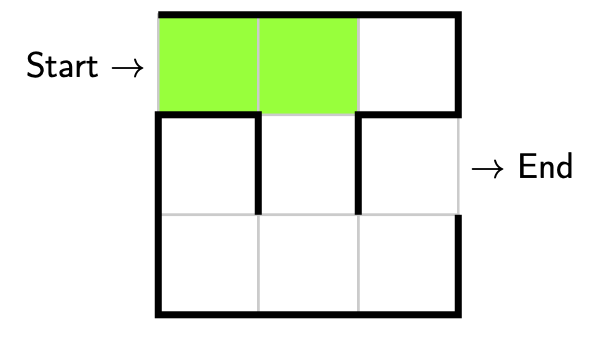
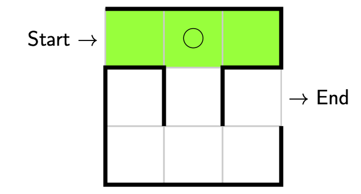
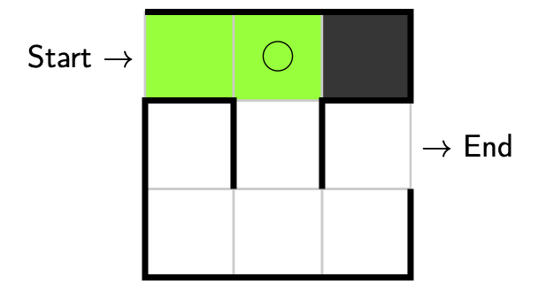
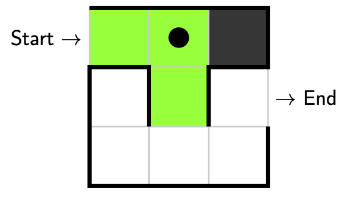
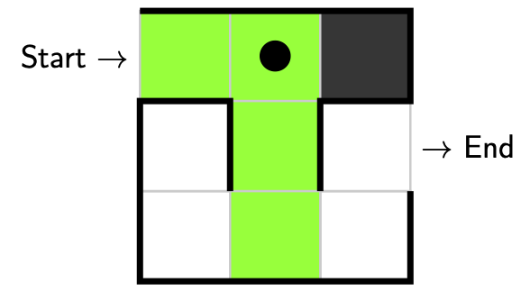
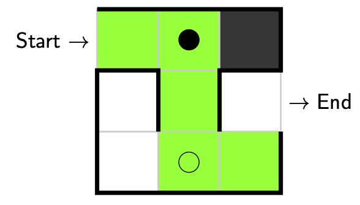
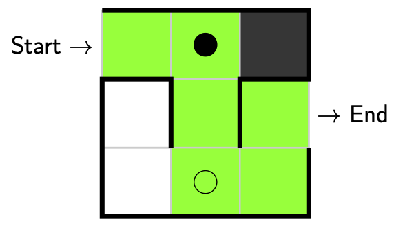

Backtracking Algorithms: Maze Example
=====================================

Backtracking algorithms are a class of algorithms that solve problems by taking
the following approach:

    Attempt to reach a solution. If it becomes apparent that you're going down
    the wrong path, backtrack to the previous decision point, make a different
    decision and try again. Keep trying until you reach a solution or all
    possibilities have been explored.

Backtracking algorithms require repeating the following steps until a solution
has been reached.

1. **Explore.** Choose a next step towards a solution.
2. **Decision.** Note if a decision has been made.
3. **Validate.** Check whether the current solution (or partial solution) is
   valid or whether you've reach a complete solution.
4. **Backtrack.** If the solution is not valid, backtrack to the most recent
   decision where there are still explorable options.

Maze Example
------------

Let's try and solve a maze using the backtracking algorithm. Consider the
following maze.

.. image:: img/3_maze1.png
    :width: 230
    :align: center

First we explore the maze. Starting at the indicated start we only have one
option and that is to take a step forwards. Here we have **explored**, no
**decision** was made, our partial solution is **valid** (since we're not at a
dead end), so there is no need to **backtrack**.

Let's take another step. Again we only have one option, and that is to take a
step forwards. Here we have **explored**, no **decision** was made, our partial
solution is **valid** (since we're not at a dead end), so there is no need to
**backtrack**.

Now we'll take another step. This time we have two options. We can either go
straight ahead or we can go right. Suppose we went straight ahead. Again we
have **explored**, but this time **a decision was made!** What we'll do is
we'll place an empty circle to mark down where the decision was made. We also
check whether our solution is **valid**. Unfortunately we have reached a dead
end so our solution is **not valid**.

This means we need to **backtrack** to our most recent decision point where a
decision can still be made, i.e. an empty circle.

This time we'll make a different decision and this time turn right. Since this
is the last decision we can make from this point there is no need to return
here to make a different decision. To indicate this we'll colour our marker in
to remind us not to return. Here we have **explored**, no **decision** was
made, our partial solution is **valid** (since we're not at a dead end), so
there is no need to **backtrack**.

Let's take another step. Again we only have one option, and that is to take a
step forwards. Here we have **explored**, no **decision** was made, our partial
solution is **valid** (since we're not at a dead end), so there is no need to
**backtrack**.

We've reached another decision point! We can either go left or we can go right.
Suppose we went left. Again we have **explored**, but since **a decision** was
made we'll place a little marker down to remind us where the decision was made.
We also check whether our partial solution is **valid**, which is is (since
we're not at a dead end), so there is no need to **backtrack**.

Let's take another step. Again we only have one option, and that is to take a
step forwards. Here we have **explored** and no **decision** was made, but this
time we can see our solution is **valid** and **complete!** We're done! We've
solved the maze!

