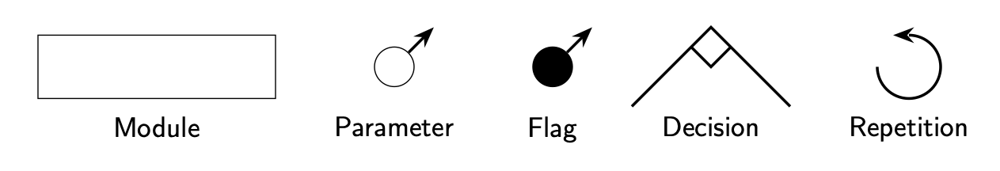
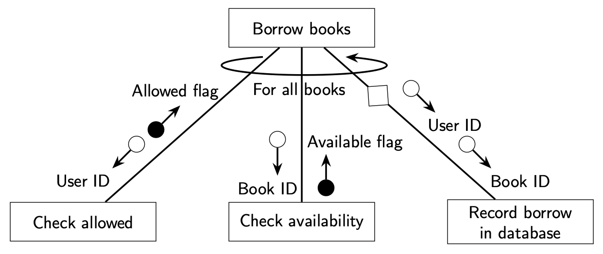
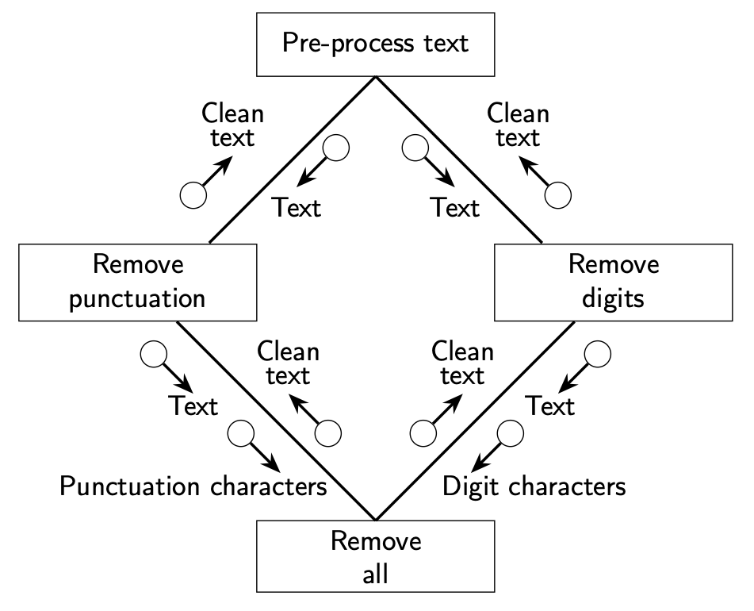

Structure Charts
================

Structure charts are a traditional tool in structured software design to depict the organisation of modules within a system. Each chart represents how a program’s major components (modules or functions) are subdivided into submodules, how control flows between them, and what data is exchanged.

Structure charts are different from flowcharts because they are "static", which means that they represent how to break software or a program down into components rather than steps or procedures.

Structure charts allow varying levels of **abstraction**. This means that you can restrict a structure chart to only high level functions, or if you like show all functions within the system, or even a varying level of detail within parts of the chart. You can even create multiple structure charts that reference each other to help break down the system.

Structure charts are often used to help design software systems and over time the amount of detail or structure can change. This process is known as **refinement**.

Symbols
-------

* **Module or Process:** A rectangle with the module name inside represents a component such as a function.

* **Parameters or Data Flow:** An empty circle with an arrow represents the flow of data or parameters of a function being called. The text next to the symbol.

* **Flag or Control Parameter:** A filled circle with an arrow represents a flag, i.e. a Boolean, is passed to a module to trigger a condition.

* **Decision:** The intersection of two lines with a diamond at the intersection point represents an optional execution of a component or function. *Note that a diamond can appear on a single connecting line if calling that module is optional.*

* **Repetition:** A curved arrow represents a repeated action or loop.

Top-Down and Bottom-Up Design
-----------------------------

Structure charts are a natural tool to design systems **top-down** as detail can be incrementally added to the chart.

However you can still apply structure charts in a bottom-up approach. You would first determine the lower-level modules, then illustrate how they connect together to form higher-level functionalities.

The final structure chart can appear the same as a top-down chart in its final form, but conceptually you are assembling from smaller parts upwards.

Examples
--------

Library Borrowing System
~~~~~~~~~~~~~~~~~~~~~~~~

Imagine a program that handles book borrowing for a library. You might draw this as the structure chart below:

**Explanation**

* Borrow book

  * The *main control module*. It coordinates all sub-tasks.

    * This task will repeat for all books the user wants to borrow as indicated by the curved arrow.

* Check allowed

  * This sends the user's data to the system and return a flag indicating whether the user can borrow books.

* Check availability

  * This sends the book's information to the system and returns a flag indicating whether this book is available to borrow.

* Record borrow in database

  * This sends the user's information and book's information to the database so the borrow is recorded

  * The is an optional subroutine as indicated by the diamond along the call line. This subroutine will not execute if either the allowed or available flag come back as false.

**Top-down Approach**

Following a top-down design approach, you could continue adding detail to this figure. For example, you could expand the *Checked allowed* module to have the submodules: *Check overdue*, *Check borrowing limit* and *Check user restriction (e.g. age)*, or you could expand the *Check availability* module to have the submodules: *Check not on hold* and *Check allowed to be borrowed*.

String Preprocessor
~~~~~~~~~~~~~~~~~~~

Imagine a program the preprocesses text by removing unwanted punctuation and numerical digits.

**Explanation**

* Remove all

  * This module is given some text to clean and characters to remove, will remove all the given characters and returned the clean text.

  .. code-block:: python

    def remove_all(text, chars):
        for c in chars:
            text = text.replace(c, '')
        return text

* Remove punctuation

  * This module is given some text to clean and will remove all punctuation and return the clean text. This module uses the *Remove all* module. 

  .. code-block:: python

    def remove_punctuation(text):
        punctuation = '.,!?;:\'\"-()[]{}'
        return remove_all(text, punctuation)

* Remove digits

  * This module is given some text to clean and will remove all digits and return the clean text. This module uses the *Remove all* module

  .. code-block:: python

    def remove_digits(text):
        digits = '0123456789'
        return remove_all(text, digits)

* Pre-process text

  * The *main control module*. It coordinates the removal of punctuation and the removal of digits from the given text.

**Bottom-up Approach**

This is an example of where a bottom-up approach might have been used where the *Remove all* module was implemented first. An advantage of the bottom-up approach is that existing modules are easily re-used. In this case *Remove all* is used by both *Remove punctuation* and *Remove digits*. You could keep expanding this up where you might have a parent process which is *Format text*, this might call *Pre-process text* and then call another another module such *Style* text. 

.. dropdown:: Question 1
    :open:
    :color: info
    :icon: question

    Which symbol in a structure chart is commonly used to show a *repeated action* or loop?

    A. Rectangle with the module name

    B. Diamond on a connecting line

    C. Straight arrow

    D. Curved arrow

    .. dropdown:: Solution
        :class-title: sd-font-weight-bold
        :color: dark

        **D.**

        A curved arrow typically denotes a loop or repeated execution of a module in a structure chart.

.. dropdown:: Question 2
    :open:
    :color: info
    :icon: question

    True or False, Structure charts are used to depict the *step-by-step logic* within a single function

    .. dropdown:: :material-regular:`lock;1.5em` Solution
        :class-title: sd-font-weight-bold
        :color: dark

        *Solution is locked*

.. dropdown:: Question 3
    :open:
    :color: info
    :icon: question

    Why might you include multiple levels of detail in a single structure chart (or even maintain *separate* structure charts) for the same system?

    .. dropdown:: :material-regular:`lock;1.5em` Solution
        :class-title: sd-font-weight-bold
        :color: dark

        *Solution is locked*

.. dropdown:: Question 4
    :open:
    :color: info
    :icon: question

    *2023  HSC Software Design and Development Exam Question 12*

    .. image:: img/8_question2.png
        :width: 450
        :align: center

    A. They indicate whether the item is found.

    B. They indicate that a search was carried out.

    C. They pass on the error message 'Item not found'.

    D. They pass on the item details that were found in the list.

    .. dropdown:: :material-regular:`lock;1.5em` Solution
        :class-title: sd-font-weight-bold
        :color: dark

        *Solution is locked*

.. dropdown:: Question 5
    :open:
    :color: info
    :icon: question

    *2017  HSC Software Design and Development Exam Question 16*

    Refer to the following diagram

    .. image:: img/8_question3.png
        :width: 300
        :align: center

    Which of the following algorithm fragments correspond to the diagram?

    A.

     .. code-block:: text

        BEGIN M
            A
            FOR Counter = 1 to 5
                B
                IF Counter is even THEN
                    C
                ENDIF
            NEXT Counter
        END M

    B.

     .. code-block:: text

        BEGIN M
            A
            B
            IF Counter is even THEN
                C
            ENDIF
        END M

    C.

     .. code-block:: text

        BEGIN M
            A
            Counter = 1
            REPEAT
                IF Counter is even THEN
                    B
                ELSE
                    C
                ENDIF
                Increment counter
            UNTIL Counter = 5
        END M

    D.

     .. code-block:: text

        BEGIN M
            FOR Counter = 1 to 5
                A
                B
                IF Counter is even THEN
                    C
                ENDIF
            NEXT Counter
        END M

    .. dropdown:: :material-regular:`lock;1.5em` Solution
        :class-title: sd-font-weight-bold
        :color: dark

        *Solution is locked*

.. dropdown:: Question 6
    :open:
    :color: info
    :icon: question

    *2024 HSC Software Design and Development Exam Question 16*

    Consider the following structure chart.

    .. image:: img/8_question1.png
        :width: 300
        :align: center

    Which of the following flowcharts matches the logic in the MAIN module?

    A.

    .. image:: img/8_question1a.png
        :width: 200
        :align: center

    B.

    .. image:: img/8_question1b.png
        :width: 150
        :align: center

    C.

    .. image:: img/8_question1c.png
        :width: 200
        :align: center

    D.

    .. image:: img/8_question1d.png
        :width: 200
        :align: center

    .. dropdown:: :material-regular:`lock;1.5em` Solution
        :class-title: sd-font-weight-bold
        :color: dark

        *Solution is locked*