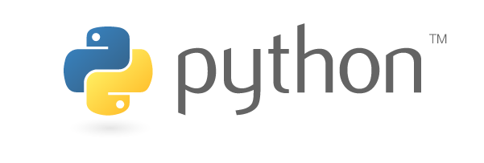

.. role:: python(code)
   :language: python

Getting Started
====================

Python
--------------------

Python is a programming language that allows us to communicate with our computer to perform various tasks and solve a wide range of problems. In this module we will introduce you to the basics of Python

If this is your first time learning how to program, don't worry if you feel overwhelmed by all the content. Learning to code is hard! You might not understand everything straight away.

The best way to learn Python is to practice, practice, practice!

Printing
--------------------

In order to get the computer to display information to the screen, we use the print() function.

Try running the code below!

.. code-block:: python

    print('I love Python')

Take note of the following:

- ``print`` must be in lower case. If you try using ``Print``, it won't work! This is because the computer is fussy! It can only understand very specific instructions.
- ``'I love Python'`` is just a piece of text. This is the information we want to display.
- We use ' ' or " " to indicate text. (We actually refer to text as a string; more on this later.)
- We tell the computer what to display by placing the contents in circular brackets ().

This is the structure of the print() function:

:python:`print(information_you_want_to_display)`.
