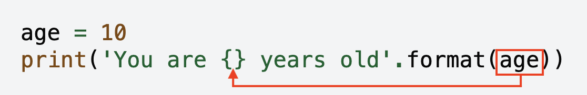
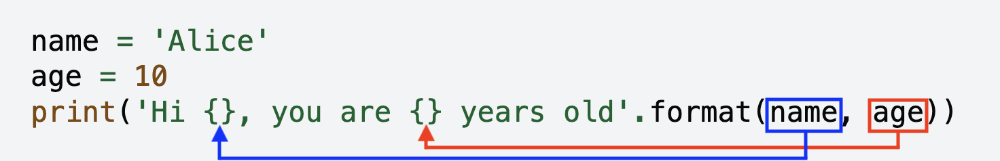

.. role:: python(code)
   :language: python

String Formatting
=================

Often it's nice to format the information you want to display to the user.

For example, you might use string concatenation.

.. code-block:: python

    age = '10'
    print('You are ' + age + ' years old')

However, you will notice that age in the above example is a string. This won't work the same way if age is an integer. 

.. code-block:: python

    age = 10
    print('You are ' + age + ' years old')

Remember, you can't mix and match types!

Using .format()
---------------

We can format strings using ``.format()``. Here is an example:

.. code-block:: python

    age = 10
    print('You are {} years old'.format(age))

* ``.format()`` comes *after* the last ``'``.

* The information we want to display goes into the ``()``.

* ``{}`` is a placeholder. The information will be placed where the ``{}`` is in the string.

We can format multiple pieces of information! Each piece of information is separated by a ``,`` and unpacked into their respective ``{}`` placeholders.

.. code-block:: python

    name = 'Alice'
    age = 10
    print('Hi {}, you are {} years old'.format(name, age))

* Each piece of information we want to display goes into the ``()``.

* ``{}`` are placeholders. The information will be placed in order where the ``{}``'s are in the string.

We are also able to format floats to a specific number of decimal places. Instead of using an empty ``{}`` placeholder, we can use ``{:.xf}`` to display the first x decimal places (you can remember ``.x`` means '*x digits after the decimal point*' and the ``f`` means that you are formatting a *float*). For example, ``{:.2f}`` will display to 2 decimal places and ``{:.5f}`` will display to the first 5 decimal places.

.. code-block:: python

    pi = 3.14159265359
    print('Pi to 2 decimal places: {:.2f}'.format(pi))
    print('Pi to 5 decimal places: {:.5f}'.format(pi))
    print('Pi to 10 decimal places: {:.10f}'.format(pi))

.. dropdown:: Question 1
    :open:
    :color: info
    :icon: question

    What do you think the output of the following code will be?

    .. code-block:: python

        activity = 'programming'
        print('I love {}!'.format(activity))

    .. dropdown:: Solution
        :class-title: sd-font-weight-bold
        :color: dark

        .. code-block:: html

            I love programming!

        The string stored in the variable ``activity`` will fill the placeholder ``{}`` to construct the string ``'I love programming!'``.

.. dropdown:: Question 2
    :open:
    :color: info
    :icon: question

    What do you think the output of the following code will be?

    .. code-block:: python

        print('{} and {} make twenty'.format('ten', 10))

    .. dropdown:: :material-regular:`lock;1.5em` Solution
        :class-title: sd-font-weight-bold
        :color: dark

        .. .. code-block:: html

        ..     ten and 10 make twenty

        .. When there are multiple variables they are unpacked in order. This means ``'ten'`` will fill the first placeholder ``{}`` and ``10`` will fill the second placeholder ``{}``.

        *Solution is locked*

.. dropdown:: Question 3
    :open:
    :color: info
    :icon: question

    What do you think the output of the following code will be?

    .. code-block:: python

        print('1/3 is approximately {:.2f}'.format(1/3))

    .. dropdown:: :material-regular:`lock;1.5em` Solution
        :class-title: sd-font-weight-bold
        :color: dark

        .. .. code-block:: html

        ..     1/3 is approximately 0.33

        .. Variables given to ``.format()`` will be evaluated. In this case the ``1/3`` will evaluate to ``0.33333...``. This will then be unpacked into the ``{:.2f}``. The ``.2`` will say there will be 2 digits after the decimal place and ``f`` indicates that the variable will be treated as a float.

        *Solution is locked*

.. dropdown:: Code challenge: Nice to Meet You!
    :color: warning
    :icon: star

    Write a program that reads in a user's name and prints out 

    .. code-block:: html

        Hello name. 
        Nice to meet you!

    Here are some examples of how your code should run.

    **Example 1**

    .. code-block:: html

        Enter your name: Jess
        Hello Jess. 
        Nice to meet you!

    **Example 2**

    .. code-block:: html

        Enter your name: Ali
        Hello Ali. 
        Nice to meet you!

    .. Hint:: Don't forget to take note of the punctuation and the capitalisation. You need to match the spelling exactly!

    .. dropdown:: :material-regular:`lock;1.5em` Solution
        :class-title: sd-font-weight-bold
        :color: dark

        .. .. code-block:: python

        ..     name = input('Enter your name: ')
        ..     print('Hello ' + name + '.')
        ..     print('Nice to meet you!')

        *Solution is locked*

.. dropdown:: Code challenge: Round to 2 Decimal Places
    :color: warning
    :icon: star

    Write a program that reads in a number from the user and outputs the number to 2 decimal places.

    Here are some examples of how your code should run.

    **Example 1**

    .. code-block:: html

        Enter a number: 1234.5678
        Your number to 2 decimal places is: 1234.57

    **Example 2**

    .. code-block:: html

        Enter a number: 3.14159
        Your number to 2 decimal places is: 3.14

    .. dropdown:: :material-regular:`lock;1.5em` Solution
        :class-title: sd-font-weight-bold
        :color: dark

        .. .. code-block:: python

        ..     n = float(input('Enter a number: '))
        ..     print('Your number to 2 decimal places is: {:.2f}'.format(n))

        *Solution is locked*

.. dropdown:: Code challenge: Seconds in Day
    :color: warning
    :icon: star

    Write a program to calculate the number of seconds in a specified number of days.

    Here are some examples of how your code should run.

    **Example 1**

    .. code-block:: html

        How many days? 1
        There are 86400 seconds in 1 days.

    **Example 2**

    .. code-block:: html

        How many days? 5
        There are 432000 seconds in 5 days.

    .. hint:: There are 24 hours in 1 day, 60 minutes in 1 hour and 60 seconds in 1 minute. This means there are 24 x 60 x 60 seconds in a day!

    .. dropdown:: :material-regular:`lock;1.5em` Solution
        :class-title: sd-font-weight-bold
        :color: dark

        .. .. code-block:: python

        ..     days = int(input('How many days? '))

        ..     seconds = days * 24 * 60 * 60
        ..     print('There are {} seconds in {} days.'.format(seconds, days))

        *Solution is locked*