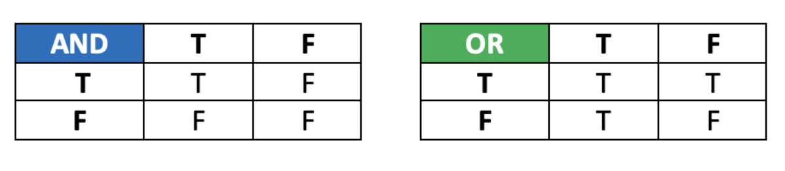

.. role:: python(code)
   :language: python

And/Or
====================

It is possible to build more complex conditions using ``and`` or ``or``.

* ``and``: **both** conditions have to be ``True`` to evaluate as ``True``

* ``or``: only **one** condition has to be ``True`` to evaluate as ``True``

One way to remember this is:

* if you want fish **and** chips, you are expecting **both**.

* if you want fish **or** chips, you are only expecting **one** or the other, but you're also happy if you get both.

You can visualise these rules using a truth table:

.. dropdown:: Question 1
    :open:
    :color: info
    :icon: question

    Does the following program return ``True`` or ``False``?

    .. code-block:: python
        
        x = 4
        print(x > 2 or x < 10)

    .. dropdown:: Solution
        :class-title: sd-font-weight-bold
        :color: dark

        ``x < 2`` is True

        ``x < 10`` is True

        True or True = **True**

.. dropdown:: Question 2
    :open:
    :color: info
    :icon: question

    Does the following program return ``True`` or ``False``?

    .. code-block:: python
        
        x = 1
        print(x < 2 and x > 3)

    .. dropdown:: Solution
        :class-title: sd-font-weight-bold
        :color: dark

        ``x < 0`` is True

        ``x > 3`` is False

        True and False = **False**

.. dropdown:: Question 3
    :open:
    :color: info
    :icon: question

    Does the following program return ``True`` or ``False``?

    .. code-block:: python
        
        x = 6
        y = 2
        z = x * y

        print(z > x or y > 2)

    .. dropdown:: Solution
        :class-title: sd-font-weight-bold
        :color: dark

        ``z > x`` is True

        ``y > 2`` is False

        True or False = **True**

.. dropdown:: Question 3
    :open:
    :color: info
    :icon: question

    Does the following program return ``True`` or ``False``?

    .. code-block:: python
        
        day = 5
        month = 'November'
        print(day == 5 and month != 'November')

    .. dropdown:: Solution
        :class-title: sd-font-weight-bold
        :color: dark

        ``day == 5`` is True

        ``month != 'November'`` is False

        True and False = **False**