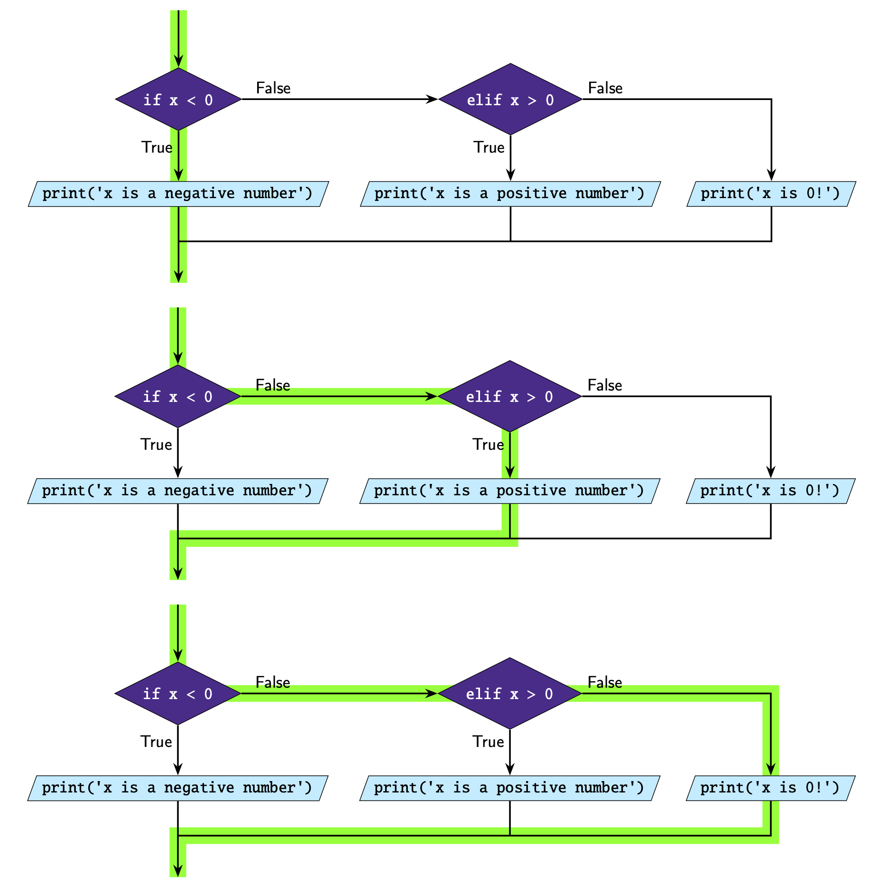

Code Testing
============

Path Coverage
-------------

It's important that you're able to test your code to verify that it will behave the way
you intend. An common way to test code is to come up with **input-output** pairs and
check whether your program produces the correct output. We also want to be selective
when choosing our input output pairs so that we get **path coverage**, i.e. our
input-output pairs test every possible path in our code.

**Example:** The purpose of this program is to identify whether x is positive, negative
or 0.

.. code-block::

    x = int(input('x: '))

    if x < 0:
        print('x is a negative number')
    elif x > 0:
        print('x is a positive number')
    else:
        print('x is 0!')

This program has 3 possible paths.

So examples of input-output pairs we can use to test this program so that we get path
coverage are:

.. list-table::
    :widths: 30 70
    :header-rows: 1

    - - Input
      - Expected output
    - - -3
      - x is a negative number
    - - 0
      - x is 0!
    - - 2
      - x is a positive number

Note that the second column is our *expected output*. We should run our code to
determine whether the code output actually matches our expected output.

Boundary Values
---------------

Another thing we often want to test are boundary values. These are where it causes our
program to change. When we have a condition, e.g. ``x < 3``, we should check what
happens when ``x`` is:

- less than 3
- exactly 3
- greater than 3

And ensure the results are what we expect.

**Example**

.. code-block:: python

    current_speed = int(input("What is your current speed? "))

    speed_limit = 40

    if current_speed > speed_limit:
        print(
            "You are speeding! {}km/h is above the speed limit of {}km/h. Slow down!".format(
                current_speed, speed_limit
            )
        )
    else:
        print("You are travelling within the speed limit.")

In this program we want to test what happens when ``current_speed`` is near
``speed_limit``.

- If we test 41 (just above 40) our program outputs *You are speeding! 41km/h is above
  the speed limit of 40km/h. Slow down!*
- At exactly 40 our program outputs *You are travelling within the speed limit.*
- And at 39 (just below 40) our program again outputs *You are travelling within the
  speed limit.*

Faulty and Abnormal Data
------------------------

Faulty and abnormal data is when the values fall outside the expectations of the system.
Whether your not these inputs should be invalid or not will depend on the program
**specifications**, which describes what the code is meant to do (or not meant to do).
The program should always be able to handle all valid inputs, but what happens when
invalid data is entered is often up to the programmer to decide.

**Example**

If we look at the same program as in the previous example, *invalid*, i.e.
*faulty*/*abnormal* input data would include anything that cannot be converted to an
integer. This is because in the first line of the program the user input is converted to
an integer.

.. code-block:: python

    current_speed = int(input("What is your current speed? "))

Examples of faulty and abnormal data would include ``hello`` and ``3.5``.

.. dropdown:: Question 1
    :open:
    :color: info
    :icon: question

    The following program asks the user what the weather is like. If it's rainy the program is meant to remind the user to take an umbrella, if it's sunny the program is meant to remind the user to take a hat and if it's cold the program is meant to remind the user to take a jumper. The program should always remind the user to take their phone regardless of the weather.

    Below is table of input-output pairs.

    .. list-table::
        :widths: 10 30 60
        :header-rows: 1

        * -
          - Input
          - Expected output
        * - A
          - rainy
          - Take an umbrealla!

            Don't forget to take your phone!
        * - B
          - sunny
          - Take a hat!!

            Don't forget to take your phone!
        * - C
          - cold
          - Take a jumper

            Don't forget to take your phone!
        * - D
          - windy
          - Don't forgt to take your phone!

    Which input-output pairs does the following code fail on?

    .. code-block:: python

        weather = input("What's the weather like today? ")

        if weather == 'rainy':
            print('Take an umbrella!')
            print("Don't forget to take your phone!")

        if weather == 'sunny':
            print('Take a hat!')
            print("Don't forget to take your phone!")

        if weather == 'cold':
            print('Take a jumper!')

    *Select all that apply*.

    .. dropdown:: Solution
        :class-title: sd-font-weight-bold
        :color: dark

        The code fails on C and D.

.. dropdown:: Question 2
    :open:
    :color: info
    :icon: question

    How many paths does the following program have?

    .. code-block:: python

        x = 4

        if x%2 == 0:
            if x%3 == 0:
                print('{} is divisible by both 2 and 3'.format(x))
            else:
                print('{} is divisible by 2 but not by 3'.format(x))
        elif x%3 == 0:
            print('{} is divisible by 3 but not by 2'.format(x))
        else:
            print('{} is not divisible by either 2 or 3'.format(x))

    .. image:: img/5_question2a.png
        :width: 650
        :align: center

    .. dropdown:: Solution
        :class-title: sd-font-weight-bold
        :color: dark

        **4**

        Path 1

        .. image:: img/5_question2b.png
            :width: 300
            :align: center

        Path 2

        .. image:: img/5_question2c.png
            :width: 300
            :align: center

        Path 3

        .. image:: img/5_question2d.png
            :width: 300
            :align: center

        Path 4

        .. image:: img/5_question2e.png
            :width: 300
            :align: center

.. dropdown:: Question 3
    :open:
    :color: info
    :icon: question

    Consider the following program.

    .. code-block:: python

        today = input('Today: ')
        holidays = bool(input('Today is a holiday: '))

        if holidays:
            print("It's the holidays!")
        else:
            if today == 'Saturday' or today == 'Sunday':
                print("It's the weekend!")
            else:
                print('Today is a school day.')

    Suppose we have tested the following input pairs:

    **Input pair 1:** Wednesday, True

    **Input pair 2:** Saturday, True

    **Input pair 3:** Sunday, True

    **Input pair 4:** Sunday, False

    Which of the following additional input pairs do we require to ensure our test cases cover all possible paths? *Select all that apply*.

    A. Monday, True

    B. Friday, False

    C. Sunday, False

    D. Thursday, True

    .. dropdown:: :material-regular:`lock;1.5em` Solution
        :class-title: sd-font-weight-bold
        :color: dark

        .. **B. Friday, False**

        .. Input pairs 1, 2, and 3 all satisfy the first condition because ``holiday`` is ``True``.

        .. .. image:: img/5_question3a.png
        ..     :width: 500
        ..     :align: center

        .. Input pair 4 satisfies the second condition because ``holidays`` is ``False`` but ``today`` is ``Sunday``.

        .. .. image:: img/5_question3b.png
        ..     :width: 500
        ..     :align: center

        .. Thus we are looking for a input-output pair where both conditions evaluate to ``False``. This is true for option B.

        .. .. image:: img/5_question3c.png
        ..     :width: 500
        ..     :align: center

        *Solution is locked*

.. dropdown:: Question 4
    :open:
    :color: info
    :icon: question

    Consider the following code specifications:

    Write a program that asks the user for a number and checks whether that number is positive, negative or 0. Here are some examples of how your code should run.

    **Example 1**

    .. code-block:: markdown

        x: 3
        x is positive

    **Example 2**

    .. code-block:: markdown

        x: -1.5
        x is negative

    **Example 3**

    .. code-block:: markdown

        x: 0
        x is 0!

    Does the following code meet the specifications outlined above?

    .. code-block::

        x = int(input('x: '))

        if x < 0:
            print('x is a negative number')
        elif x > 0:
            print('x is a positive number')
        else:
            print('x is 0!')

    .. dropdown:: :material-regular:`lock;1.5em` Solution
        :class-title: sd-font-weight-bold
        :color: dark

        .. **No**

        .. The program needs to be able to handle *floats*. If you tried example 2 you'll see that it doesn't work.

        *Solution is locked*

.. dropdown:: Question 5
    :open:
    :color: info
    :icon: question

    Consider the following program:

    .. code-block::

        temp = int(input("What's the temperature like today? "))

        if temp < 15:
            print('Take a jumper!')
        if temp > 25:
            print('Take a fan.')

    Which of the following are boundary values you should test? *Select all that apply*.

    A. 14

    B. 15

    C. 16

    D. 24

    E. 25

    F. 26

    .. dropdown:: :material-regular:`lock;1.5em` Solution
        :class-title: sd-font-weight-bold
        :color: dark

        .. :octicon:`issue-closed;1em;sd-text-success;` 14

        .. :octicon:`issue-closed;1em;sd-text-success;` 15

        .. :octicon:`issue-closed;1em;sd-text-success;` 16

        .. :octicon:`issue-closed;1em;sd-text-success;` 24

        .. :octicon:`issue-closed;1em;sd-text-success;` 25

        .. :octicon:`issue-closed;1em;sd-text-success;` 26

        .. Boundary values can be used to identify when a program changes behaviour. In this case we have the conditions ``temp < 15`` and ``temp > 25``. We should check values just above, just below and equal to the values on the right had side of these conditions.

        .. * If ``temp`` is 14 the program outputs: *Take a jumper!*

        .. * If ``temp`` is 15 the program doesn't output anything

        .. * If ``temp`` is 16 the program doesn't output anything

        .. * If ``temp`` is 24 the program doesn't output anything

        .. * If ``temp`` is 25 the program doesn't output anything

        .. * If ``temp`` is 26 the program outputs: *Take a fan*.

        *Solution is locked*

.. dropdown:: Question 6
    :open:
    :color: info
    :icon: question

    Consider the following program.

    .. code-block::

        temp = int(input("What's the temperature like today? "))

        if temp < 15:
            print('Take a jumper!')
        if temp > 25:
            print('Take a fan.')

    The program is meant to take in integers which describe the temperature to the nearest degree (in celsius). Which of the following would be considered invalid, i.e. faulty, inputs and should be tested? *Select all that apply*.

    A. ``-4``

    B. ``'cold'``

    C. ``'three'``

    D. ``17.5``

    .. dropdown:: :material-regular:`lock;1.5em` Solution
        :class-title: sd-font-weight-bold
        :color: dark

        .. **valid:** ``-4``

        .. **faulty/invalid:** ``'cold'``, ``'three'``, ``17.5``

        .. This program is expecting integers. ``'cold'`` and ``'three'`` are strings, so they are invalid. ``17.5`` is a float so this is invalid.

        *Solution is locked*
