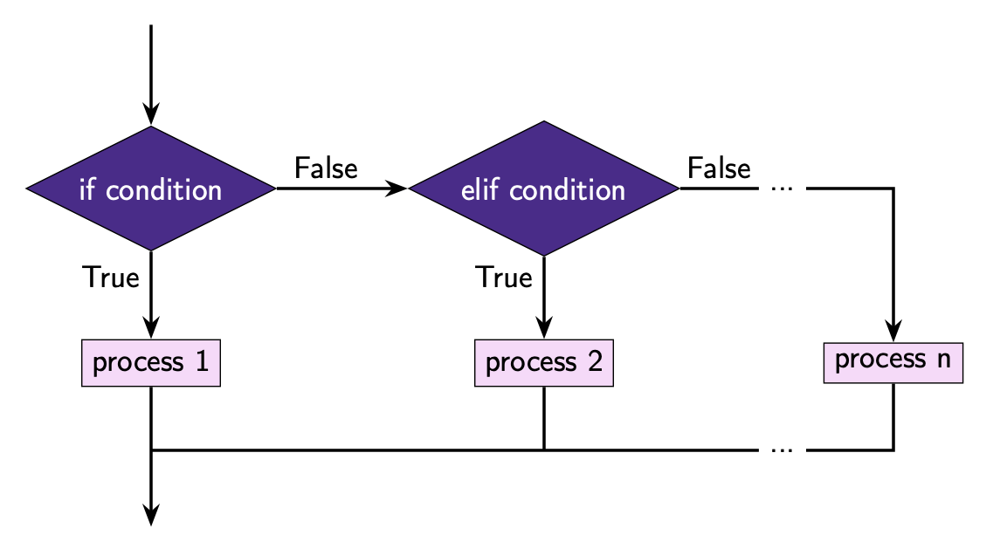

If-Elif-Else Statements
=======================

To add more conditions to an ``if``-``else`` statement, we can use ``elif``.

The ``elif`` statement must be used *between* the ``if`` and the ``else`` statements.
You can also have as many ``elif`` statements as you want!

Here is how we use the ``elif`` statement:

.. code-block::

    if condition_1:
        # code to execute if condition 1 is true
    elif condition_2:
        # code to execute if condition 2 is true
    elif condition_3:
        # code to execute if condition 3 is true
    ...
    else:
        # code to execute if none of the conditions are true

Take note of the following:

    - ``elif`` is a keyword
    - Each condition must evaluate to either ``True`` or ``False``
    - ``:`` is placed at the end of *each* condition
    - The *first* condition that evaluates to ``True`` controls which section of code
      executes
    - The code inside the ``elif`` statement must be **indented**. Note that only the
      code blocks are indented. The lines beginning with ``if``, ``elif`` or ``else``
      are not indented.

Here is an example of an ``if``-``elif``-``else`` statement.

.. code-block:: python

    x = 1

    if x < 0:
        print("x is a negative number")
    elif x > 0:
        print("x is a positive number")
    else:
        print("x is 0!")

In this example the second condition is ``True`` so the second ``print`` statement runs.

.. dropdown:: Question 1
    :open:
    :color: info
    :icon: question

    What do you think the output of the following code will be?

    .. code-block:: python

        light = 'green'

        if light == 'green':
            print('GO!')
        elif light == 'yellow':
            print('Slow down!')
        elif light == 'red':
            print('Stop!')
        else:
            print("That can't be right. Traffic lights can't be {}.".format(light))

    .. dropdown:: Solution
        :class-title: sd-font-weight-bold
        :color: dark

        In this example the condition in the first ``if`` statement evaluates to ``True`` so the program prints ``'GO!'``.

        .. image:: img/3_question1.png
            :width: 650
            :align: center

.. dropdown:: Question 2
    :open:
    :color: info
    :icon: question

    Consider the two programs below. They are similar but not quite the same. If you set the variable ``light`` to ``'yellow'``, both programs will print *Slow down!*.

    **Program 1**

    .. code-block:: python

        light = 'yellow'

        if light == 'green':
            print('GO!')
        if light == 'yellow':
            print('Slow down!')
        if light == 'red':
            print('Stop!')

    **Program 2**

    .. code-block:: python

        light = 'yellow'

        if light == 'green':
            print('GO!')
        elif light == 'yellow':
            print('Slow down!')
        elif tlight == 'red':
            print('Stop!')
        else:
            print("That can't be right. Traffic lights can't be {}.".format(light))

    Suppose we changed the value stored in the variable ``light``. For which of the following values of ``light`` will program 1 and program 2 result in **different** outputs? *Select all that apply*.

    A.

      .. code-block:: python

        light = 'green'

    B.

      .. code-block:: python

        light = 'yellow'

    C.

      .. code-block:: python

        light = 'red'

    D.

      .. code-block:: python

        light = 'blue'

    E.

      .. code-block:: python

        light = 'purple'

    .. dropdown:: :material-regular:`lock;1.5em`  Solution
        :class-title: sd-font-weight-bold
        :color: dark

        .. :octicon:`x-circle;1em;sd-text-danger;` ``light = 'green'``

        .. :octicon:`x-circle;1em;sd-text-danger;` ``light = 'yellow'``

        .. :octicon:`x-circle;1em;sd-text-danger;` ``light = 'red'``

        .. :octicon:`issue-closed;1em;sd-text-success;` ``light = 'blue'``

        .. :octicon:`issue-closed;1em;sd-text-success;` ``light = 'purple'``

        .. In program 1, if all the conditions evaluate to ``False``, you'll see that none of the print statements execute.

        .. .. image:: img/3_question2b.png
        ..     :width: 300
        ..     :align: center

        .. In program 2, you'll see that if all of the conditions evaluate to ``False`` the final print statement saying *That can't be right. Traffic lights can't be blue* will run. Note that this is fundamentally different to program 1. If you tried to add a print at the end of program 1, it will *always* run, whereas the final print statement in program 2 only runs when all conditions are ``False``.

        .. .. image:: img/3_question2a.png
        ..     :width: 700
        ..     :align: center

        *Solution is locked*

.. dropdown:: Code challenge: Red team blue
    :color: warning
    :icon: star

    Implement the algorithm illustrated in the diagram below in Python. **Pay close attention to the indentation.**

    .. image:: img/3_question3.png
        :width: 700
        :align: center

    .. dropdown:: :material-regular:`lock;1.5em` Solution
        :class-title: sd-font-weight-bold
        :color: dark

        .. .. code-block:: python

        ..     red = 3
        ..     blue = 3

        ..     if red > blue:
        ..         print('Red team wins!')
        ..     elif blue > red:
        ..         print('Blue team wins!')
        ..     else:
        ..         print("It's a draw!")
        ..     print('Congratulations to all players!')

        .. Things to note:

        .. * In this example both conditions evaluate to ``False``, which means that the red and blue team have the same score.

        .. * The ``print('Congratulations to all players!')`` is not inside the ``if``-``elif``-``else`` statement, so it is not indented.

        *Solution is locked*
