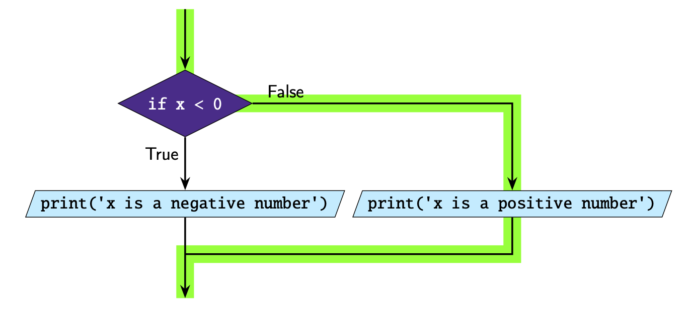

If-Else Statements
==================

If you want to execute code if a condition is ``False``, we can use the ``else``
statement.

The ``else`` statement is always used *after* an ``if`` statement. The structure of an
``if``-``else`` statement is:

.. code-block::

    if condition:
        # code you execute if condition is true
    else:
        # code you execute if condition is false

Take note of the following:

- ``else`` is a keyword
- The code inside the ``else`` statement only executes if the condition is ``False``.
  The ``else`` statement doesn't have a condition after it. (Remember: *Else is lonely.
  Else is by itself!*)
- ``:`` is placed after the ``else``
- Similar to the ``if`` statement, the code *inside* the ``else`` statement must be
  **indented**.

Here is an example of a simple ``if``-``else`` statement.

.. code-block:: python

    x = 1

    if x < 0:
        print("x is a negative number")
    else:
        print("x is a positive number")

In this example the condition is False so the second print statement runs.

.. dropdown:: Question 1
    :open:
    :color: info
    :icon: question

    What do you think the output of the following code will be?

    .. code-block:: python

        current_speed = 45
        speed_limit = 40

        if current_speed > speed_limit:
            print('You are speeding! {}km/h is above the speed limit of {}km/h. Slow down!'.format(current_speed, speed_limit))
        else:
            print('You are travelling within the speed limit.')

    .. dropdown:: Solution
        :class-title: sd-font-weight-bold
        :color: dark

        .. code-block:: html

            You are speeding! 45km/h is above the speed limit of 40km/h. Slow down!

        The condition in the ``if`` statement evaluates to ``True`` so the code indented in the ``if`` statement will execute,  but the code under the ``else`` will not.

        .. image:: img/2_question1.png
            :width: 550
            :align: center

        Note that this code also using string formatting.

        .. image:: img/format2.1.png
            :width: 800
            :align: center

.. dropdown:: Question 2
    :open:
    :color: info
    :icon: question

    What do you think the output of the following code will be?

    .. code-block:: python

        time = 6

        print("I'm hungry.")

        if time == 6:
            print("It's dinner time!")
        else:
            print('Dinner will be soon...')

        print('I hope we get pizza for dinner!')

    .. dropdown:: :material-regular:`lock;1.5em` Solution
        :class-title: sd-font-weight-bold
        :color: dark

        .. .. code-block:: html

        ..     I'm hungry.
        ..     It's dinner time!
        ..     I hope we get pizza for dinner!

        .. The first print statement will run because it's not inside an ``if``-``else`` statement.

        .. .. image:: img/2_question2.png
        ..     :width: 550
        ..     :align: center

        .. In the ``if``-``else`` block of code the condition in the ``if`` statement evaluates to ``True`` so the code indented in the ``if`` statement will execute, but the code under the ``else`` will not.

        .. The final ``print`` statement will always run because it's not inside an ``if``-``else`` statement.

        *Solution is locked*

.. dropdown:: Code challenge: Elevator
    :color: warning
    :icon: star

    Implement the algorithm illustrated in the diagram below in Python. **Pay close attention to the indentation.**

    .. image:: img/2_question3.png
            :width: 400
            :align: center

    .. dropdown:: :material-regular:`lock;1.5em` Solution
        :class-title: sd-font-weight-bold
        :color: dark

        .. .. code-block:: python

        ..         pressed = 'up'

        ..         print('Doors closing')

        ..         if pressed == 'up':
        ..             print('Moving up')
        ..         else:
        ..             print('Moving down')

        ..         print('Doors opening')

        .. Things to remember:

        .. * Code inside the ``if`` and the ``else`` statements have to be indented. The rest of the code should not be indented.

        .. * Use ``==`` for comparison.

        .. * The ``else`` statement is lonely. *The else is by itself!*

        *Solution is locked*

.. dropdown:: Code challenge: Odd Even
    :color: warning
    :icon: star

    Write a program that asks the user for an integer and then displays whether the number is odd or even.

    **Example 1**

    .. code-block:: html

        Enter a number: 1
        This number is odd

    **Example 2**

    .. code-block:: html

        Enter a number: 2
        This number is even

    .. hint::
        Use the modulus operator ``%`` to returns the remainder.

        * When even numbers are divided by 2 the remainder is 0

        * When odd numbers are divided by 2 the remainder is 0

    .. dropdown:: :material-regular:`lock;1.5em` Solution
        :class-title: sd-font-weight-bold
        :color: dark

        .. .. code-block::

        ..     x = int(input('Enter a number: '))

        ..     if x % 2 == 0:
        ..         print('This number is even')
        ..     else:
        ..         print('This number is odd')

        *Solution is locked*
