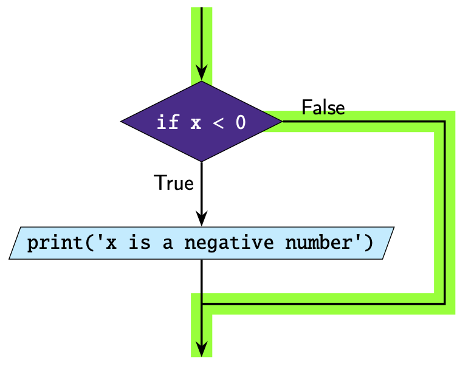
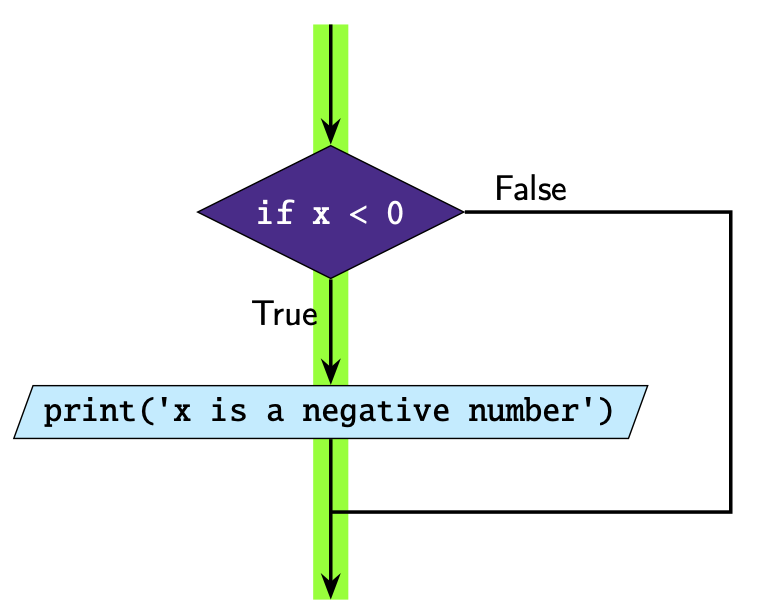

.. role:: python(code)
   :language: python

If Statements
====================

The :python:`if` statement lets us execute a section of code if a specified condition is True.

The structure of an if statement is:

.. code-block:: python

  if condition:
      # code you execute if condition is true

Take note of the following:

* :python:`if` is a keyword
* The condition must evaluate to either :python:`True` or :python:`False`
* The code inside the if statement only executes if the condition is :python:`True`
* :python:`:` is placed at the end of the condition
* The code inside the if statement must be indented. The indentation defines the
  code block. This allows you to put multiple lines inside the if statement.
* The indentation can be done using tab or spaces, as long as you're consistent!

Here is an example of a simple if statement.

.. exec_code::
  :language: python

  x = -2

  if x < 0:
      print('x is a negative number')

In this example the condition is :python:`True` so the print statement runs.

This is how we can represent this code diagrammatically. The green line
indicates the 'path' the code takes.

Let's look at another example.

.. exec_code::
  :language: python

  x = 1

  if x < 0:
      print('x is a negative number')

In this example the condition is :python:`False` so the print statement does not run.

.. dropdown:: Question 1
    :open:
    :color: info
    :icon: question

    What do you think the output of the following code will be?

    .. code-block:: python
        
      weather = 'rainy'

      if weather == 'rainy':
          print('Take an umbrella!')

      if weather == 'sunny':
          print('Take a hat!')

    .. dropdown:: Solution
        :class-title: sd-font-weight-bold
        :color: dark

        In this example we have two ``if`` statements, one after the after. If you look at the condition in the first ``if`` statement, this evaluates to ``True`` so the program prints

        .. code-block:: python
          
          Take an umbrella!

        The second ``if`` statement however evaluates to ``False``, so nothing happens.

        .. image:: img/1_question1.png
          :width: 300
          :align: center

.. dropdown:: Question 2
    :open:
    :color: info
    :icon: question

    What do you think the output of the following code will be?

    .. code-block:: python

      status = 'still cooking'

      if status == 'finished':
          print('Cake is done.')
          print('Take it out of the oven!')
      print('Yum cake!')

    .. dropdown:: :material-regular:`lock;1.5em` Solution
        :class-title: sd-font-weight-bold
        :color: dark

        .. In this example we have one ``if`` statement. If you look carefully at the code only the first two ``print`` are *indented*, which means these are *inside* the ``if`` statement. The condition in the ``if`` statement is ``False`, so these lines of code do not run.

        .. The ``print`` statement on the last line is **not** indented, so it is not part of the ``if`` statement. This means that this line of code will always run.

        .. .. image:: img/1_question2.png
        ..   :width: 300
        ..   :align: center

        *Solution is locked*

.. dropdown:: Code challenge: Big Number
    :color: warning
    :icon: star

    Write a program that reads in a number from the user. If that number is greater than 100 your program should output:

    .. code-block:: html

      That's a big number!

    **Example 1**

    .. code-block:: html
    
      Enter a number: 107
      That's a big number!

    **Example 2**

    .. code-block:: html
      
      Enter a number: 2

    .. dropdown:: :material-regular:`lock;1.5em` Solution
        :class-title: sd-font-weight-bold
        :color: dark

        .. .. code-block:: 

        ..   n = int(input('Enter a number: '))
        ..   if n > 100:
        ..       print("That's a big number!")

        *Solution is locked*

.. dropdown:: Code challenge: 3 is Lucky!
    :color: warning
    :icon: star

    Write a program that asks the user for a number. If that number is 3, the program should say *3 is lucky!* If the user enters any other number, the program should say nothing.

    **Example 1**

    .. code-block:: html
      
      Enter a number: 3
      3 is lucky!

    **Example 2**

    .. code-block:: html
    
      Enter a number: 5

    .. dropdown:: :material-regular:`lock;1.5em` Solution
        :class-title: sd-font-weight-bold
        :color: dark

        .. .. code-block:: 

        ..   n = int(input('Enter a number: '))
        ..   if n == 3:
        ..       print('3 is lucky!')

        *Solution is locked*

.. dropdown:: Code challenge: Favourite Colour
    :color: warning
    :icon: star

    Write a program that asks for the user's favourite colour. If their favourite colour is **red**, the program should output:

    .. code-block:: html

        That's my favourite colour!

    Regardless of what colour the user says, the program should also say:

    .. code-block:: html
  
      What a nice colour
  
    Here are some examples of how your code should run.

    **Example 1**

    .. code-block:: html

      What is your favourite colour? red
      That's my favourite colour!
      What a nice colour

    **Example 2**
  
    .. code-block:: html

      What is your favourite colour? blue
      What a nice colour

    .. hint::

      Don't forget to take note of the spelling!

    .. dropdown:: :material-regular:`lock;1.5em`  Solution
        :class-title: sd-font-weight-bold
        :color: dark

        .. .. code-block:: 

        ..   colour = input('What is your favourite colour? ')

        ..   if colour == 'red':
        ..       print("That's my favourite colour!")
              
        ..   print('What a nice colour')

        *Solution is locked*

.. dropdown:: Code challenge: Temperature
    :color: warning
    :icon: star

    Write a program that reads in today's temperature (in degrees celsius) from the user. 

    If the temperature is less than 15 degrees the program should output:

    .. code-block:: html

        Take a jumper!

    If the temperature is greater than 25 degrees the program should output:

    .. code-block:: html
    
        Take a fan.

    You can assume all temperatures are given to the nearest degree.

    **Example 1**

    .. code-block:: html
      
      What's the temperature like today? 5
      Take a jumper!

    **Example 2**

    .. code-block:: html
    
      What's the temperature like today? 30
      Take a fan.

    **Example 3**

    .. code-block:: html
    
      What's the temperature like today? 20

    .. dropdown:: :material-regular:`lock;1.5em` Solution
        :class-title: sd-font-weight-bold
        :color: dark

        .. .. code-block:: 

        ..   temp = int(input("What's the temperature like today? "))

        ..   if temp < 15:
        ..       print('Take a jumper!')
        ..   if temp > 25:
        ..       print('Take a fan.')

        *Solution is locked*