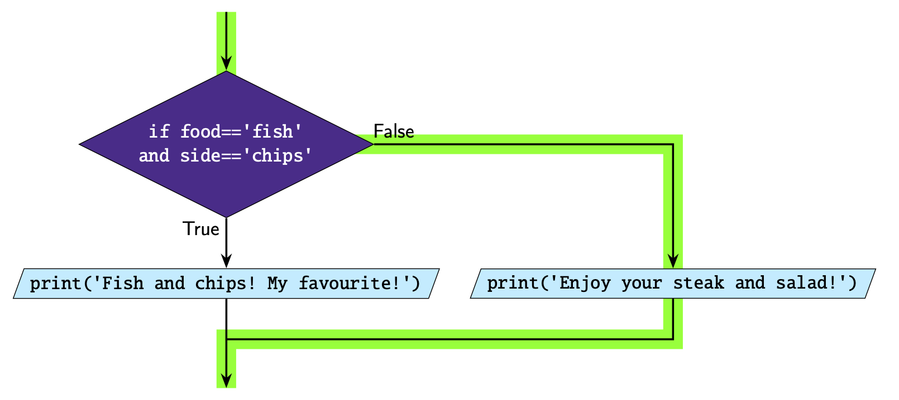

More Complicated if-elif-else Statements
========================================

Combining conditions
--------------------

Don't forget you can make more complex conditions by combining multiple
conditions using ``and`` and ``or``.

.. code-block::

    food = 'steak'
    side = 'salad'

    if food == 'fish' and sides == 'chips':
        print('Fish and chips! My favourite!')
    else:
        print('Enjoy your {} and {}!'.format(food, side))

Nesting
-------

You can also put ``if``-``elif``-``else`` statements *inside* other
``if``-``elif``-``else`` statements. **Pay close attention to the
indentation.**

In this example, if the first condition evaluates to ``True`` the code is
directed to another ``if``-``else`` statement.

.. code-block:: python

    x = 4

    if x % 2 == 0:
        if x % 3 == 0:
            print("{} is divisible by both 2 and 3".format(x))
        else:
            print("{} is divisible by 2 but not by 3".format(x))
    elif x % 3 == 0:
        print("{} is divisible by 3 but not by 2".format(x))
    else:
        print("{} is not divisible by either 2 or 3".format(x))

.. dropdown:: Question 1
    :open:
    :color: info
    :icon: question

    What do you think the output of the following code will be?

    .. code-block:: python

        today = 'Wednesday'
        holidays = False

        if holidays:
            print("It's the holidays!")
        else:
            if today == 'Saturday' or today == 'Sunday':
                print("It's the weekend!")
            else:
                print('Today is a school day.')

    .. dropdown:: Solution
        :class-title: sd-font-weight-bold
        :color: dark

        .. code-block:: html

            Today is a school day.

        The first condition evaluates to ``False``, so we go down the ``else`` branch. Inside this branch we have another ``if``-``else`` statement. This condition also evaluates to ``False``, so the program will print *Today is a school day*.

        .. image:: img/4_question1.png
            :width: 600
            :align: center

.. dropdown:: Question 2
    :open:
    :color: info
    :icon: question

    Consider the two programs below. They are similar but not quite the same.  If you set ``red = 3`` and ``blue = 2``, both programs will output

    .. code-block:: html

        Red team wins!
        Congratulations to the winning team!

    **Program 1**

    .. code-block::

        red = 3
        blue = 2

        if red > blue:
            print('Red team wins!')
        elif blue > red:
            print('Blue team wins!')
        else:
            print("It's a draw!")
        print('Congratulations to the winning team!')

    **Program 2**

    .. code-block::

        red = 3
        blue = 2

        if red == blue:
            print("It's a draw!")
        else:
            if red > blue:
                print('Red team wins!')
            else:
                print('Blue team wins!')
            print('Congratulations to the winning team!')

    Suppose we changed the value stored in the variables ``red`` and ``blue``. For which of the following will program 1 and program 2 result in **different** outputs? *Select all that apply*.

    A.

      .. code-block:: python

        red = 5
        blue = 0

    B.

      .. code-block:: python

        red = 2
        blue = 2

    C.

      .. code-block:: python

        red = 2
        blue = 4

    D.

      .. code-block:: python

        red = 0
        blue = 0

    .. dropdown:: :material-regular:`lock;1.5em` Solution
        :class-title: sd-font-weight-bold
        :color: dark

        .. :octicon:`x-circle;1em;sd-text-danger;` ``red = 5``, ``blue = 0``

        .. :octicon:`issue-closed;1em;sd-text-success;` ``red = 2``, ``blue = 2``

        .. :octicon:`x-circle;1em;sd-text-danger;` ``red = 2``, ``blue = 4``

        .. :octicon:`issue-closed;1em;sd-text-success;` ``red = 0``, ``blue = 0``

        .. In program 1, if all the conditions evaluate to ``False`` we end up in the ``else`` branch which means that the program will print *It's a draw!*. There is then a final print statement which is outside the ``if``-``elif``-``else``. This print statement will always execute so the program will always print *Congratulations to the winning team!*.

        .. .. image:: img/4_question3b.png
        ..     :width: 600
        ..     :align: center

        .. In program 2 you'll see that the structure is slightly different. In this case ``print('Congratulations to the winning team!')`` is inside the first ``else`` branch and will only print if there is not a draw between the red and blue team. So in this example it won't print.

        .. .. image:: img/4_question3a.png
        ..     :width: 600
        ..     :align: center

        *Solution is locked*

.. dropdown:: Code challenge: Red Team Blue Team
    :color: warning
    :icon: star

    Implement the algorithm illustrated in the diagram below in Python. **Pay close attention to the indentation.**

    .. image:: img/4_question2.png
        :width: 600
        :align: center

    .. dropdown:: :material-regular:`lock;1.5em` Solution
        :class-title: sd-font-weight-bold
        :color: dark

        .. .. code-block::

        ..     red = 4
        ..     blue = 5

        ..     if red == blue:
        ..         print("It's a draw!")
        ..     else:
        ..         if red > blue:
        ..             print('Red team wins!')
        ..         else:
        ..             print('Blue team wins!')
        ..         print('Congratulations to the winning team!')

        .. Things to note:

        .. * We encouter the second ``if`` statement if the first ``if`` statement evaluates to ``False``

        .. * The ``print('Congratulations to the winning team!')`` happens if the first ``if`` statement evaluates to ``False``, but will execute regardless of the outcome of the second condition. This means it's inside the ``else`` branch of the first ``if`` statement, but is not inside the second ``if`` statement.

        *Solution is locked*

.. dropdown:: Code challenge: Order x, y and z
    :color: warning
    :icon: star

    Write a program that asks the user for integers x, y and z. Each value will be unique, i.e. none of the values will be the same. Your program should then order these values from largest to smallest and display them in the following format:

    .. code-block:: html

        largest > second largest > smallest

    **Example 1**

    .. code-block:: html

        x: 3
        y: 7
        z: 1
        7 > 3 > 1

    **Example 2**

    .. code-block:: html

        x: 2
        y: 5
        z: 9
        9 > 5 > 2

    **Example 3**

    .. code-block:: html

        x: 6
        y: 4
        z: 8
        8 > 6 > 4

    .. dropdown:: :material-regular:`lock;1.5em` Solution
        :class-title: sd-font-weight-bold
        :color: dark

        .. .. code-block::

        ..     x = int(input('x: '))
        ..     y = int(input('y: '))
        ..     z = int(input('z: '))

        ..     if x > y and x > z:
        ..         if y > z:
        ..             print('{} > {} > {}'.format(x, y, z))
        ..         else:
        ..             print('{} > {} > {}'.format(x, z, y))
        ..     elif y > z:
        ..         if x > z:
        ..             print('{} > {} > {}'.format(y, x, z))
        ..         else:
        ..             print('{} > {} > {}'.format(y, z, x))
        ..     else:
        ..         if x > y:
        ..             print('{} > {} > {}'.format(z, x, y))
        ..         else:
        ..             print('{} > {} > {}'.format(z, y, x))

        *Solution is locked*
