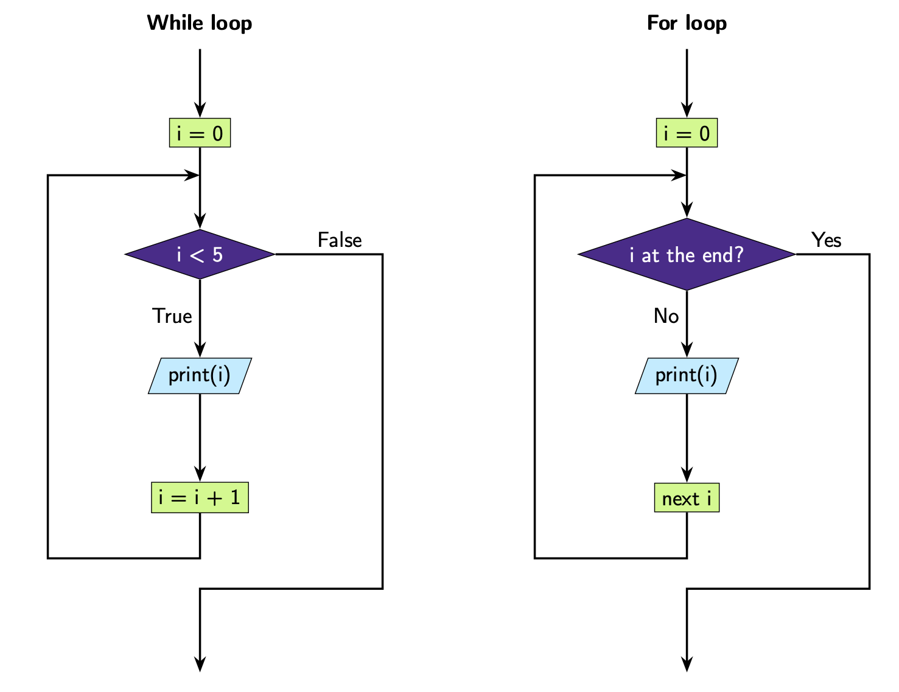
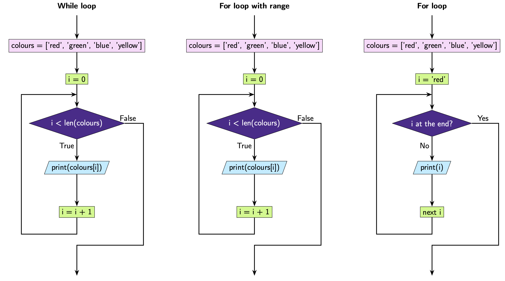

Equivalent Loops
================

When programming, you'll find that there are often multiple ways to write your
program and have it do the same thing! Have a look at the examples below. You
will find that in each example, the programs do the exact same thing.

**Example 1:** Count 0 to 4

.. exec_code::
    :language: python

    i = 0
    while i < 5:
        print(i)
        i = i + 1

.. exec_code::
    :language: python

    for i in range(5):
        print(i)

**Example 2:** Print each colour

.. exec_code::
    :language: python

    colours = ['red', 'green', 'blue', 'yellow']
    i = 0
    while i < len(colours):
        print(colours[i])
        i = i + 1

.. exec_code::
    :language: python

    colours = ['red', 'green', 'blue', 'yellow']
    for i in range(len(colours)):
        print(colours[i])

.. exec_code::
    :language: python

    colours = ['red', 'green', 'blue', 'yellow']
    for i in colours:
        print(i)

When you write a loop you will have to choose whether you use a ``for`` loop or
a ``while`` loop. Often, it won't matter which one you choose as both will
work. But in general, you would use:

- a ``while`` loop if you don't know how many times to repeat your code -
  instead, you will terminate your loop once a certain *condition* is met
- a ``for`` loop if you know how many times you want to repeat your code

.. dropdown:: Question 1
    :open:
    :color: info
    :icon: question

    Which of the following ``while`` loops produces the same output as the ``for`` loop shown below?

    .. code-block:: python

        for i in range(5, 10):
            print(i)

    A.

     .. code-block:: python

        i = 0
        while i < 10:
            print(i)
            i = i + 1

    B.

     .. code-block:: python

        i = 5
        while i < 10:
            print(i)
            i = i + 1

    C.

     .. code-block:: python

        i = 0
        while i < 10:
            print(i)
            i = i + 5

    D.

     .. code-block:: python

        i = 1
        while i < 10:
            print(i)
            i = i + 5

    .. dropdown:: Solution
        :class-title: sd-font-weight-bold
        :color: dark

        **B.**

        This ``for`` loop counts from 5 up to but not including 10. To construct an equivalent ``while`` loop, we want ``i`` to start at 5 and then increase by 1 at each iteration until it also goes up to but does not include 10. Of the options provided the second one is the only one where ``i`` starts at 5.

        .. image:: img/9_question1.png
            :width: 600
            :align: center

.. dropdown:: Question 2
    :open:
    :color: info
    :icon: question

    Will the following two programs produce the same output?

    **Program 1**

    .. code-block:: python

        words = ['rain', 'one', 'light', 'owl', 'ranch']
        for i in range(len(words)):
            print('b{}'.format(words[i]))

    **Program 2**

    .. code-block:: python

        words = ['rain', 'one', 'light', 'owl', 'ranch']
        for i in words:
            print('b' + i)

    .. dropdown:: :material-regular:`lock;1.5em` Solution
        :class-title: sd-font-weight-bold
        :color: dark

        *Solution is locked*

.. dropdown:: Question 3
    :open:
    :color: info
    :icon: question

    Construct a ``for`` loop that is equivalent to the following ``while`` loop.

    .. code-block:: python

        fries = ['curly', 'shoestring', 'waffle', 'crinkle', 'wedge']

        i = -1
        while i > -len(fries):
            print(fries[i])
            i = i - 1

    .. dropdown:: :material-regular:`lock;1.5em` Solution
        :class-title: sd-font-weight-bold
        :color: dark

        *Solution is locked*
