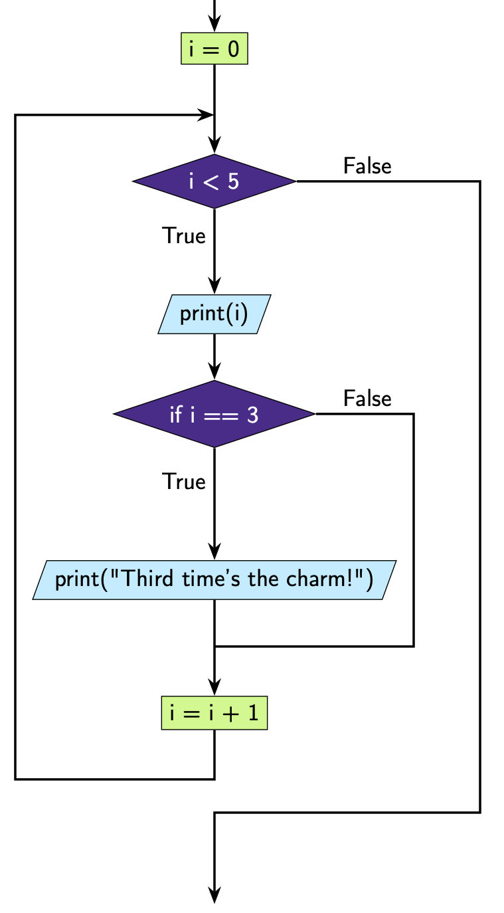

For Loops With Conditionals
===========================

Just like we saw with ``while`` loops, we can put conditionals inside our ``for`` loops.

Here is an example with an ``if`` statement.

.. exec_code::
    :language: python

    for i in range(5):
        print(i)
        if i == 3:
            print("Third time's the charm!")

**What's happening here?**

We have used ``range(5)``, which means that ``i`` will take on the values ``[0, 1, 2, 3,
4]``. At each iteration we execute the code block:

.. code-block:: text

    print(i)
    if i == 3:
        print("Third time's the charm!")

At the **first** iteration ``i = 0``. We ``print(i)`` and output

.. code-block:: text

    0

Since the condition ``i == 3`` is ``False``, we move onto the next iteration.

At the **second** iteration ``i = 1``. We ``print(i)`` and output

.. code-block:: text

    1

Since the condition ``i == 3`` is ``False``, we move onto the next iteration.

At the **third** iteration ``i = 2``. We ``print(i)`` and output

.. code-block:: text

    2

Since the condition ``i == 3`` is ``False``, we move onto the next iteration.

At the **fourth** iteration ``i = 3``. We ``print(i)`` and output

.. code-block:: text

    3

This time the condition ``i == 3`` is ``True``, so we also output

.. code-block:: text

    Third time's the charm!

At the **fifth** iteration ``i = 4``. We ``print(i)`` and output

.. code-block:: text

    4

Since the condition ``i == 3`` is ``False`` we don't do anything else. Since 4 is the
last number in the sequence, we exit the loop.

This is how we can represent this code diagrammatically.

.. dropdown:: Question 1
    :open:
    :color: info
    :icon: question

    What do you think the output of the following code will be?

    .. code-block:: python

        for i in ['alligators', 'bears', 'cows']:
            print('I like {}!'.format(i))
            if i == 'alligators':
                print('CRUNCH')
            if i == 'bears':
                print('GRRRRRRR')
            if i == 'cows':
                print('MOOOOOOO')

    .. dropdown:: Solution
        :class-title: sd-font-weight-bold
        :color: dark

        Let's trace through this code.

        We can see our iterable is the list ``['alligators', 'bears', 'cows']``, and ``i`` is our variable name.

        At the **first** iteration, ``i`` will store the **first** value in our list i.e. ``i = 'alligators'``. Then we will execute the code on ``line 2`` and print

        .. code-block:: text

            I like alligators!

        Then we'll check the ``if`` conditions, only the first condition ``i == 'alligators'`` is ``True``, so we print

        .. code-block:: text

            CRUNCH

        At the **second** iteration, ``i`` will store the **second** value in our list i.e. ``i = 'bears'``. Then we will execute the code on ``line 2`` and print

        .. code-block:: text

            I like bears!

        Then we'll check the ``if`` conditions, only the second condition ``i == 'bears'`` is ``True``, so we print

        .. code-block:: text

            GRRRRRRR

        At the **third** iteration, ``i`` will store the **third** value in our list i.e. ``i = 'cows'``. Then we will execute the code on ``line 2`` and print

        .. code-block:: text

            I like cows!

        Then we'll check the if conditions, only the **third** condition ``i == 'cows'`` is ``True``, so we print

        .. code-block:: text

            MOOOOOOO

.. dropdown:: Question 2
    :open:
    :color: info
    :icon: question

    What do you think the output of the following code will be?

    .. code-block:: python

        foods = ['sushi', 'burger', 'falafel', 'waffles', 'lasagne', 'sundae', 'dumplings']
        for i in range(len(foods)):
            if i % 2 == 0:
                print(foods[i])

    A.

     .. code-block:: python

        0
        1
        2
        3
        4
        5
        6

    B.

     .. code-block:: python

        0
        2
        4
        6

    C.

     .. code-block:: python

        sushi
        falafel
        lasagne
        dumplings

    D.

     .. code-block:: python

        burger
        waffles
        sundae

    E.

     .. code-block:: python

        sushi
        burger
        falafel
        waffles
        lasagne
        sundae
        dumplings

    .. dropdown:: :material-regular:`lock;1.5em` Solution
        :class-title: sd-font-weight-bold
        :color: dark

        *Solution is locked*

.. dropdown:: Question 3
    :open:
    :color: info
    :icon: question

    What do you think the output of the following will be?

    .. code-block:: python

        plays = ['Hamlet', 'Romeo and Juliet', 'Julius Caesar', 'Othello', 'King Lear', 'Macbeth']

        long = 0
        for i in plays:
            if len(i) > 10:
                long = long + 1
        print(long)

    .. hint:: Did you know you can use ``len()`` to check the number of characters in a string?

        .. exec_code::
            :language: python

                print(len('abc'))

    .. dropdown:: :material-regular:`lock;1.5em` Solution
        :class-title: sd-font-weight-bold
        :color: dark

        *Solution is locked*

.. dropdown:: Question 4
    :open:
    :color: info
    :icon: question

    Implement the algorithm illustrated in the diagram below in Python.

    .. image:: img/8_question4.png
        :width: 600
        :align: center

    .. dropdown:: :material-regular:`lock;1.5em` Solution
      :class-title: sd-font-weight-bold
      :color: dark

      *Solution is locked*

.. dropdown:: Code challenge: Count Up and Down
    :color: warning
    :icon: star

    Write a program that reads in an integer, and counts from 0 up to, or down to, that integer.

    **Example 1**

    .. code-block:: text

        Enter a number: 5
        0
        1
        2
        3
        4
        5

    **Example 2**

    .. code-block:: text

        Enter a number: -3
        0
        -1
        -2
        -3

    .. dropdown:: :material-regular:`lock;1.5em` Solution
      :class-title: sd-font-weight-bold
      :color: dark

      *Solution is locked*

.. dropdown:: Code challenge: Crazy Case
    :color: warning
    :icon: star

    Write a program that takes in input from the user and coverts every second letter to upper case, and every other letter to lower case. The first letter should be upper case.

    **Example**

    .. code-block:: text

        hello there
        HeLlO ThErE

    .. hint:: You can treat strings as lists of characters, e.g.:

        .. exec_code::
            :language: python

            sample_string = 'Hello!'
            print(sample_string[5])

        You can also convert characters to upper and lower case using ``.upper()`` and ``.lower()``

        .. exec_code::
            :language: python

            print('a'.upper())
            print('A'.lower())

    .. dropdown:: :material-regular:`lock;1.5em` Solution
      :class-title: sd-font-weight-bold
      :color: dark

      *Solution is locked*

.. dropdown:: Code challenge: Prime Number
    :color: warning
    :icon: star

    Write a program that asks the user for a number. If the given number is a prime number the program should print

    *n is a prime number*

    otherwise your program should print

    *n is not a prime number*

    **Example 1**

    .. code-block:: text

        n: 347
        347 is a prime number

    **Example 2**

    .. code-block:: text

        n: 102
        102 is not a prime number

    .. dropdown:: :material-regular:`lock;1.5em` Solution
      :class-title: sd-font-weight-bold
      :color: dark

      *Solution is locked*
