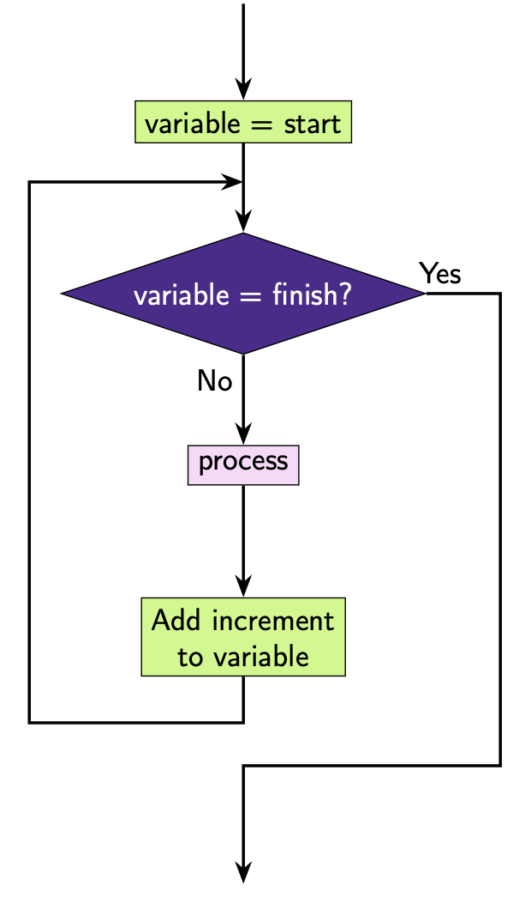

For Loops
=========

``for`` loops can be used to repeat code.

The structure of a for loop is:

.. code-block:: text

    for variable in iterable:
        # code you want to execute

.. note::

    An iterable is some sequence of values you can go through. In general, our iterables will be lists, but they can also be strings!

Here is an example:

.. exec_code::
    :language: python

    for number in [1, 5, 8, 2]:
        print(number)

**What's happening here?**

We can see our iterable is the list ``[1, 5, 8, 2]``, and number is our
variable name.

At the **first** iteration, ``number`` will store the **first** value in our
list i.e. ``number = 1``. Then we will execute the code on ``line 2`` and print
1.

At the **second** iteration, number will store the second value in our list
i.e. ``number = 5``. Then we will execute the code on ``line 2`` and print 5.

At the **third** iteration, number will store the third value in our list i.e.
``number = 8``. Then we will execute the code on ``line 2`` and print 8.

At the **fourth** iteration, number will store the fourth value in our list
i.e. ``number = 2``. Then we will execute the code on ``line 2`` and print 2.

After the number 2 there are no more numbers left in the list so the loop
terminates.

This is how we can represent this code diagrammatically.

Here is another example, this time with a larger code block:

.. exec_code::
    :language: python

    for number in [1, 5, 8, 2]:
        print(number * 2)
        print('I have doubled that number for you!')
    print('All done here!')

Take note of the following:

- ``for`` is a keyword
- ``in`` is a keyword
- ``:`` is placed at the end of the ``for`` loop definition
- The code you want *repeated* must be **indented**

.. dropdown:: Question 1
    :open:
    :color: info
    :icon: question

    What do you think the output of the following code will be?

    .. code-block:: python

        for value in [3, 1, 4, -2, 3]:
            print(value + 1)

    .. dropdown:: Solution
        :class-title: sd-font-weight-bold
        :color: dark

        In this example the variable ``value`` will take on the values 3, 1, 4, -2, 3. The line print(value + 1) is indented, which means that this line will get repeated each time so the program will print 3 + 1, 1 + 1, 4 + 1, -2 + 1, 3 + 1 , which is 4, 2, 5, -1, 4.

        .. image:: img/6_question1.png
            :width: 270
            :align: center

.. dropdown:: Question 2
    :open:
    :color: info
    :icon: question

    What do you think the output of the following code will be?

    .. code-block:: python

        for letter in ['A', 'B', 'C']:
            print(letter)
        print("Now I know my ABC's")

    .. dropdown:: :material-regular:`lock;1.5em` Solution
      :class-title: sd-font-weight-bold
      :color: dark

      *Solution is locked*

.. dropdown:: Question 3
    :open:
    :color: info
    :icon: question

    What is wrong with the following program?

    .. code-block:: python

        For i in [1, 2, 3]:
            print(i)

    A. This will result in a **NameError** because ``i`` is not defined.

    B. This will result in a **SyntaxError** because ``for`` should be spelt with a lower case 'f'.

    C. This will result in an **IndentationError** because ``print(i)`` should not be indented.

    D. This will result in an infinite loop because ``i`` is not incremented at the end of the loop.

    .. dropdown:: :material-regular:`lock;1.5em` Solution
      :class-title: sd-font-weight-bold
      :color: dark

      *Solution is locked*

.. dropdown:: Question 4
    :open:
    :color: info
    :icon: question

    Write a program that sums the numbers 1 to 10 and prints the result.

    .. dropdown:: :material-regular:`lock;1.5em` Solution
      :class-title: sd-font-weight-bold
      :color: dark

      *Solution is locked*

.. dropdown:: Question 5
    :open:
    :color: info
    :icon: question

    Implement the algorithm illustrated in the diagram below in Python.

    .. image:: img/6_question3.png
        :width: 270
        :align: center

    The output of your program should be:

    .. code-block:: text

        Start your engines...
        3
        2
        1
        Go!

    .. dropdown:: :material-regular:`lock;1.5em` Solution
      :class-title: sd-font-weight-bold
      :color: dark

      *Solution is locked*

.. dropdown:: Code challenge: Cubes
    :color: warning
    :icon: star

    You have been provided with a list of numbers.

    .. code-block:: python

        numbers = [4, 7, 9, 12, 30, 12, 86, 341, 19, 3, 8, 6529, 7, 0, 345]

    Write a program that loops through the list and for each number :math:`n`, prints out :math:`n^3` on a new line.

    The output of your program should look like this:

    .. code-block:: text

        64
        343
        729
        ...
        343
        0
        41063625

    .. hint:: The ``**`` operator can be interpreted as '*to the power of*'. For example, ``2**3`` is :math:`2^3`.

    .. dropdown:: :material-regular:`lock;1.5em` Solution
      :class-title: sd-font-weight-bold
      :color: dark

      *Solution is locked*

.. dropdown:: Code challenge: Multiply All
    :color: warning
    :icon: star

    You have been provided with a list of numbers.

    .. code-block:: python

        numbers = [4, 17, 9, 5, 7, 12, 3, 14, 3, 23, 45, 8, 103, 21, 6, 9, 3, 3, 13]

    Write a program that loops through ``numbers`` and multiplies all the numbers together and prints out the final result.

    **Example:** This example is with a smaller list of numbers.

    .. code-block:: python

        numbers = [2, 3, 6]

    The above list would produce the output:

    .. code-block:: text

        36

    .. hint:: It might be helpful to create the variable ``result = 1``, and then multiply result by each number.

    .. dropdown:: :material-regular:`lock;1.5em` Solution
      :class-title: sd-font-weight-bold
      :color: dark

      *Solution is locked*
