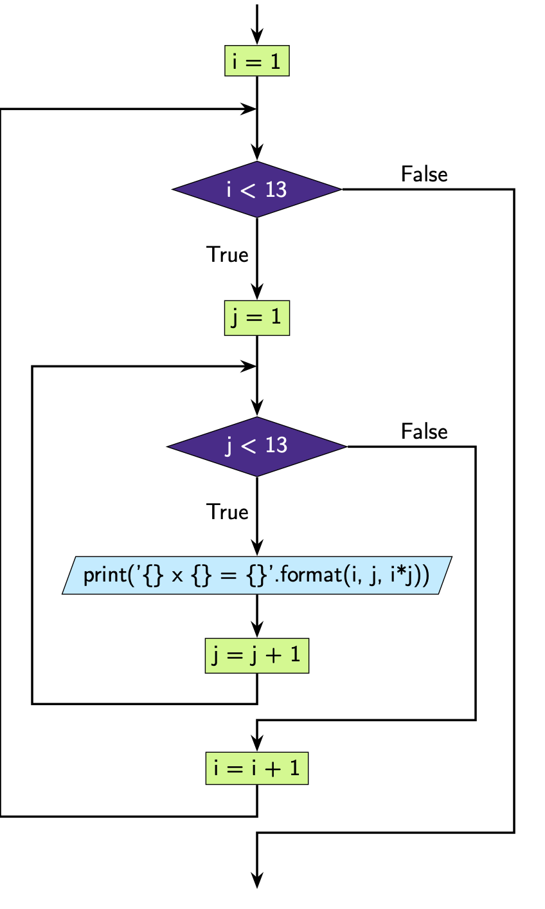

Nested Loops
============

You can make the block of code inside the loops as complex as you want. This
means you can also put loops *inside* other loops, whether they be ``while``
loops or ``for`` loops.

**Example:** multiplication tables with nested ``for`` loops.

.. code-block:: python

    for i in range(1, 13):
        for j in range(1, 13):
            print("{} x {} = {}".format(i, j, i * j))

.. code-block:: text

    1 x 1 = 1
    1 x 2 = 2
    1 x 3 = 3
    ...
    12 x 11 = 132
    12 x 12 = 144

**What's happening here?**

We can see that at the **first** iteration of the outer loop, ``i = 1``. Then
we run the code block inside this ``for`` loop, which is

.. code-block:: python

    for j in range(1, 13):
        print("{} x {} = {}".format(i, j, i * j))

This is another for loop, this time with ``j`` looping from 1, ..., 12, each
time printing ``'{} x {} = {}'.format(i, j, i*j)``. Note that for the entire
duration of this loop running ``i`` is still 1. This means we get ``1 x 1 =
1``, ..., ``1 x 12 = 12``.

We can see that at the **second** iteration of the outer loop, ``i = 2``. Again
we run the code block inside this for loop, which is

.. code-block:: python

    for j in range(1, 13):
        print("{} x {} = {}".format(i, j, i * j))

This loop will again run in its entirety with ``j`` looping from 1, ..., 12,
each time printing ``'{} x {} = {}'.format(i, j, i*j)``. For the entire
duration of this loop running ``i`` is still 2. This means we get ``2 x 1 =
2``, ..., ``2 x 12 = 24``.

We keep running through the outer loop for ``i`` = 1, ..., 12, each time
running the inner loop. This gives us all of the standard multiplication
tables.

Note that **the iteration variables you use in your outer and inner loops need
to have different variable names**, otherwise you will overwrite the value of
the iteration variable used in your outer loop. In this example our outer
iteration variable is i and our inner iteration variable is ``j``.

**Example:** multiplication tables with nested ``while`` loops.

.. code-block:: python

    i = 1
    while i < 13:
        j = 1
        while j < 13:
            print("{} x {} = {}".format(i, j, i * j))
            j = j + 1
        i = i + 1

**Example:** multiplication tables with a ``while`` loop inside a ``for`` loop.

.. code-block:: python

    for i in range(1, 13):
        j = 1
        while j < 13:
            print("{} x {} = {}".format(i, j, i * j))
            j = j + 1

.. dropdown:: Question 1
    :open:
    :color: info
    :icon: question

    Write a program with an outer ``while`` loop and an inner ``for`` loop that prints out the standard multiplication table from :math:`1\times1` to :math:`12\times 12`, as shown below.

    .. code-block:: text

        1 x 1 = 1
        1 x 2 = 2
        1 x 3 = 3
        ...
        12 x 11 = 132
        12 x 12 = 144

    .. dropdown:: Solution
        :class-title: sd-font-weight-bold
        :color: dark

        .. code-block:: python

            i = 1
            while i < 13:
                for j in range(1, 13):
                    print('{} x {} = {}'.format(i, j, i * j))
                i = i + 1

.. dropdown:: Question 2
    :open:
    :color: info
    :icon: question

    What do you think the output of the following code will be?

    .. code-block:: python

        n = 5

        for i in range(n):
            line = ''
            for j in range(n):
                line = line + '*'
            print(line)

    A.

     .. code-block:: text

        *
        **
        ***
        ****
        *****

    B.

     .. code-block:: text

        *****
        *****
        *****
        *****

    C.

     .. code-block:: text

        *
        *
        *
        *
        *

    D.

     .. code-block:: text

        * * * * *

    .. dropdown:: :material-regular:`lock;1.5em` Solution
        :class-title: sd-font-weight-bold
        :color: dark

        *Solution is locked*

.. dropdown:: Question 3
    :open:
    :color: info
    :icon: question

    Write a program that will prints out all of the date for every day of the year. You have been provided with the ``months`` and ``days`` list which tells you the number of days in each month (for a non-leap year).

    .. code-block:: python

        months = ['Jan', 'Feb', 'Mar', 'Apr', 'May', 'Jun', 'Jul', 'Aug', 'Sept', 'Oct', 'Nov', 'Dec']
        days = [31, 28, 31, 30, 31, 30, 31, 31, 30, 31, 30, 31]

    The output of your program should look like this.

    .. code-block:: text

        Jan 1
        Jan 2
        ...
        Dec 30
        Dec 31

    .. dropdown:: :material-regular:`lock;1.5em` Solution
        :class-title: sd-font-weight-bold
        :color: dark

        *Solution is locked*

.. dropdown:: Question 4
    :open:
    :color: info
    :icon: question

    Implement the algorithm illustrated in the diagram below in Python.

    .. image:: img/10_question4.png
        :width: 300
        :align: center

    .. dropdown:: :material-regular:`lock;1.5em` Solution
        :class-title: sd-font-weight-bold
        :color: dark

        *Solution is locked*

.. dropdown:: Code challenge: Alarm Clock
    :color: warning
    :icon: star

    Write a program that simulates an alarm clock set for 7:00 am. The program should count each minute from 0:00 through to 7:00, after which time it will tell the user to *WAKE UP!!!*.

    Your program should look like this:

    .. code-block:: text

        0:00
        0:01
        0:02
        0:03
        0:04
        0:05
        ...
        6:55
        6:56
        6:57
        6:58
        6:59
        WAKE UP!!!

    .. dropdown:: :material-regular:`lock;1.5em` Solution
        :class-title: sd-font-weight-bold
        :color: dark

        *Solution is locked*

.. dropdown:: Code challenge: Grid
    :color: warning
    :icon: star

    Write a program that asks the user for an integer :math:`n` and then prints out an :math:`n` grid.

    **Example 1**

    .. code-block:: text

        n: 1
        + - +
        |   |
        + - +

    **Example 2**

    .. code-block:: text

        n: 5
        + - + - + - + - + - +
        |   |   |   |   |   |
        + - + - + - + - + - +
        |   |   |   |   |   |
        + - + - + - + - + - +
        |   |   |   |   |   |
        + - + - + - + - + - +
        |   |   |   |   |   |
        + - + - + - + - + - +
        |   |   |   |   |   |
        + - + - + - + - + - +

    .. dropdown:: :material-regular:`lock;1.5em` Solution
        :class-title: sd-font-weight-bold
        :color: dark

        *Solution is locked*

.. dropdown:: Code challenge: X Marks The Spot
    :color: warning
    :icon: star

    Write a program that asks the user for an integer :math:`n`, and co-ordinates :math:`x` and :math:`y`. Your program should then print out an :math:`n\times n` grid and places an ``x`` at the co-ordinates :math:`(x, y)`. In this co-ordinate system the top left corner is :math:`(1, 1)`, as shown in the diagram below.

    .. image:: img/x_marks_the_spot.png
        :width: 400
        :align: center

    **Example 1**

    .. code-block:: text

        n: 5
        x: 2
        y: 3
        + - + - + - + - + - +
        |   |   |   |   |   |
        + - + - + - + - + - +
        |   |   |   |   |   |
        + - + - + - + - + - +
        |   | x |   |   |   |
        + - + - + - + - + - +
        |   |   |   |   |   |
        + - + - + - + - + - +
        |   |   |   |   |   |
        + - + - + - + - + - +

    **Example 2**

    .. code-block:: text

        n: 8
        x: 6
        y: 2
        + - + - + - + - + - + - + - + - +
        |   |   |   |   |   |   |   |   |
        + - + - + - + - + - + - + - + - +
        |   |   |   |   |   | x |   |   |
        + - + - + - + - + - + - + - + - +
        |   |   |   |   |   |   |   |   |
        + - + - + - + - + - + - + - + - +
        |   |   |   |   |   |   |   |   |
        + - + - + - + - + - + - + - + - +
        |   |   |   |   |   |   |   |   |
        + - + - + - + - + - + - + - + - +
        |   |   |   |   |   |   |   |   |
        + - + - + - + - + - + - + - + - +
        |   |   |   |   |   |   |   |   |
        + - + - + - + - + - + - + - + - +
        |   |   |   |   |   |   |   |   |
        + - + - + - + - + - + - + - + - +
