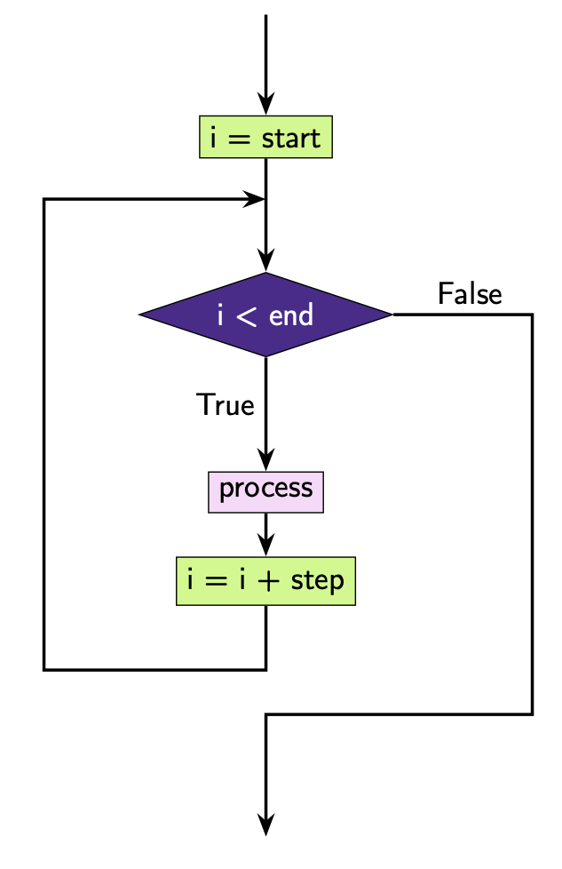

.. role:: python(code)
   :language: python

Range
=====

When using ``for`` loops, you have seen that we typically loop through a list. We can automatically create lists of sequential values using the ``range()`` function. The ``range()`` function creates an iterable with a specific set of numbers.

The structure of the ``range()`` function is:

.. code-block:: text

   range(end)

.. code-block:: text
   
   range(start, end)

.. code-block:: text
   
   range(start, end, step_size)

.. info:: The start value is *included* while the end value is *excluded* and the *start*, *end*, and *step_size* must be *integers*.

To see exactly what the ``range()`` function produces, it's easiest to convert the result to a list using the ``list()`` function. Let's see some examples.

**Example** ``range(end):`` end value is specified. By default, ``range()`` will start at 0, and count up in steps of 1 to the end value, but does not include the end value.

.. exec_code::
    :language: python

    print(list(range(3)))

**Example** ``range(start, end):`` start and end value is specified. ``range()`` will start at the specified start value, and count up in steps of 1 to the end value, but does not include the end value.

.. exec_code::
    :language: python

    print(list(range(2, 5)))

**Example** ``range(start, end, step):`` start and end value is specified.  ``range()`` will start at the specified start value, and count up by the specified step to the end value, but does not include the end value.

.. exec_code::
    :language: python

    print(list(range(6, 15, 3)))

You can also specify a *negative* step, which means range will count down. The same rules apply as previously in that ``range()`` will start at the specified start value, and count *down* by the specified step to the end value, but does not include the end value.

.. exec_code::
    :language: python

    print(list(range(10, 2, -2)))

Here is an example of what ``range()`` might look like in a ``for`` loop.

.. exec_code::
    :language: python

    for i in range(5):
        print(i)

Note that this is effectively the same as

.. exec_code::
    :language: python

    for i in [0, 1, 2, 3, 4]:
        print(i)

or

.. exec_code::
    :language: python

    i = 0
    while i < 5:
        print(i)
        i = i + 1

Since we know what values the iteration variable will take in a ``for`` loop using range (we know the **start**, the **end** and **step**), we can represent it using a flow chart similar to how we draw flowcharts for while loops.

.. dropdown:: Question 1
    :open:
    :color: info
    :icon: question

    What do you think the output of the following code will be?

    .. code-block:: python

        print(list(range(5, 11)))

    A. 

     .. code-block:: python

        [5, 6, 7, 8, 9, 10, 11]

    B. 

     .. code-block:: python

        [5, 6, 7, 8, 9, 10]

    C. 

     .. code-block:: python

        [6, 7, 8, 9, 10, 11]

    D. 

     .. code-block:: python

        [0, 1, 2, 3, 4, 5, 6, 7, 8, 9, 10, 11]

    .. dropdown:: Solution
        :class-title: sd-font-weight-bold
        :color: dark

        Recall that ``range(start, end, step)`` means ``range()`` will start at the specified start value, and count up by the specified step to the end value, but does not include the end value. This means we'll start at 5 and count up to but not include 11.

.. dropdown:: Question 2
    :open:
    :color: info
    :icon: question

    Rewrite the following code using ``range()``.

    .. code-block:: python

        total = 0

        for i in [1, 3, 5, 7, 9, 11, 13, 15, 17, 19]:
            total = total + i
        print(total)

    .. dropdown:: :material-regular:`lock;1.5em` Solution
      :class-title: sd-font-weight-bold
      :color: dark

      *Solution is locked*

.. dropdown:: Question 3
    :open:
    :color: info
    :icon: question

    Which of the following are equivalent to ``range(0, 5, 1)``? *Select all that apply*.

    A. 

     .. code-block:: python

        [0, 1, 2, 3, 4, 5]

    B. 

     .. code-block:: python

        range(0, 5)

    C. 

     .. code-block:: python

        range(5, 1)

    D. 

     .. code-block:: python

        list(range(5)

    .. dropdown:: :material-regular:`lock;1.5em` Solution
      :class-title: sd-font-weight-bold
      :color: dark

      *Solution is locked*

.. dropdown:: Question 4
    :open:
    :color: info
    :icon: question

    What do you think the output of the following code will be?

    .. code-block:: python

        for i in range(3):
            print('Hello!')

    A. 

     .. code-block:: python

        1 Hello!
        2 Hello!
        3 Hello!

    B. 

     .. code-block:: python

        0 Hello!
        1 Hello!
        2 Hello!

    C. 

     .. code-block:: python

        Hello!
        Hello!
        Hello!

    D. 

     .. code-block:: python

        Hello!

.. dropdown:: Question 5
    :open:
    :color: info
    :icon: question

    Given the following list

    .. code-block:: python

        musicals = ['Wicked', 'Les Miserables', 'Hamilton', 'Cats', 'Phantom of the Opera']

    Write a ``for`` loop that will result in the following output

    .. code-block:: text

        1. Wicked
        2. Les Miserables
        3. Hamilton
        4. Cats
        5. Phantom of the Opera

    .. dropdown:: :material-regular:`lock;1.5em` Solution
      :class-title: sd-font-weight-bold
      :color: dark

      *Solution is locked*

.. dropdown:: Code challenge: Count Up
    :color: warning
    :icon: star

    Write a program that reads in an integer, and counts from 0 up to that integer. Your program should use a for loop.

    **Example 1**

    .. code-block:: text

        Enter a number: 3
        0
        1
        2
        3

    **Example 2**

    .. code-block:: text
        
        Enter a number: 5
        0
        1
        2
        3
        4
        5

    .. dropdown:: :material-regular:`lock;1.5em` Solution
      :class-title: sd-font-weight-bold
      :color: dark

      *Solution is locked*