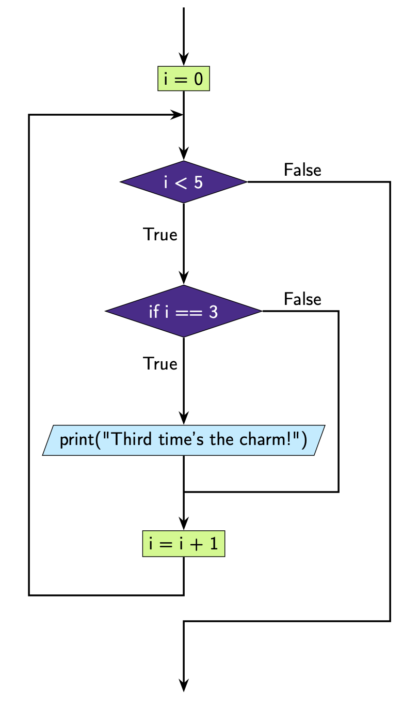
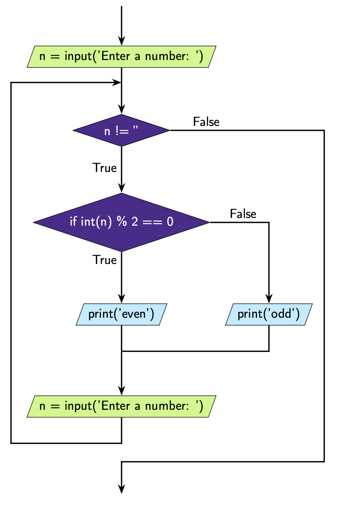

.. role:: python(code)
   :language: python

While Loops With Conditionals
=============================

So far the loops we have looked at have had simple blocks of code inside the loop, i.e. the blocks that were being repeated were quite simple. What you'll see is that the code inside the loop can be as complicated as you'd like. For example, we can add conditionals inside the loop.

Here's an example with an ``if`` statement.

.. exec_code::
    :language: python

    i = 0

    while i < 5:
        print(i)
        if i == 3:
            print("Third time's the charm!")
        i = i + 1

**What's happening here?**

We can see that the condition we have set for our while loop is ``i < 5``. 

At the **first** iteration ``i = 0``. This means the loop condition is ``True``. We execute the code block: 

.. code-block:: python

    print(i)
    if i == 3:
        print("Third time's the charm!")
    i = i + 1

This means that we output:

.. code-block:: python

    0

Then since the condition ``i == 3`` is ``False``, we increment ``i`` and move onto the next iteration.

At the **second** iteration ``i = 1``. This means the loop condition is ``True``. Again, we execute the code block and we output:

.. code-block:: python

    1

Then since the condition ``i == 3`` is ``False``, we increment ``i`` and move onto the next iteration.

At the **third** iteration ``i = 2``. This means the loop condition is ``True``. Again, we execute the code block and we output:

.. code-block:: python

    2

Then since the condition ``i == 3`` is ``False``, we increment ``i`` and move onto the next iteration.

At the **fourth** iteration ``i = 3``. This means the loop condition is ``True``. Again, we execute the code block and we output:

.. code-block:: python

    3

This time the condition ``i == 3`` is ``True``, so we also output:

.. code-block:: python

    Third time's the charm!

We increment ``i`` and move onto the next iteration.

At the **fifth** iteration ``i = 4``. This means that the loop condition is ``True``. Again, we execute the code block and we output:

.. code-block:: python

    4

Then since the condition ``i == 3`` is ``False``, we increment ``i`` and move onto the next iteration.

At the sixth iteration ``i = 5``. This means that the loop condition is ``False``. We do not execute the code block.

This is how we can represent this code diagrammatically.

Note that there are *two* ``False`` routes running down the right hand side of the figure. This means that there should be *two* levels of indentation in the code.

Here's an example of an ``if``-``else`` statement inside a loop using ``input()``.

.. code-block:: python

    n = input('Enter a number: ')

    while n != '':
        if int(n) % 2 == 0:
            print('even')
        else:
            print('odd')
        n = input('Enter a number: ')

What you'll notice with this loop is that this loop is going to keep asking the user for a number. With each number, the program will check whether ``int(n) % 2 == 0``, i.e. checks whether the number is even or not. If the number is even the program will output:

.. code-block:: text

    even

otherwise it will output:

.. code-block:: text

    odd

This program will keep going until the user enters an empty string. 

Again there are *two* ``False`` routes running down the right hand side of the figure, which corresponds to *two* levels of indentation in the code.

.. dropdown:: Question 1
    :open:
    :color: info
    :icon: question

    Will the following two programs produce the same output?

    **Program 1**

    .. code-block:: python

        i = 0
        while i < 100:
            print(i)
            i = i + 10

    **Program 2**

    .. code-block:: python

        i = 0
        while i < 100:
            if i%10 == 0:
                print(i)
            i = i + 1

    .. dropdown:: Solution
        :class-title: sd-font-weight-bold
        :color: dark

        Let's look at **Program 1**. This program is going start at ``i = 0`` and then at each iteration ``i`` will increase by ``10`` since we update ``i`` with ``i = i + 10``. Since we print each value of ``i``, we get the output:

        .. code-block:: text

            0
            10
            20
            30
            40
            50
            60
            70
            80
            90

        Note that we don't print 100 because when ``i = 100`` the ``while`` condition is ``False``, the code block inside the loop doesn't run and we exit the program.

        Now let's look at **Program 2**. This program is going start at ``i = 0`` and then at each iteration ``i`` will increase by 1 since we update i with i = i + 1. This means we'll run the loop 100 times (from i = 0, ..., 99). Inside the loop we have the code block

        .. code-block:: python

            if i%10 == 0:
                print(i)
            i = i + 1
            
        This means that at each iteration we check to see whether ``i`` is divisible by 10 and if it is, we ``print(i)``. This means we get the output:

        .. code-block:: text

            0
            10
            20
            30
            40
            50
            60
            70
            80
            90

        Thus, the output of program 1 and program 2 are the same even though the code is different!

        .. image:: img/5_question1.png
            :width: 700
            :align: center

        Note that program 1 has *one* ``False`` route running down the right hand side of the figure and program 1 only has *one* level of indentation. Program 2 has *two* False routes running down the right hand side of the figure and program 2 has *two* levels of indentation.

.. dropdown:: Question 2
    :open:
    :color: info
    :icon: question

    What do you think the output of the following will be?

    .. code-block:: python

        cars = ['red', 'white', 'blue', 'white', 'blue', 'green', 'red', 'blue']

        count = 0

        i = 0
        while i < len(cars):
            if cars[i] == 'blue':
                count = count + 1
            i = i + 1

        print(count)

    .. dropdown:: :material-regular:`lock;1.5em` Solution
      :class-title: sd-font-weight-bold
      :color: dark

      *Solution is locked*

.. dropdown:: Question 3
    :open:
    :color: info
    :icon: question

    What is wrong with the following code?

    .. code-block:: python

        n = int(input())

        while n != '':
            if n%3 == 0:
                print('divisible by 3')
            n = int(input())

    A. The indentation on ``line 6`` does not match the indentation on ``line 5``.

    B. ``n`` is not an integer, which means ``n%3`` in ``line 4`` results in a **TypeError** as you cannot take the modulus of a string.

    C. To exit the loop the user needs to enter a blank lint, but this will result in a **ValueError** on ``line 1`` or ``line 6`` as you cannot convert an empty string to an integer.

    D. The code will result in an infinite loop

    .. dropdown:: :material-regular:`lock;1.5em` Solution
      :class-title: sd-font-weight-bold
      :color: dark

      *Solution is locked*

.. dropdown:: Question 4
    :open:
    :color: info
    :icon: question

    We want to write a program that will read integers from a user and if the integer is divisible by 3 the program will output

    .. code-block:: text

        divisible by 3
    
    otherwise the program will do nothing.

    The program will terminate only if the user doesn't provide input, e.g. enters an empty string.

    An example of how this program might run is shown below with user input shown in bold.

    .. code-block:: text

        4
        8
        9
        divisible by 3
        12
        divisible by 3

    Our first attempt at the code did not work:

    .. code-block:: python

        n = int(input())

        while n != '':
            if n%3 == 0:
                print('divisible by 3')
            n = int(input())

    Write a new program that fixes the error in our first attempt.

    .. dropdown:: :material-regular:`lock;1.5em` Solution
      :class-title: sd-font-weight-bold
      :color: dark

      *Solution is locked*

.. dropdown:: Question 5
    :open:
    :color: info
    :icon: question

    Implement the algorithm illustrated in the diagram below in Python

    .. image:: img/5_question5.png
        :width: 300
        :align: center

    
    .. dropdown:: :material-regular:`lock;1.5em` Solution
      :class-title: sd-font-weight-bold
      :color: dark

      *Solution is locked*

.. dropdown:: Code challenge: Odd Numbers
    :color: warning
    :icon: star

    You have been provided with a list called ``numbers``.

    .. code-block:: python

        numbers = [5, 12, 39, 45, 2, 61, 22, 49, 50, 73, 11, 84, 32, 40, 18, 39, 85, 16, 14, 49, 99, 68, 57, 35, 66]
   
    Write a program that loops through the lists and sums all the odd numbers. Print your result.

    .. dropdown:: :material-regular:`lock;1.5em` Solution
      :class-title: sd-font-weight-bold
      :color: dark

      *Solution is locked*