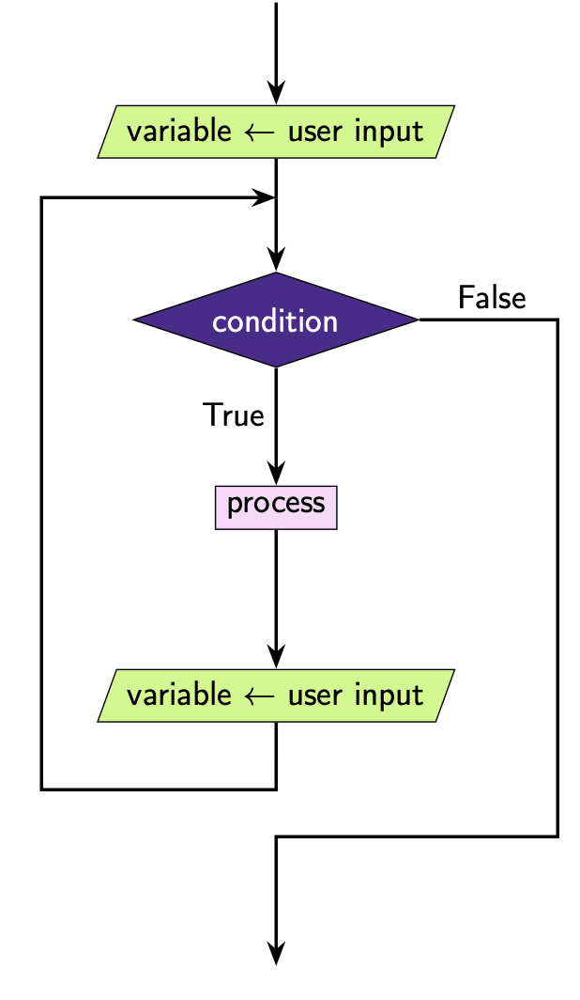
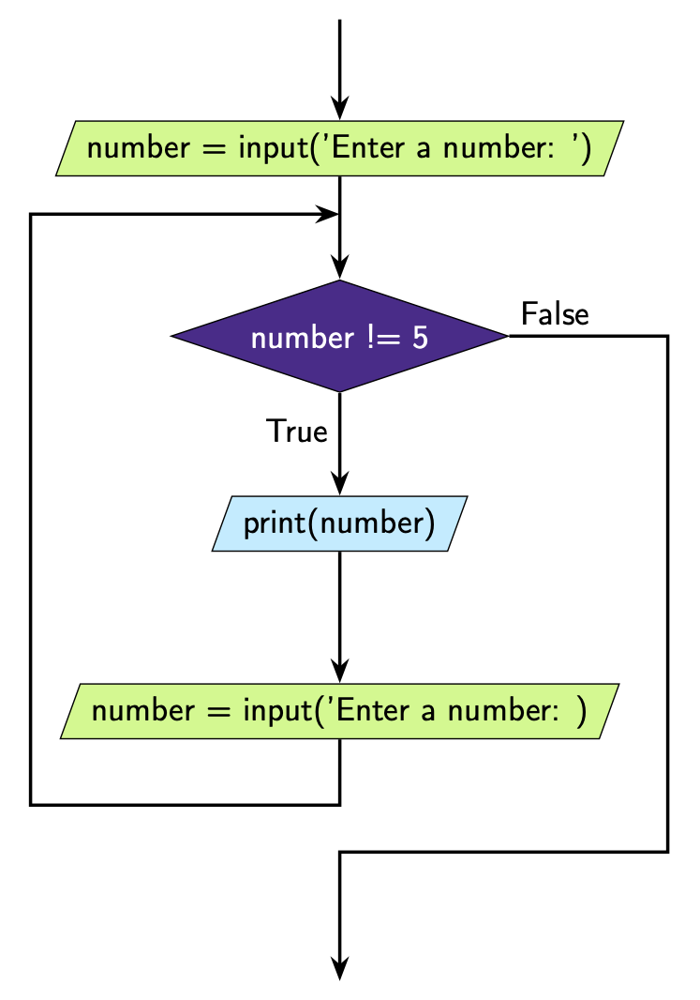

While Loops With Input
======================

It is often useful to use a ``while`` loop to request information from a user *until*
they enter a specific string that will cause the loop to terminate.

It's important to note that this time the variable we check in our loop is obtained via
``input()``. This means we represent it with a **parallelogram** in our flowchart.

Here is an example.

.. code-block:: python

    number = input("Enter a number: ")

    while number != "5":
        print(number)
        number = input("Enter a number: ")

What you'll notice is that each time you enter a number, the program will repeat that
number unless that number is 5. If the user enters a 5, the condition ``number != 5`` is
``False`` and the loop terminates.

This is how we can represent this code diagrammatically.

Note that it looks a little different to our previous diagrams. The main difference are:

- We aren't iterating through a series of sequential values. The user decides what the
  next value of number will be.
- The condition we are checking is that ``number`` *is not* a specific value (in this
  case ``number`` is not 5).
- ``number`` is not actually a number at all it's a string!

A very common string to terminate on is the empty string ``''``, i.e. the program will
terminate if the user presses enter without giving any other input.

.. code-block:: python

    number = input("Enter a number: ")

    while number != "":
        print(number)
        number = input("Enter a number: ")

.. dropdown:: Question 1
    :open:
    :color: info
    :icon: question

    What's wrong with the following code snippet?

    .. code-block:: python

       colour = input('Enter a colour: ')

       while colour != 'blue':
          print(colour)

       print("That's my favourite colour!")

    A. This will result in a **NameError** because colour is not defined.

    B. This will result in a **SyntaxError** because ``!=`` is not a valid comparison operator

    C. This will result in a **ValueError** as the ``!=`` operator only works for integers

    D. The code will result in an infinite loop if the user enters a colour that is not blue because colour is never updated.

    .. dropdown:: Solution
       :class-title: sd-font-weight-bold
       :color: dark

       Let's trace through this example. We'll assume the user inputs the colour **red**.

       We can see that the condition we have set is that ``colour != 'blue'``.

       The first input the user gives is red, so ``colour = 'red'``. This means the condition is ``True`` and we execute the code block which means we ``print(colour)`` and we get

       .. code-block:: python

          red

       Next we start the loop again, but since colour is not updated, we still have  ``colour = 'red'``. This means the condition is ``True`` and we execute the code block which means we ``print(colour)`` and we get

       .. code-block:: python

          red

       As you can see, we'll continue printing *red* indefinitely. If you look at the diagram you'll see that the variable update step is missing from the body of the loop.

       .. image:: img/4_question1.png
          :width: 280
          :align: center

.. dropdown:: Question 2
    :open:
    :color: info
    :icon: question

    Construct a while loop the asks the user to Enter a word and terminates if the user enters the word *stop*. When the program terminates it should say *Program has stopped*.

    An example of how this program might run is shown below with user input shown in bold.

    .. code-block:: text

       Enter a word: full
       Enter a word: non
       Enter a word: door
       Enter a word: stop
       Program has stopped

    .. dropdown:: :material-regular:`lock;1.5em` Solution
       :class-title: sd-font-weight-bold
       :color: dark

       *Solution is locked*

.. dropdown:: Question 3
    :open:
    :color: info
    :icon: question

    Suppose you ran the following code.

    .. code-block:: python

       print('Guess a number between 1 and 10')
       guesses = 1

       n = input()
       while n != '2':
          guesses = guesses + 1
          n = input()

       print('Correct! That took you {} guess(es)!'.format(guesses))

    The user guesses the values **4**, **9** and then **2**. What would the output of this program look like (including the lines containing user input).

    .. dropdown:: :material-regular:`lock;1.5em` Solution
       :class-title: sd-font-weight-bold
       :color: dark

       *Solution is locked*

.. dropdown:: Code challenge: Echo Forever
    :color: warning
    :icon: star

    Write a program that echoes back everything the user says, but stops as soon as the user stops saying things (i.e. they press enter).

    **Example 1**

    .. code-block:: text

       Hello
       Hello
       How are you?
       How are you?

    **Example 2**

    .. code-block:: text

       The weather is nice today.
       The weather is nice today.
       Don't you think?
       Don't you think?
       Yes I do.
       Yes I do.

    .. hint:: You can check whether a user hasn't provided any input by comparing the input to an empty string ``''``. The condition you will want to use is: ``!= ''``

    .. dropdown:: :material-regular:`lock;1.5em` Solution
       :class-title: sd-font-weight-bold
       :color: dark

       *Solution is locked*

.. dropdown:: Code challenge: Add To The List
    :color: warning
    :icon: star

    Write a program that asks the user what they need to buy. The program should continuously read in each item the user needs to buy and add it to a Python list, stopping as soon as the user enters a blank line. The program should print out the resultant list.

    **Example 1**

    .. code-block:: text

       What do you need to buy?
       apples
       oranges

       ['apples', 'oranges']

    **Example 2**

    .. code-block:: text

       What do you need to buy?
       pears
       pineapples
       peaches
       papayas
       passionfruits

       ['pears', 'pineapples', 'peaches', 'paypayas', 'passionfruits']

.. dropdown:: Code challenge: What Is The Password?
    :color: warning
    :icon: star

    Write a program that asks the user to enter a password. If the password is in the list of passwords, the program should say *Welcome back!*. If the password is not in the list, it should say *Not a valid password*. While the password is invalid, the program should keep asking the user to enter a password.

    The examples given use the following password list:

    .. code-block:: text

       passwords = ['open sesame', 'password', '12345']

    **Example**

    .. code-block:: text

       Enter password: apple
       Not a valid password.
       Enter password: orange
       Not a valid password.
       Enter password: pear
       Not a valid password.
       Enter password: 12345
       Welcome back!

    .. hint:: Python has the keywords in and not in which can be used to check if a word is in a list or not.

    .. exec_code::
       :language: python

       animals = ['python', 'quokka', 'zebra']
       print('quokka' in animals)
       print('snake' not in animals)

    .. dropdown:: :material-regular:`lock;1.5em` Solution
       :class-title: sd-font-weight-bold
       :color: dark

       *Solution is locked*
