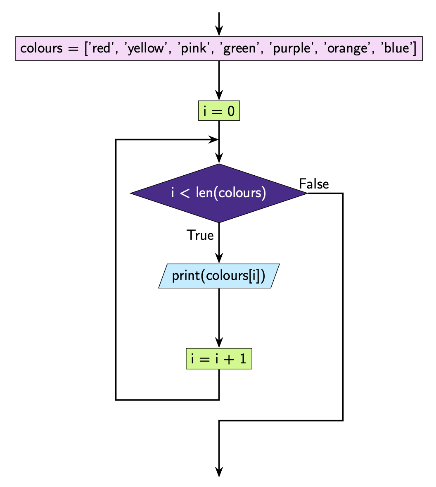

While Loops With Lists
======================

It's often useful to use a loop to iterate through a list. Suppose you had the
following list of colours. You can print out each colour using the following
code:

.. code-block:: python

    colours = ["red", "yellow", "pink", "green", "purple", "orange", "blue"]

    print(colours[0])
    print(colours[1])
    print(colours[2])
    print(colours[3])
    print(colours[4])
    print(colours[5])
    print(colours[6])

What you'll have noticed is that the code is quite *repetitive*. If you ever
see code that is repetitive, it often means it can be replaced by a loop! Have
a look at the example below.

*Recall that ``len()`` tells you the number of elements in the given list. In
this case is ``len(colours)`` is 7.*

.. code-block:: python

    colours = ["red", "yellow", "pink", "green", "purple", "orange", "blue"]

    i = 0
    while i < len(colours):
        print(colours[i])
        i = i + 1

.. dropdown:: Question 1
    :open:
    :color: info
    :icon: question

    What do you think the output of the following will be?

    .. code-block:: python

       numbers = ['one', 'two', 'three', 'four', 'five']

       i = len(numbers) - 1
       while i >= 0:
          print(numbers[i])
          i = i - 1

    .. dropdown:: Solution
       :class-title: sd-font-weight-bold
       :color: dark

       Let's trace through this code.

       ``len(numbers)`` gives us the number of elements in the list ``numbers``, which in this case is 5. This means that initially ``i`` is 4 since ``i = len(numbers - 1)``.

       We can also see that the condition we have set for our ``while`` loop is ``i > 0``.

       At the **first** iteration ``i = 4``. This means the condition is ``True``. We execute the code block:

       .. code-block:: python

          print(numbers[i])
          i = i - 1

       This means that we output ``numbers[4]``:

       .. code-block:: python

          five

       At the **second** iteration ``i = 3``. This means the condition is ``True``. Again, we execute the code block and we output ``numbers[3]``:

       .. code-block:: python

          four

       At the **third** iteration ``i = 2``. This means that the condition is ``True``. Again, we execute the code block and we output ``numbers[2]``:

       .. code-block:: python

          three

       At the **fourth** iteration ``i = 1``. This means that the condition is ``True``. Again, we execute the code block and we output ``numbers[1]``:

       .. code-block:: python

          two

       At the fifth iteration ``i = 0``. This means that the condition is ``True``. Again, we execute the code block and we output ``numbers[0]``:

       .. code-block:: python

          one

       At the sixth iteration ``i = -1``. This means that the condition is ``False``. We do not execute the code block.

       .. image:: img/3_question1.png
          :width: 400
          :align: center

.. dropdown:: Question 2
    :open:
    :color: info
    :icon: question

    What do you think the output of the following will be?

    .. code-block:: python

       numbers = ['one', 'two', 'three', 'four', 'five']
       new_list = []

       i = len(numbers) - 1
       while i >= 0:
          new_list.append(numbers[i])
          i = i - 1

       print(new_list)

    A.

     .. code-block:: python

       ['five', 'four', 'three', 'two', 'one']

    B.

     .. code-block:: python

       ['four', 'three', 'two', 'one']

    C.

     .. code-block:: python

       ['one', 'two', 'three', 'four', 'five']

    D.

     .. code-block:: python

       ['two', 'three', 'four', 'five']

    .. dropdown:: :material-regular:`lock;1.5em` Solution
       :class-title: sd-font-weight-bold
       :color: dark

       *Solution is locked*

.. dropdown:: Question 3
    :open:
    :color: info
    :icon: question

    What do you think the output of the following will be?

    .. code-block:: python

       fruits = ['apple', 'banana', 'cherry', 'date', 'eggplant', 'fig', 'grape']

       i = 0
       while i <= len(fruits):
          print(fruits[i])
          i = i + 2

    .. dropdown:: :material-regular:`lock;1.5em` Solution
       :class-title: sd-font-weight-bold
       :color: dark

       *Solution is locked*

.. dropdown:: Question 4
    :open:
    :color: info
    :icon: question

    What do you think the output of the following will be?

    .. code-block:: python

       numbers = [5, 3, 8, -3, 0, 2]

       total = 0

       i = 0
       while i < len(numbers):
          total = total + numbers[i]
          i = i + 1

       print(total)

    .. dropdown:: :material-regular:`lock;1.5em` Solution
       :class-title: sd-font-weight-bold
       :color: dark

       *Solution is locked*

.. dropdown:: Question 5
    :open:
    :color: info
    :icon: question

    Rewrite the following code using a while loop.

    .. code-block:: python

       symbols = ['@', '%', '#', '+', '^']

       print(symbols[0])
       print(symbols[0] + symbols[0] + symbols[0])
       print(symbols[1])
       print(symbols[1] + symbols[1] + symbols[1])
       print(symbols[2])
       print(symbols[2] + symbols[2] + symbols[2])
       print(symbols[3])
       print(symbols[3] + symbols[3] + symbols[3])
       print(symbols[4])
       print(symbols[4] + symbols[4] + symbols[4])

    .. dropdown:: :material-regular:`lock;1.5em` Solution
       :class-title: sd-font-weight-bold
       :color: dark

       *Solution is locked*

.. dropdown:: Code challenge: All the numbers!
    :color: warning
    :icon: star

    You have been provided with a list of numbers.

    .. code-block:: python

       numbers = [58, 67, 48, 12, 67, 88, 50, 54, 13, 46, 89, 98, 27, 13, 83]

    Write a program that prints out each of these numbers on a new line and at the end says That's all the numbers!

    The output of your program should look like this:

    .. code-block:: text

       58
       67
       48
       ...
       13
       83
       That's all the numbers!

    .. note::

       The ... indicates that there are more numbers that are just not shown in the example. Here we only show the first 3 lines and last 3 lines of output.

    .. dropdown:: :material-regular:`lock;1.5em` Solution
       :class-title: sd-font-weight-bold
       :color: dark

       *Solution is locked*
