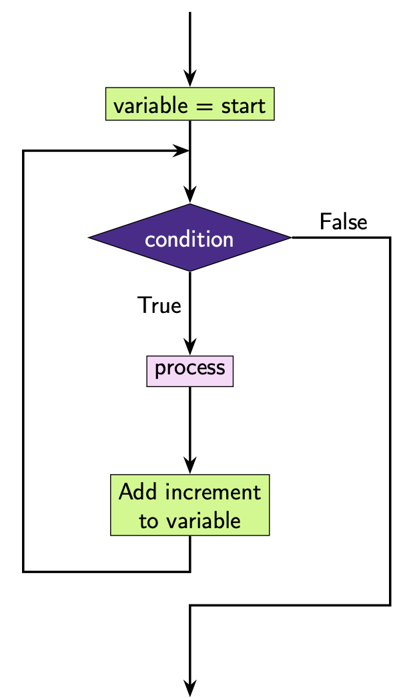

.. role:: python(code)
   :language: python

While Loops
===========

While loops can be used to repeat code.

The structure of a ``while`` loop is:

.. code-block:: text
   
	while condition:
		# code that executes while condition is true

Here is an example:

.. exec_code::
    :language: python

    i = 0
    while i < 3:
        print(i)
        i = i + 1 # increment i by 1

.. note::

    Another way you can increment ``i`` by 1 is using ``i += 1``. This is equivalent to ``i = i + 1``. Similarly you can decrease ``i`` by 1 using ``i -= 1``, which is equivalent to ``i = i - 1``. Actually the ``+=`` and ``-=`` notation will work for any number ``i += 3`` increase ``i`` by 3 and ``i -= 5`` decrease ``i`` by 5. 

**What's happening here?**

We can see that the condition we have set for our while loop is ``i < 3``. 

At the **first** iteration ``i = 0``. This means the condition is ``True``. We execute the code block: 

.. code-block::
    
    print(i)
    i = i + 1

This means that we output:

.. code-block::

    0

At the **second** iteration ``i = 1``. This means the condition is ``True``. Again, we execute the code block and we output:

.. code-block::
    
    1

At the  **third** iteration ``i = 2``. This means that the condition is ``True``. Again, we execute the code block and we output:

.. code-block::
    
    2

At the **fourth** iteration ``i = 3``. This means that the condition is ``False``. We do not execute the code block.

This is how we can represent this code diagrammatically.

Here ``i = 0`` and ``i = i + 1`` are **processes** that are happening within the program but aren't being shown to the user. This means we represent these with **rectangles** in the flowchart. The ``print`` statement results in **output** to the user so we represent it with a **parallelogram**. Here we colour the processes related to ``i`` in **green** to identify it as the variable related to the loop, but the colouring is non-standard and most of the time these diagrams will be shown in black and white.

Note that we don't always have to increment by 1 and we don't always have to start at ``i = 0``. For example, we might want to print out all the odd numbers less than 10. We can do so with the following.

.. exec_code::
    :language: python

    i = 1
    while i < 10:
        print(i)
        i = i + 2 # increment i by 2

**What's happening here?**

We can see that the condition we have set for our while loop is ``i < 10``. 

At the **first** iteration ``i = 1``. This means the condition is ``True``. We execute the code block: 

.. code-block::

    print(i)
    i = i + 2

This means that we output:

.. code-block::
    
    1

At the **second** iteration ``i = 3``. This means the condition is ``True``. Again, we execute the code block and we output:

.. code-block::

    3

At the  **third** iteration ``i = 5``. This means that the condition is ``True``. Again, we execute the code block and we output:

.. code-block::

    5

At the **fourth** iteration ``i = 7``. This means that the condition is ``True``. Again, we execute the code block and we output:

.. code-block::
    
    7

At the **fifth** iteration ``i = 9``. This means that the condition is ``True``. Again, we execute the code block and we output:

.. code-block::
    
    9

At the **sixth** iteration ``i = 11``. This means that the condition is ``False``. We do not execute the code block. 
    
This is how we can represent this code diagrammatically.

.. dropdown:: Question 1
    :open:
    :color: info
    :icon: question

    What do you think the output of the following will be?

    .. code-block::
    
        i = 0
        while i < 3:
            print('hello!')
            i = i + 1

    
    A. 

     .. code-block:: text

        1
        2
        3

    B. 

     .. code-block:: text

        hello!
        hello!
        hello!

    C. 

     .. code-block:: text

        1 hello!
        2 hello!
        3 hello!

    D. 

     .. code-block:: text

        1
        hello!
        2
        hello!
        3
        hello!

    .. dropdown:: Solution
        :class-title: sd-font-weight-bold
        :color: dark

        **B.**

        Earlier we saw this example:

        .. exec_code::
            :language: python

            i = 0
            while i < 3:
                print(i)
                i = i + 1 # increment i by 1

        The code snippet from this question is similar to the above example except that instead of ``print(i)``, we have ``print('hello!')``. This means that *hello!* gets printed 3 times.

        .. exec_code::
            :language: python

            i = 0
            while i < 3:
                print('hello!')
                i = i + 1

        .. image:: img/1_question1.png
            :width: 230
            :align: center

.. dropdown:: Question 2
    :open:
    :color: info
    :icon: question

    What do you think the output of the following will be?

    .. code-block::
    
        i = 3

        while i > 0:
            print('{} times 5 is'.format(i))
            print(i*5)
            i = i - 1
        print('Done!')

    
    A. 

     .. code-block:: text

        i times 5 is
        1
        i times 5 is
        2
        i times 5 is
        3
        Done!

    B. 

     .. code-block:: text

        1 times 5 is 5
        2 times 5 is 10
        3 times 5 is 15
        Done!

    C. 

     .. code-block:: text

        3 times 5 is
        15
        Done!
        2 times 5 is
        10
        Done!
        1 times 5 is
        5
        Done!

    D. 

     .. code-block:: text

        3 times 5 is
        15
        2 times 5 is
        10
        1 times 5 is
        5
        Done!

    .. dropdown:: :material-regular:`lock;1.5em` Solution
        :class-title: sd-font-weight-bold
        :color: dark

        *Solution is locked*

.. dropdown:: Question 3
    :open:
    :color: info
    :icon: question

    Implement the algorithm illustrated in the diagram below in Python

    .. image:: img/1_question3.png
        :width: 250
        :align: center

    .. dropdown:: :material-regular:`lock;1.5em` Solution
        :class-title: sd-font-weight-bold
        :color: dark

        *Solution is locked*

.. dropdown:: Question 4
    :open:
    :color: info
    :icon: question

    Construct a while loop that will result in the following output

    .. code-block:: text

        30
        33
        36
        39
    
    .. dropdown:: :material-regular:`lock;1.5em` Solution
        :class-title: sd-font-weight-bold
        :color: dark

        *Solution is locked*

.. dropdown:: Question 5
    :open:
    :color: info
    :icon: question

    Will the following two programs produce the same output?

    **Program 1**

    .. code-block:: python

        i = 0
        while i < 5:
            print(-i)
            i = i + 1

    **Program 2**

    .. code-block:: python

        i = 0
        while i > -5:
            print(i)
            i = i - 1

    .. dropdown:: :material-regular:`lock;1.5em` Solution
        :class-title: sd-font-weight-bold
        :color: dark

        *Solution is locked*

.. dropdown:: Question 6
    :open:
    :color: info
    :icon: question

    What do you think the output of the following will be?

    .. code-block:: python

        i = 1
        while i < 100:
            print(i)
            i = 3*i

    A. 

     .. code-block:: text

        1
        3
        9
        27
        81

    B. 

     .. code-block:: text

        3

    C. 

     .. code-block:: text

        1
        3
        9
        12
        ...
        99

    D. 

     .. code-block:: text

        1
        33
        66
        99

    .. dropdown:: :material-regular:`lock;1.5em` Solution
        :class-title: sd-font-weight-bold
        :color: dark

        *Solution is locked*

.. dropdown:: Question 7
    :open:
    :color: info
    :icon: question

    What do you think the output of the following will be?

    .. code-block:: python

        count = 0

        i = 0
        while i < 25:
            count = count + 1
            i = i + 3
            
        print(count)

    .. dropdown:: :material-regular:`lock;1.5em` Solution
        :class-title: sd-font-weight-bold
        :color: dark

        *Solution is locked*