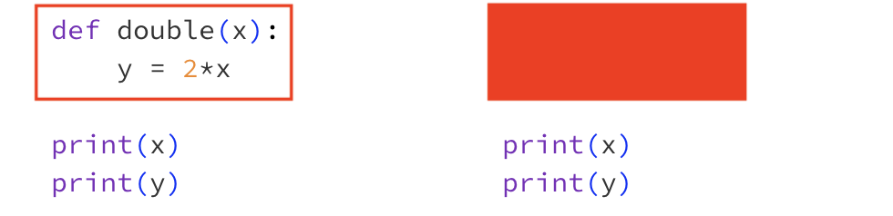

.. role:: python(code)
   :language: python

Function Scope
==============

Variables defined inside a function are only available within the function. This principle is know as the **scope** of the function and the variable exists in the **local scope** of that function. If a variable is used outside the scope in which it was defined, Python will throw a ``NameError``. 

**Example**

Here the variable ``y`` is created inside the function ``double``, this means this variable only exists inside the function and we cannot print ``y`` outside the function. This results in a **NameError** (*a variable of the specified name cannot be found*).

.. code-block:: python

    def double(x):
        y = 2*x

    print(y)

.. code-block:: text

    Traceback (most recent call last):
        File "/home/main.py", line 4, in <module>
            print(y)
                ^
        NameError: name 'y' is not defined

Similarly, ``x`` is only created inside the function, and it also only exists *inside* the function, so we cannot print ``x`` outside the function and we get a **NameError**.

.. code-block:: python

    def double(x):
        y = 2*x

    print(x)

.. code-block:: text

    Traceback (most recent call last):
        File "/home/main.py", line 4, in <module>
            print(x)
                ^
        NameError: name 'x' is not defined

You can visualise this by drawing a box around your functions. Variables that are only defined inside the box cannot be seen outside the box. If it helps, you can make your box opaque to simulate your main program being unable to 'see in' to your function.

Here you can see that to the rest of the program ``x`` and ``y`` don't exist.

Global Scope
------------

While variables created inside functions cannot be seen outside of the function, any variable defined in the main program can still be seen inside the function. An example of where this might be useful is when defining constants. 

**Example**

The function below calculates the speed of an object at time :math:`t` after it has been dropped. The function is able to 'see' ``g``, which stores the acceleration due to gravity since ``g`` is defined *outside* the function.

.. exec_code::
    :language: python

    g = 9.8 # acceleration due to gravity (m/s^2)

    def speed(time):
        return g*time

    print(speed(5))

.. dropdown:: Question 1
    :open:
    :color: info
    :icon: question

    Will the following code cause a **NameError**?

    .. code-block:: python

        def add(x, y):
            s = x + y
            return s

    .. dropdown:: Solution
        :class-title: sd-font-weight-bold
        :color: dark

        No.

        This code does not cause a **NameError** because ``s`` is defined within the local scope of the ``add`` function, and it is used within the same function. 

.. dropdown:: Question 2
    :open:
    :color: info
    :icon: question

    Will the following code cause a **NameError**?

    .. code-block:: python

        x = 10

        def check(x):
            if x < 20:
                return 'yes'
            else:
                return 'no'

        print(x)

    .. dropdown:: Solution
        :class-title: sd-font-weight-bold
        :color: dark

        This code does not cause a **NameError** because ``x`` is defined within the **global** scope of the program, and can be used at all points in the program. You can imagine drawing a box over the function to check what variables the main program can 'see'.

        .. image:: img/scope2.png
            :width: 500
            :align: center

.. dropdown:: Question 3
    :open:
    :color: info
    :icon: question

    What do you expect the output of the following code to be?

    .. code-block:: python

        x = 10

        def check(x):
            if x < 20:
                return 'yes'
            else:
                return 'no'

        print(check(50))

    A. 

     .. code-block:: text

        10

    B. 

     .. code-block:: text

        50

    C. 

     .. code-block:: text

        yes

    D. 

     .. code-block:: text

        no

    .. dropdown:: :material-regular:`lock;1.5em` Solution
        :class-title: sd-font-weight-bold
        :color: dark

        *Solution is locked*

.. dropdown:: Question 4
    :open:
    :color: info
    :icon: question

    What do you expect the output of the following code to be?

    .. code-block:: python

        x = 10

        def check(x):
            if x < 20:
                return 'yes'
            else:
                return 'no'

        check(50)
        print(x)

    A. 

     .. code-block:: text

        10

    B. 

     .. code-block:: text

        50

    C. 

     .. code-block:: text

        yes

    D. 

     .. code-block:: text

        no

    .. dropdown:: :material-regular:`lock;1.5em` Solution
        :class-title: sd-font-weight-bold
        :color: dark

        *Solution is locked*

.. dropdown:: Question 5
    :open:
    :color: info
    :icon: question

    What is the value of ``price`` printed, when this Python code is run?

    .. code-block:: python

        price = 100

        def change_price(new_price):
            price = new_price

        change_price(500)

        print(price)

    A. 100

    B. 500

    C. This code has a **NameError**

    .. dropdown:: :material-regular:`lock;1.5em` Solution
        :class-title: sd-font-weight-bold
        :color: dark

        *Solution is locked*

.. dropdown:: Question 6
    :open:
    :color: info
    :icon: question

    Will the following code cause a **NameError**?

    .. code-block:: python

        a = 10
        b = 2
        c = 3

        def quadratic(x):
            return a * x**2 + b*x + c

        print(A)

    .. dropdown:: :material-regular:`lock;1.5em` Solution
        :class-title: sd-font-weight-bold
        :color: dark

        *Solution is locked*

.. dropdown:: Code challenge: Energy
    :color: warning
    :icon: star

    Write a function to calculate the energy of an object in its rest frame given the mass.

    **Formula**

    :math:`e = mc^2`

    where :math:`c = 299 792 458`` m/s.

    **Function specification**

    * name: ``energy``

    * parameters: ``mass`` (``float``)

    * return: energy (``float``)

    **Example 1**

    .. code-block:: python

        print(energy(100))

    .. code-block:: text
    
        8.987551787368176e+18

    **Example 2**

    .. code-block:: python

        print(energy(0))

    .. code-block:: text

        0.0

    .. dropdown:: :material-regular:`lock;1.5em` Solution
        :class-title: sd-font-weight-bold
        :color: dark

        *Solution is locked*

.. dropdown:: Code challenge: Volume Of A Cylinder
    :color: warning
    :icon: star

    Write a function to calculate the volume of a cylinder. 

    **Formula**

    Volume of a cylinder

    :math:`v = \pi r^2 h`

    where :math:`r` is the radius and :math:`h` is the height. The value of :math:`\pi` can be accessed from the ``math`` module.

    **Function specification**

    * name: ``cylinder_volume``

    * parameters: ``radius`` (``float``), ``height`` (``float``)

    * return: the volume of the cylinder (``float``)

    **Example 1**

    .. code-block:: python

        print(cylinder_volume(2, 10))

    .. code-block:: text

        125.66370614359172

    **Example 2**

    .. code-block:: python

        print(cylinder_volume(5, 5))

    .. code-block:: text

        392.69908169872417

    .. dropdown:: :material-regular:`lock;1.5em` Solution
        :class-title: sd-font-weight-bold
        :color: dark

        *Solution is locked*

.. dropdown:: Code challenge: 8-ball
    :color: warning
    :icon: star

    .. image:: img/8ball.gif
        :width: 320
        :align: center

    A magic 8-ball is a special ball that can help you make a decision. Write a function called ``eight_ball`` that mimics a magic 8-ball by randomly choosing one of the following messages to display.

    **Message 1**

    .. code-block:: text

        Reply hazy, try again

    **Message 2**

    .. code-block:: text
    
        Signs point to yes

    **Message 3**

    .. code-block:: text

        You may rely on it
    
    **Function specification**

    * name: ``eight_ball``

    * parameters:  ``None``

    * return: message (``str``)

    .. dropdown:: :material-regular:`lock;1.5em` Solution
        :class-title: sd-font-weight-bold
        :color: dark

        *Solution is locked*

.. dropdown:: Code challenge: Fibonacci
    :color: warning
    :icon: star

    The Fibonacci sequence is:

    :math:`1, 1, 2, 3, 5, 8, 13, 21, 34, 55, 89, 144, ...`

    The first two terms are defined to be:

    :math:`F_1 = 1, F_2 = 1`

    With all remaining terms defined as:

    :math:`F_n = F_{n-1} + F_{n-2}`

    Write a function called ``fibonacci`` which, when given an integer, :math:`n`, will calculate the :math:`n^{th}` number in the Fibonacci sequence.

    **Function specification**

    * function name: ``fibonacci``

    * parameters: ``n`` (``int``)

    * return: :math:`F_n` (``int``)

    **Example 1**

    .. code-block:: python

        print(fibonacci(6))
    
    .. code-block:: texton

        8

    **Example 2**

    .. code-block:: python

        print(fibonacci(10))
    
    .. code-block:: text

        55