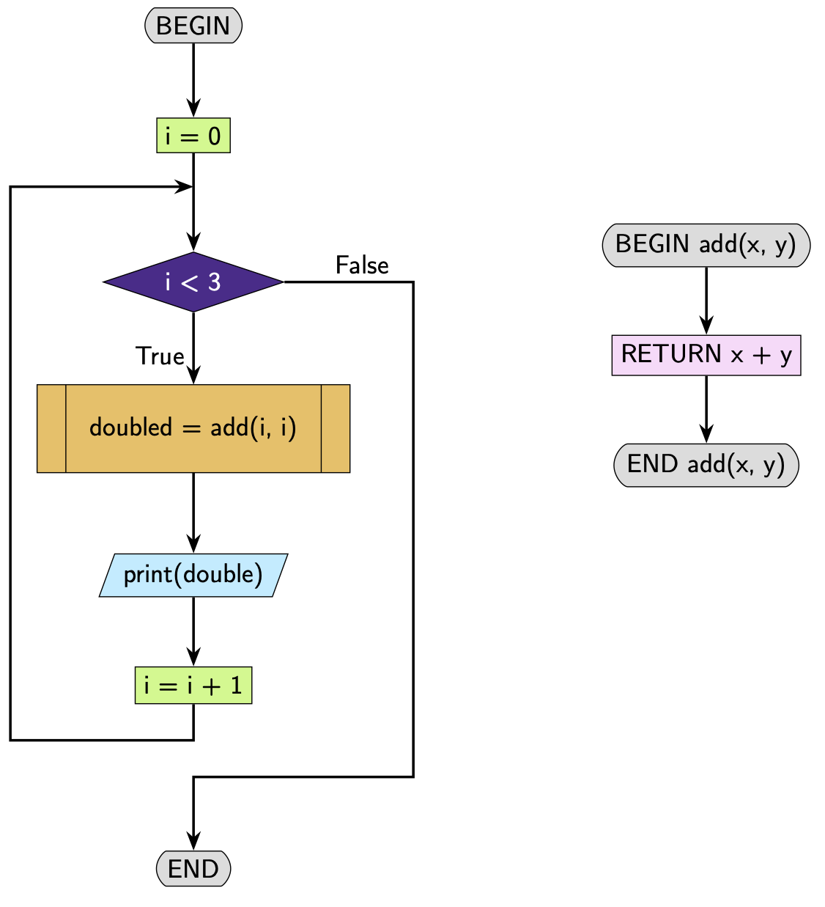

.. role:: python(code)
   :language: python

Pseudocode and Flowcharts
=========================

Pseudocode
----------

When representing a function in pseudocode we use the keywords ``BEGIN`` and ``END`` to indicate the start and end of the function.

.. code-block:: text

    BEGIN function_name
        process
    END function_name

If the function returns a value we use the keyword ``RETURN`` followed by the values that are returned

.. code-block:: text

    RETURN values

Here's an example.

**Python code**

.. code-block:: python

    def add(x, y):
        return x + y

**Pseudocode**

.. code-block:: text

    BEGIN add (x, y)
        RETURN x + y
    END add (x, y)

Once you have the pseudocode for a function, you can use this function in other scripts. For your main script you can simply use ``BEGIN`` and ``END``.

**Python code**

.. code-block:: python

    def add(x, y):
        return x + y

    for i in range(3):
        doubled = add(i, i)
        print(doubled)

**Pseudocode**

.. code-block:: text

    BEGIN
        FOR i = 0 TO 2 STEP 1
            doubled = add(i. i)
            Display doubled
    END

    BEGIN add (x, y)
        RETURN x + y
    END add (x, y)

Flowcharts
----------

We now introduce two new shapes. The terminator and the subprocess.

* **Terminator - oval:** Used to indicate the start and end of a program.

* **Subprocess - bordered rectangle:** Used to refer to another program

Here's an example.

**Python code**

.. code-block:: python

    def add(x, y):
        return x + y

    for i in range(3):
        doubled = add(i, i)
        print(doubled)

**Flow chart**

Note that there are **two** flow charts here. The first shows the main script and the second shows the function ``add()``. The main script refers to the ``add()`` function in the subprocess node.

We have now seen all the flowchart symbols we will need.

Note that the colours are arbitrary and what's important are the shapes.

.. dropdown:: Question 1
    :open:
    :color: info
    :icon: question

    Which of the following programs corresponds to the pseudocode shown below?

    .. code-block:: text

        BEGIN
            my_numbers = [5, -2, 0, 4, 0, -3, -3]
            description = []
            FOR i = 0 TO Length(my_numbers) - 1 STEP 1
                d = sign(my_numbers[i]) 
                Append d to description
            NEXT i
            Display description
        END

        BEGIN sign(x)
            IF x < 0 THEN
                RETURN 'negative'
            ELIF x > 0 THEN
                RETURN 'positive'
            ELSE
                RETURN '0'
        END sign(x)

    A. 

     .. code-block:: python

        def my_numbers(5, -2, 0, 4, 0, -3, -3):
            description = []
            for i in range(len(my_numbers)):
                description.append(my_numbers[i])
            return description

        sign(x)
        if x < 0:
            return 'negative'
        elif x > 0:
            return 'positive'
        else:
            return '0'

    B. 

     .. code-block:: python

        def my_numbers(5, -2, 0, 4, 0, -3, -3):
            description = []
            for i in range(len(my_numbers)):
                description.append(my_numbers[i])
            return description

        def sign(x):
            if x < 0:
                return 'negative'
            elif x > 0:
                return 'positive'
            else:
                return '0'

    C. 

     .. code-block:: python

        def sign(x):
            if x < 0:
                print('negative')
            elif x > 0:
                print('positive')
            else:
                print('0')

        my_numbers = [5, -2, 0, 4, 0, -3, -3]
        description = []
        for i in range(len(my_numbers)):
            description.append(sign(my_numbers[i]))
        print(description)

    D. 

     .. code-block:: python

        def sign(x):
            if x < 0:
                return 'negative'
            elif x > 0:
                return 'positive'
            else:
                return '0'

        my_numbers = [5, -2, 0, 4, 0, -3, -3]
        description = []
        for i in range(len(my_numbers)):
            description.append(sign(my_numbers[i]))
        print(description)

    .. dropdown:: Solution
        :class-title: sd-font-weight-bold
        :color: dark

        A. :octicon:`x-circle;1em;sd-text-danger;` **Incorrect.** In the pseudocode there is a function called ``sign(x)``.  You can tell from the pseudocode because there is a ``BEGIN sign(x)`` and an ``END sign(x)``. There is no ``sign(x)`` function in the python code.

        B. :octicon:`x-circle;1em;sd-text-danger;` **Incorrect.** In the pseudocode there is no function ``my_numbers(5, -2, 0, 4, 0, -3, -3)``. This is a variable created in the main script. You can identify the main script because it has a ``BEGIN`` and ``END`` without a function name. this python code has a function called`` my_numbers``.

        C. :octicon:`x-circle;1em;sd-text-danger;` **Incorrect.** ``sign()`` should contain ``return`` statements, not ``print`` statements. The pseudocode has ``return`` statements.

        D. :octicon:`issue-closed;1em;sd-text-success;` **Correct.**

.. dropdown:: Question 2
    :open:
    :color: info
    :icon: question

    Which of the following flowcharts corresponds to the pseudocode shown below?

    .. code-block:: text

        BEGIN
            my_numbers = [5, -2, 0, 4, 0, -3, -3]
            description = []
            FOR i = 0 TO Length(my_numbers) - 1 STEP 1
                d = sign(my_numbers[i])
                Append d to description
            NEXT i
            Display description
        END

        BEGIN sign(x)
            IF x < 0 THEN
                RETURN 'negative'
            ELIF x > 0 THEN
                RETURN 'positive'
            ELSE
                RETURN '0'
        END sign(x)

    A. 

    .. image:: img/1_question2a.png
        :width: 800
        :align: center

    B. 

    .. image:: img/1_question2b.png
        :width: 800
        :align: center

    .. dropdown:: :material-regular:`lock;1.5em` Solution
        :class-title: sd-font-weight-bold
        :color: dark

        *Solution is locked*

.. dropdown:: Question 3
    :open:
    :color: info
    :icon: question

    Construct the pseudocode that corresponds to the following Python function.

    .. code-block:: python

        def zero_nonzero(number_list):
            zero = 0
            nonzero = 0
            for i in range(len(number_list)):
                if number_list[i] == 0:
                    zero = zero + 1
                else:
                    nonzero = nonzero + 1
            return zero, nonzero

    .. dropdown:: :material-regular:`lock;1.5em` Solution
        :class-title: sd-font-weight-bold
        :color: dark

        *Solution is locked*

.. dropdown:: Question 4
    :open:
    :color: info
    :icon: question

    Write the Python code the corresponds to the given flowchart. 

    .. image:: img/1_question4.png
        :width: 800
        :align: center

    .. dropdown:: :material-regular:`lock;1.5em` Solution
        :class-title: sd-font-weight-bold
        :color: dark

        *Solution is locked*
