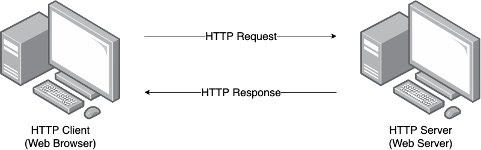
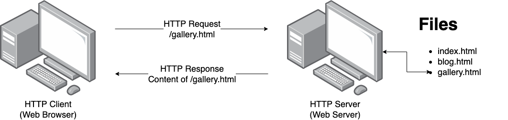

HTTP Introduction
====================

So far, the HTML files we've created are just sitting on the computer we made them on. 
If you wanted to share them with someone, you’d have to send them a copy, like emailing 
the file or putting it on a USB drive. But that means your HTML files are kind of stuck 
on their own, unable to connect with anything else.

To solve this problem, the HTTP protocol was invented. It allows computers to share 
HTML files over a network, like the internet. Thanks to HTTP, your files aren't 
trapped — they can be shared across the web, and hyperlinks can connect pages from 
anywhere in the world. This combination of HTML, hyperlinks, and the internet is what 
we call the "World Wide Web."

HTTP Protocol Overview
----------------------

The Hypertext Transfer Protocol (HTTP) defines a client-server :term:`protocol`` for the 
transmission of HTML (and associated) files over standard internet technology.

The term :term:`client` is interchangably used to mean the user's physicsl device and web 
browser. While the term :term:`server` is interchangably used to refer to the software 
which processes the requests then returns appropriate responses and the physical device 
on which the software is running.

HTTP uses a "request and response" model. Clients send requests for a 
particular resource and the server provides the resource in the body of the 
response message.

    A client requesting a resource from a server.

In general data is exchanged over HTTP in the following steps:

1. server starts and waits for a new TCP connection
2. client establishes a TCP connection with the server
3. client sends a request conforming to HTTP protocol over TCP
4. server processes request
5. server sends a response conforming to HTTP protocol over TCP
6. client and server close the TCP connection

The simplest web server hosts :term:`static` content meaning that it reads the requested 
HTML files and returns them as the response.

A crucial aspect of the HTTP protocol is that it is :term:`stateless`, meaning that each 
request is independent of the others and the requests cannot reference any previous 
requests. However we will see later, that we can add state to our web sites through 
shared information between client and server inside the request data.

HTTP Requests and Responses
---------------------------

Request and response messages are sent as :term:`plain text` but follow a very specific 
format.

Requests
^^^^^^^^^^^^^^^^^^^^

Let's start with an example HTTP request. For example, requesting the 
`Google <https://google.com.au/>`_  homepage in your browser would send the following 
request:

.. code-block:: text

    GET / HTTP/1.1
    Host: www.google.com.au

Let's look at each line:

1.  The request line ``GET / HTTP/1.1`` consists of 

    * the :term:`method` or type of request: ``GET``
    * the path to the :term:`resource`, which in this case is at the root of the server: ``/`` 
    * the version:  ``HTTP/1.1``

2.  The host line ``Host: www.google.com.au``, which is a :term:`request header field`
    that specifies the domain name the client is requesting the resource from. This is 
    required since a single server may host many websites!

Request Specification
^^^^^^^^^^^^^^^^^^^^^

.. code-block:: text

    METHOD PATH VERSION
    Host: DOMAIN_NAME
    Header-field-1: value1
    Header-field-2: value2
    ...
    Header-field-N: valueN

Breakdown:

*   ``METHOD``, typically one of:

    * ``GET`` - request that the server returns the specified resource
    * ``POST`` - send data  

*   ``PATH`` - path on the server to a resource 
*   ``VERSION`` - normally ``HTTP/1.1``
*   Mandatory ``Host`` header field
*   Optional header fields and values, e.g.

    * ``Accept: text/html``
    * ``Accept-Language: en``

.. attention:: 

    TODO: Add more details about header fields
    https://en.wikipedia.org/wiki/List_of_HTTP_header_fields#Standard_request_fields

Response
^^^^^^^^^^^^^^^^^^^^

Continuing the example from earlier, the Google web server would respond with:

.. code-block:: text

    HTTP/1.1 200 OK
    Date: Monday, 8 Sep 2024 09:00:00 GMT
    Content-Type: text/html

    <!DOCTYPE html><html><head>...

where we have truncated the HTML to save page space.

Let's look at each line:

1.  The status line ``HTTP/1.1 200 OK`` consists of:

    * the version ``HTTP/1.1``
    * the :term:`status code` of ``200`` meaning the request was successful
    * the status code reason phrase ``OK``

2. Date response header field

3. Content-type response header field

4. The body of the response, which contains the HTML of the page
    

Response Specification
^^^^^^^^^^^^^^^^^^^^^^

.. code-block:: text

    VERSION STATUS_CODE REASON_PHRASE
    Header-field-1: value1
    Header-field-2: value2
    ...
    Header-field-N: valueN

    BODY

Breakdown:

*   ``VERSION`` - normally ``HTTP/1.1``
*   ``STATUS_CODE REASON_PHRASE`` - indicates the status of the request, typically one of:

    * ``200 OK``
    * ``404 NOT FOUND``
    * ``500 INTERNAL SERVER ERROR``

*   Optional header fields and values, e.g.

    * ``Content-Type: text/html``

.. attention:: 

    TODO: Add summary of status codes https://en.wikipedia.org/wiki/List_of_HTTP_status_codes

Glossary
--------

.. glossary::
    Client
        TODO

    Method
        TODO

    Plain text
        TODO

    Server
        TODO

    Stateless
        TODO

    Static
        TODO

    Status Code
        TODO

    Protocol
        TODO

    Resource
        TODO

    Request header field
        TODO
