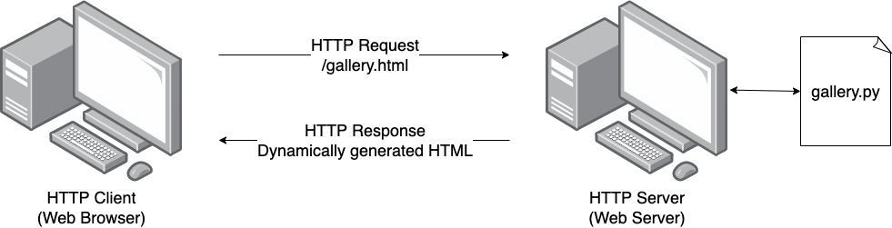

Server Side Scripting
=====================

Since the process inside the server is completely opaque to the client we could just 
generate them on the fly by running another program.

DYNAMIC

    A client requesting a resource from a server.

.. figure:: img/server_side2.png
    :width: 480
    :align: center

    A client requesting a resource from a server.

