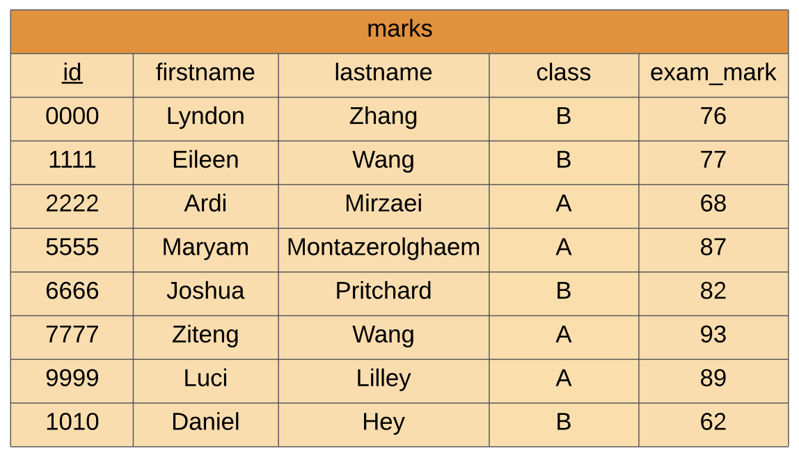
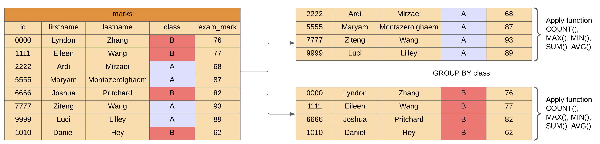

.. role:: sql(code)
   :language: sql

Group By
==============================

It can often be useful to group data by a particular attribute. For example, consider 
the following table.

Let's suppose we want to see how students performed on the exam ``BY`` class. In this 
case, there are two classes, class A and class B. What we can do, is :sql:`GROUP BY` 
class. The structure of a :sql:`GROUP BY` statement:

.. code-block::
    
    GROUP BY attribute;

The :sql:`GROUP BY` clause goes after a :sql:`WHERE` clause.

We then need to provide a function that summarises information about each group. The 
functions we can use are:

*   :sql:`COUNT()`
*   :sql:`MAX()`
*   :sql:`MIN()`
*   :sql:`SUM()`
*   :sql:`AVG()`

This whole process can be summarised by the figure below.

These functions go in the :sql:`SELECT`` statement. Here is an example.

.. code-block:: sql

    SELECT AVG(exam_mark), class
    FROM marks
    GROUP BY class