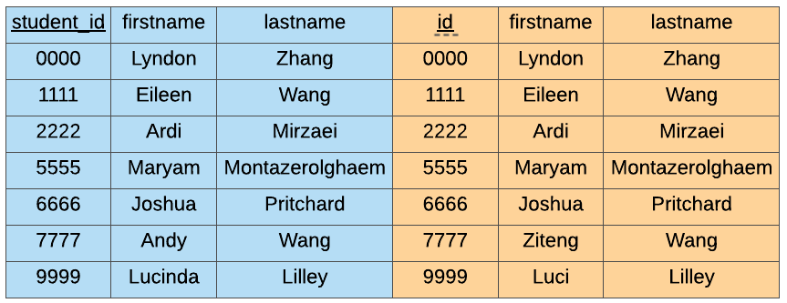

Joins
=====

A relationship is a connection between relations, i.e. tables. For example, we
can add a ``transactions`` table to relate our ``customers`` and ``products``
table. The first record of our transactions table tells us that Stephen has
purchased 2 pineapples.


Sometimes it can be useful to combine data from multiple tables. To merge two
tables together, we use a ``JOIN``. We will also need to specify which column
in the two tables need to match and for that we use the ``ON``` keyword.

.. code-block:: sql

    SELECT table.attribute_1, table.attribute_2, ...
    FROM table_1
    JOIN table_2
    ON table_1.attribute = table_2.attribute;

**Example**

In this example we have a table called ``students`` and a table called
``marks``.


We can merge these tables by matching the ``student_id`` and the ``id``
attributes.

.. code-block:: sql

    SELECT *
    FROM students
    JOIN marks
    ON students.student_id = marks.id;

If you run the code above you'll find that the ``JOIN``` will return a new
table that looks like this:


We take all the columns from both tables, and we keep only the people that
appear in both tables. For this reason, this operation is also called an
``INNER JOIN``.


When performing the ``JOIN`` we had to match ``ON``` the ``id`` columns between
the two tables, but we also had to specify the table first so we know which
table the column, i.e. the attribute, came from.

In general, to identify a column we use the following format:

.. code-block::

    table.attribute

Since it can be exhausting to type out the table name again and again, we can
give the tables an alias (think of this as a nickname) by specifying the alias
after the table name.

.. code-block::

    table alias

.. code-block:: sql

    SELECT *
    FROM students s
    JOIN marks m
    ON s.student_id = m.id;

Here, we use the alias ``s`` for the ``students`` table and ``m`` for the
``marks`` table.

You will have noticed that some of the columns/attributes are repeated. This is
because we used ``SELECT *``` so we see all of the columns across both tables.



We can reduce the number of columns with our ``SELECT`` statement, but don't
forget we need to label our columns by ``table.attribute``!

.. code-block:: sql

    SELECT students.student_id, students.firstname, students.lastname, marks.exam_mark
    FROM students
    JOIN marks
    ON students.student_id = marks.id;

In this case, we take all the attributes from the ``students`` table but only
the ``exam_mark`` attribute from the ``marks`` table.


To make this nicer, we can use aliases instead!

.. code-block:: sql

    SELECT s.student_id, s.firstname, s.lastname, m.exam_mark
    FROM students s
    JOIN marks m
    ON s.student_id = m.id;
