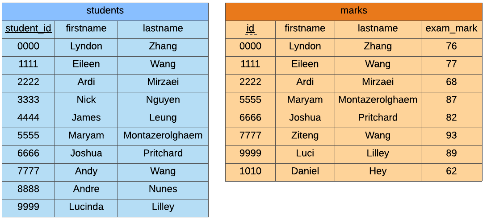
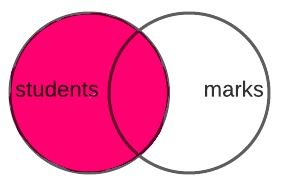
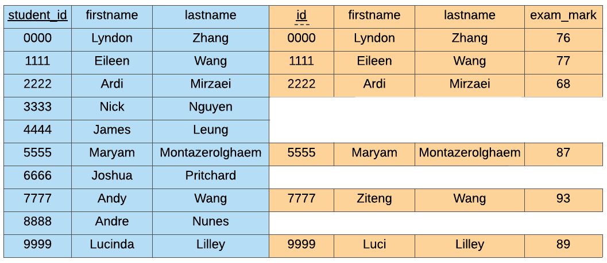
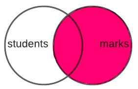
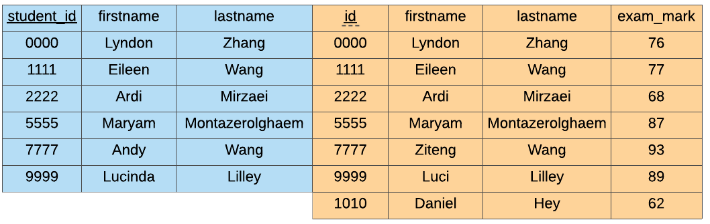
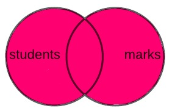
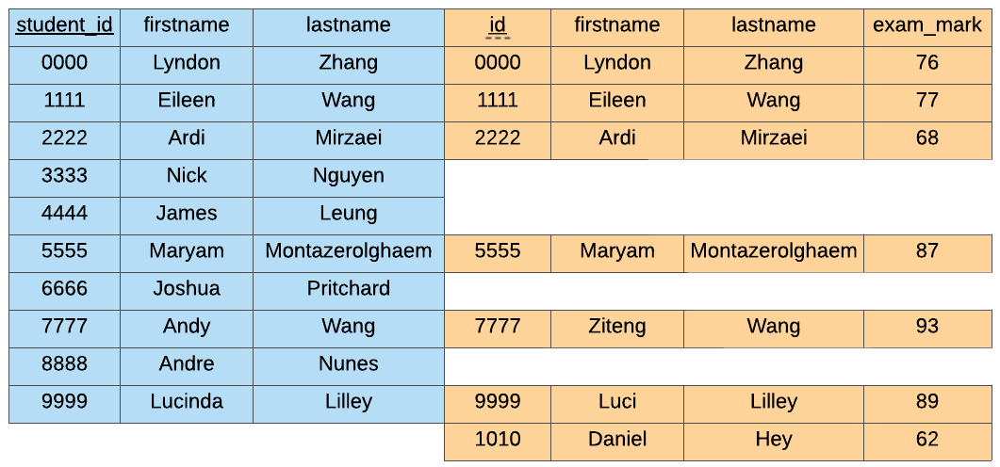

More Joins
==========

The type of JOIN that we have just learnt is an ``INNER JOIN`` There are a few more
types of ``JOIN``\s that we will cover briefly.

To demonstrate how these joins work, we will continue to use our ``student`` and
``marks`` tables.

Left Join
---------

The ``LEFT JOIN`` keeps everything from the first table (students) and if there is a
match in the second table (marks), it adds the information from the second table to the
end of first table.

.. code-block:: sql

    SELECT *
    FROM students s
    LEFT JOIN marks m
    ON s.student_id = m.id;

Right Join
----------

The ``RIGHT JOIN`` keeps everything from the second table (marks) and if there is a
match in the first table (students), it adds the information from the first table to the
start of the second table.

.. code-block:: sql

    SELECT *
    FROM students s
    RIGHT JOIN marks m
    ON s.student_id = m.id;

Full Outer Join
---------------

The ``FULL OUTER JOIN`` keeps everything!

.. code-block:: sql

    SELECT *
    FROM students s
    FULL OUTER JOIN marks m
    ON s.student_id = m.id;
