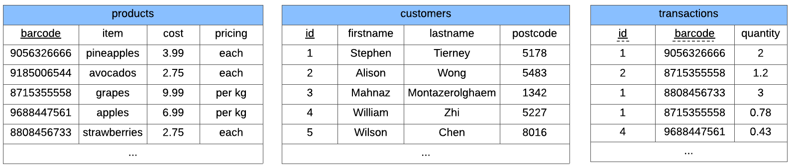

Overview
========

What is a Database?
-------------------

A database stores data relating to a particular subject. For example, you can
have a database storing all the information on staff in a company.

Databases store data as a collection of relations (tables). There are usually
relationships between these relations in the database.

Below is an example of a shopping database.

In this database, we have 3 tables.

- The **customers** table tells us about the customers that come to the shop
- The **products** table tells us about the items that the shop is selling
- The **transactions** table tells us which customers have bought which items,
  and how much they have purchased.

Querying a Database
-------------------

To extract information from a database we construct a *query*.

A query is an instruction that tells the database what to do. For example, we
can get a database to display a table, or we can tell the database to add new
data.

To give our instructions to the database in a way it can understand, we need to
formulate our query with a particular structure. For this, we will be using SQL
(Structured Query Language). Like Python, SQL has its own rules for how you
should write commands.

Here is an example of a query that displays the customers table.

.. code-block:: sql

    SELECT *
    FROM customers;
