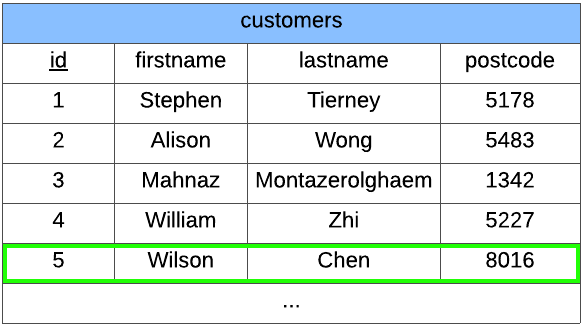

.. role:: sql(code)
   :language: sql

Update
==============================

Sometimes we want to modify a record that already exists in our database. 

For example, one of our customers might move to a new house. Then we would have to 
update their postcode. 

To perform an :sql:`UPDATE` we need to :sql:`SET` new values and we also need to 
specify a criteria to identify records :sql:`WHERE` we will make our changes.

.. code-block:: sql

    UPDATE table
    SET attribute_1 = value_1, attribute_2 = value_2, ...
    WHERE condition;

**Example**

We can update our ``customers`` table to change Wilson's postcode.

.. code-block:: sql

    UPDATE customers
    SET postcode = 6289
    WHERE id = 5;

Primary Key
-----------------

You will have noticed that the condition we chose was ``id = 5``, but equally, we could 
have used ``firstname = 'Wilson'``.

The difference is that ``id`` is the primary key (it's marked in the diagram by the 
underline). This means that no two records can have the same ``id``. It is possible 
for multiple records to have ``'Wilson'`` as the ``firstname``, in which case we would 
be updating the postcodes of every record where ``firstname = 'Wilson'``.

