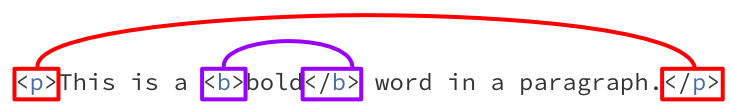

Elements and Tags
=================

As mentioned earlier, the main building block of HTML are tags, which define how to
display different parts of a webpage. Each tag is written inside angle brackets, like
this: ``<tag>``. A HTML page is a hierarchy of tags, with tags nesting inside each
other.

These tags represent page :term:`elements` and can be divided into two types:

- non-void elements
- void elements

Non-void elements
-----------------

A non-void element consist of a an opening tag like ``<tag>``, content inside the tag
and a closing tag, like ``</tag>``. Closing tags are marked by the forward slash ``/``
before the name.

Example syntax of non-void element tag structure:

.. code-block:: html

    <tag>
        Tag content is placed between opening and closing tags
    </tag>

.. attention::

    Don't skip the end tag! Some browsers may attempt to repair tags when interpreting
    HTML, however this behaviour cannot be relied on.

    Find more details in the `standard
    <https://www.w3.org/TR/2011/WD-html-markup-20110113/syntax.html#syntax-elements>`_.

Void elements
-------------

Void elements are special and do not contain any content. A common example is the
horizontal rule tag, which creates a thin horizontal line across the page.

In the example below, the ``
`` tag is used between sections on the page. Note that
it doesn't require closing.

.. code-block:: html

    
This is the last paragraph in the section

    

    <h2>Sub-heading</h2>

    
This is the first paragraph in a new section

.. hint::

    Find more details in the `standard
    <https://www.w3.org/TR/2011/WD-html-markup-20110113/syntax.html#syntax-elements>`_.

Nesting Tags
------------

Non-void element tags support nesting, meaning you can place one set of tags inside
another. We call a tag that encloses other tags a :term:`parent`, while the tags inside
it are the :term:`children`.

For example, if you want to make a word bold within a paragraph, you can do this:

.. code-block:: html

    
This is a <b>bold</b> word in a paragraph.

This is valid because the ``<b></b>`` tags are contained within the enclosing
:term:`contents` of the :term:`parent` ``

`` tags.

Every end tag must be contained within the :term:`contents` of the tag in which the
starting tag is contained.

    You can visualise this by drawing a 'rainbow' between each pair of opening and
    closing tags. The arches of the 'rainbow' should never cross.

If you accidentally misnest the tags like this:

.. code-block:: html

    
This is a <b>bold
 word in a paragraph.</b>

It becomes invalid, because the closing tag of ``</b>`` is outside the enclosing
contents of the ``

`` tags.

Tag Attributes
--------------

Tag attributes provide a mechanism for supplying more information, setting parameters or
customisation.

Key points:

- each tag defines its own set of attributes
- attributes are specified in the start tag only
- attributes are specified as name-value pairs
- attributes are not case sensitive, but lowercase is recommended
- you should enclose values in quote marks

Here's the general syntax of tag attributes, where each attribute has an associated
value:

.. code-block:: html

    <tag attribute1="value1" attribute2="value2">
        The tag content
    </tag>

The anchor tag, ``<a>``, used to specify hyperlinks provides a good example of
attributes since the hyperlink is set by the `href` attribute.

.. code-block:: html

    <a href="https://google.com/">Let's go to Google!</a>

Tag Rules Summary
-----------------

Tags must obey the following rules:

1. Non-void elements require opening and closing tags
2. Close tags within their nesting scope
3. Some tags are self-closing
4. Tag names are not case-sensitive, but lowercase is recommended
5. Attributes should be properly used inside tags

Glossary
--------

.. glossary::

    Children
        Children are elements nested inside another element. For example, if a
        paragraph is inside a ``
``, the paragraph is the "child" of the ``
``.

    Elements
        HTML elements are the building blocks of a webpage. They are written with
        tags, and they define the structure and content of a webpage.

    Contents
        The contents of an HTML element are the text, images, or other elements that
        are placed inside an element's opening and closing tags. For example, in
        ``
Hello World!
``, "Hello World!" is the content of the paragraph element.

    Parent
        A parent element is one that contains other elements (its children). For
        example, if a list item (``<li>``) is inside a ``<ul>`` (unordered list), the
        ``<ul>`` is the parent of the ``<li>``.
