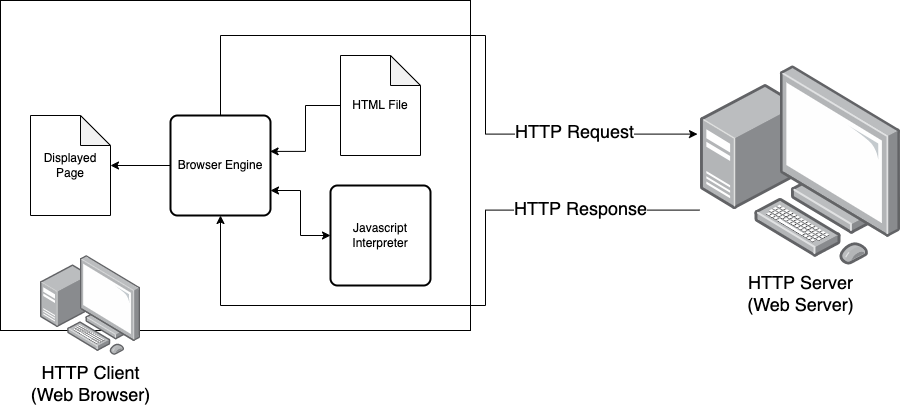

Javascript
====================

Introduction
--------------------

JavaScript is a powerful and versatile programming language developed in the mid-1990s 
to enhance web pages by allowing them to respond to user interactions. Unlike HTML, 
which primarily defines the structure of a web page, JavaScript allows developers to 
make web pages dynamic. This means that a website can change and respond to what you 
do—like when a button click updates part of the page without needing to reload the 
entire site.

Initially designed to run inside web browsers, JavaScript quickly gained popularity 
because of its ability to bring websites to life. With JavaScript, developers could 
create interactive features like animations, form validations, and real-time content 
updates. By the early 2000s, JavaScript had matured into a commercially viable tool, 
allowing web pages to include complex programs that could execute directly in the 
browser. This meant that websites could provide richer experiences, ranging from 
simple interactions to fully-fledged applications.

Today, nearly all websites use JavaScript in some way, and many are entirely dependent 
on it. For example, popular services like social media platforms, streaming sites, 
and online games all rely on JavaScript to function. The language's growth has been so 
significant that even computer hardware manufacturers now design their processors to 
optimize JavaScript performance, ensuring websites run smoothly on all kinds of devices.

JavaScript is essential for modern web development. Its ability to handle everything 
from basic user interactions to complex applications has proven invaluable.

Javascript Browser Model
--------------------------

When you visit a website, your browser downloads and processes (or "parses") the HTML, 
CSS, and JavaScript files that make up the page. HTML structures the content, CSS 
styles it, and JavaScript adds interactivity. JavaScript can be embedded directly 
within an HTML file using <script> tags, known as inline scripts, or it can be served 
in a separate file, linked in the HTML through a ``<script>`` tag, known as an external 
script.

    A really good caption.

As the browser parses the HTML, it encounters these script tags and executes the 
JavaScript code. Inline scripts are run immediately as the browser reads them, while 
external scripts are fetched from their source and then executed. JavaScript can 
manipulate the content on the page, respond to user interactions, or fetch additional 
data from the internet, making web pages dynamic and interactive.
