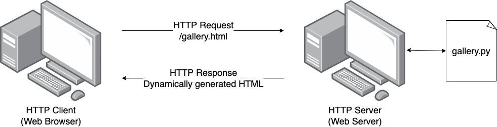
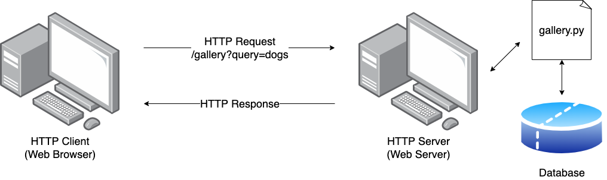

Server Side Scripting
=====================

The process the server uses to respond to HTTP requests is invisible to the
client. Therefore we could choose to run a program that handles the request and
generates HTML on the fly. Using a program to generate a HTTP response is known
as :term:`server side scripting`. The 'scripting' part of the term refers to
the fact that early implementations used scripting languages such as Perl.

If we use a program to generate a HTTP response, we can then create
:term:`dynamic` HTML content. This simple idea powers most websites we use
today.

In the figure below we can see a client requesting the ``gallery.html``
resource from a HTTP server. The server runs the ``gallery.py`` Python script
to generate a response, which is dynamically generated.

    A client requesting a dynamic resource from a server.

Example
-------

This script below is a minimal example of how to write a server side
application in Python. Each time a client makes a request, this script will run
and return a different time and date.

.. code-block:: python
    :caption: time.py

    from datetime import datetime
    from wsgiref.simple_server import make_server

    def application(env, start_response):
        start_response("200 OK", [("Content-Type", "text/html")])  # Magic, ignore it
        now = datetime.now()
        return [f"<html><body>Hello World it is currently {now}.</body></html>"]

    if __name__ == "__main__":
        server = make_server("localhost", 80, application)
        print("Serving WSGI on port 80...")
        server.serve_forever()

The function name ``application`` and the ``start_response`` functions are
:term:`WSGI` specific.

Databases
---------

A :term:`dynamic` web site usually needs a source of data to fill out the page
contents. This data is often stored in a database. In this case the script used
to generate the HTML content also needs to fetch data from the database. We
will explain how to achieve this in
:doc:`/web_part1/server_cont/flask_databases`.

    A client requesting a dynamic resource from a server, backed by a database.

Glossary
--------

.. glossary::

    Dynamic
        Dynamic content on a website changes based on user interactions or data from a
        server, such as personalised recommendations or live updates.

    Server Side Scripting
        Server-side scripting is the process of running code on the server to generate
        dynamic content for a webpage before sending it to the client, often using
        languages like Python, PHP, or Node.js.

    WSGI
        WSGI is a standard interface between web servers and Python applications,
        allowing them to communicate so that Python web apps can serve dynamic content
        on the internet.
