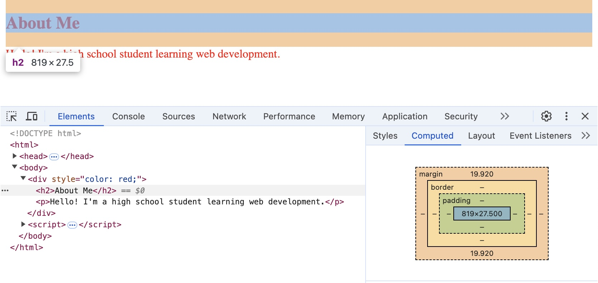

Box Model
=========

In this section, you'll learn about the CSS :term:`box model`, which that defines how
elements are structured and displayed on a webpage. Understanding the box model is
crucial because it allows you to control the spacing, borders, and overall layout of
your content.

HTML elements are categorized into two main types: :term:`block` elements and
:term:`inline` elements. Each element on the page belongs to either category by default.
You can override this with your own CSS.

``display`` Property
--------------------

The way an element flows or fits with other page elements is determined by the value of
its :term:`display` property in CSS.

By default, elements have a specific display value assigned to them:

- Block elements have ``display: block``;
- Inline elements have ``display: inline``;

Block Elements
--------------

Block elements start on a new line and take up the full width available by default,
stacking one on top of the other.

**Common Block Elements:**

Examples of block elements are:

- ``<div>``
- ``<h1>`` to ``<h6>`` (headings)
- ``<p>`` (paragraph)
- ``<ul>`` and ``<ol>`` (lists)
- ``<li>`` (list items)

**Example:**

In this example, each element starts on a new line because they are block elements.

.. literalinclude:: ../../_static/examples/css/block_element_snippet.html
    :language: html

.. grid::

    .. grid-item-card::

       .. raw:: html

          <iframe class="sd-w-100" height="150px" src="../../_static/examples/css/block_element_full.html"></iframe>

Div
---

The ``<div>`` (division) element is a block-level element used as a container to group
other HTML elements. It doesn't have any special formatting or meaning, rather it they
are used for:

- **Layout:** A div can be used to create sections like headers, footers, sidebars, and
  main content areas.
- **Styling Sections:** It can wrap multiple elements to apply styles or manipulate them
  as a single unit.

``<div>`` elements are :term:`block` elements and we will use them in the following
section to explain the :term:`box model`.

**Example:**

In this example, the ``<div>`` groups the heading and paragraph together, allowing you
to style them as a single section.

.. literalinclude:: ../../_static/examples/css/div_element_snippet.html
    :language: html

.. grid::

    .. grid-item-card::

       .. raw:: html

          <iframe class="sd-w-100" height="100px" src="../../_static/examples/css/div_element_full.html"></iframe>

Box Model
---------

The CSS Box Model is a way of describing the space a :term:`block` element occupies on a
webpage. It consists of four parts:

1. :term:`Content`: The size of of content inside the element.
2. :term:`Padding`: The space between the content and the border.
3. :term:`Border`: The line surrounding the padding and content.
4. :term:`Margin`: The space outside the border that separates the element from other
   elements.

.. grid::

    .. grid-item-card::

       .. raw:: html

          <iframe class="sd-w-100" height="590px" src="../../_static/examples/css/box_visual.html"></iframe>

**Example**

.. literalinclude:: ../../_static/examples/css/box_example_snippet.html
    :language: html

.. grid::

    .. grid-item-card::

       .. raw:: html

          <iframe class="sd-w-100" height="116px" src="../../_static/examples/css/box_example_full.html"></iframe>

Explanation

- :term:`Margin`: ``20px`` of space around the outside of the border.
- :term:`Padding`: ``10px`` of space between the content and the border.
- :term:`Border`: A ``2px`` solid black line around the padding and content.

Inline Elements
---------------

Inline elements only take up as much space as necessary and flow along with the
surrounding content.

**Common Inline Elements:**

Examples of inline elements are:

- ``<span>``
- ``<a>`` (links)
- ```` (images)
- ``<b>`` (text formatting)

**Example:**

Here, the ``<strong>`` tag is an inline element that styles the word "bold" without
breaking the flow of the sentence.

.. literalinclude:: ../../_static/examples/css/inline_element_snippet.html
    :language: html

.. grid::

    .. grid-item-card::

       .. raw:: html

          <iframe class="sd-w-100" height="50px" src="../../_static/examples/css/inline_element_full.html"></iframe>

Changing ``display`` type
-------------------------

To change an element to block or inline, you need to set the ``display`` property of the
element. This means that you to make an inline element behave like a block element, or
vice versa.

Syntax:

.. code-block:: css

    <element style="display: value;">

Valid options:

- ``block`` — The element behaves like a block element.
- ``inline`` — The element behaves like an inline element.
- ``inline-block`` - The element is formatted as an inline element but allows setting of
  properties like height and width.

There are other options, such as ``flex``, which we will discuss in a later section.

Example: Make a Block Element
~~~~~~~~~~~~~~~~~~~~~~~~~~~~~

By default, ``<span>`` is an inline element. You can make it behave like a block element
using ``display: block;``.

.. literalinclude:: ../../_static/examples/css/css_make_block_snippet.html
    :language: html

.. grid::

    .. grid-item-card::

       .. raw:: html

          <iframe class="sd-w-100" height="100px" src="../../_static/examples/css/css_make_block_full.html"></iframe>

Explanation:

- The ``<span>`` now starts on a new line and takes up the full width available.
- It pushes the following ``<p>`` element to the next line.
- The background color helps visualize the block area.

Example: Make an Inline Element
~~~~~~~~~~~~~~~~~~~~~~~~~~~~~~~

By default, ``<div>`` is a block element. You can make it behave like an inline element
using ``display: inline;``.

.. literalinclude:: ../../_static/examples/css/css_make_inline_snippet.html
    :language: html

.. grid::

    .. grid-item-card::

       .. raw:: html

          <iframe class="sd-w-100" height="60px" src="../../_static/examples/css/css_make_inline_full.html"></iframe>

Explanation:

- The <div> now flows within the paragraph text without starting a new line.
- The text inside the <div> is styled in red.
- The <div> only takes up as much space as its content requires.

Inspecting Elements
-------------------

Modern web browsers come with built-in developer tools that allow you to inspect and
modify the HTML and CSS of a webpage in real-time.

1. **Open Developer Tools:**

   - Right-click on any element on a webpage and select "Inspect" or "Inspect Element".
   - Alternatively, you can press `F12` on your keyboard.

2. **Explore the Elements Panel:**

   - You'll see the HTML structure on one side and the CSS styles on the other.
   - Click on different elements to see their properties.

3. **View the Box Model:**

   - In the styles pane, look for a diagram representing the box model.
   - It will display the margins, borders, padding, and content size of the selected
     element.

**Example:**



    Web inspector view of an earlier example showing the margin of the ``<h2>``

Glossary
--------

.. glossary::

    Block
       A block element is an HTML element that starts on a new line and extends to fill
       the full width available, stacking vertically by default.

    Border
       The border is the line or edge that surrounds an element's padding and content,
       forming a visible outline around the element.

    Box Model
       The CSS Box Model is a framework that describes how HTML elements are structured
       and displayed, consisting of four parts: content, padding, border, and margin.

    Content
       Content refers to the actual text, images, or other media contained within an
       HTML element.

    Display
       The ``display`` property in CSS determines how an HTML element is rendered on
       the page, controlling its layout behavior as block, inline, or other display
       types.

    Inline
       An inline element is an HTML element that does not start on a new line and only
       takes up as much width as necessary, flowing within the surrounding content.

    Margin
       Margin is the space outside an element's border that separates it from other
       elements, adding space between elements on a webpage.

    Padding
       Padding is the space between an element's content and its border, adding internal
       spacing around the content within the element.
