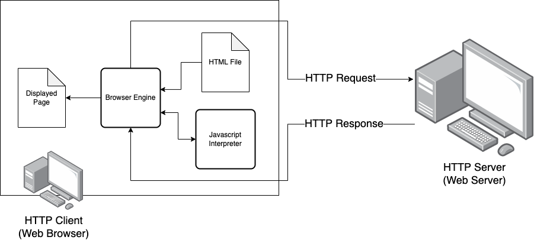

JavaScript
==========

JavaScript in the Browser
-------------------------

JavaScript allows web developers to make web pages dynamic and interactive.
This means that a website can change and respond to what the user does in real
time without needing to refresh the page. With JavaScript, almost anything on a
web page can be modified dynamically, including the page's styling.

Today, nearly all websites use JavaScript in some way, and many are entirely
dependent on it. For example, popular services like social media platforms,
streaming sites, and online games all rely on JavaScript to function.

JavaScript is essential for modern web development. Its ability to handle
everything from basic user interactions to complex applications has proven
invaluable.

JavaScript Browser Model
------------------------

When you visit a website, your browser downloads and processes (or "parses")
the HTML, CSS, and JavaScript files that make up the page. The HTML structures
the content, CSS styles it, and JavaScript adds interactivity and dynamicism.
JavaScript can be embedded directly within an HTML file using ``<script>``
tags, known as inline scripts, or it can be served in a separate file, linked
in the HTML through a ``<script>`` tag, known as an external script.

    The JavaScript Browser Model.

As the browser parses the HTML, it encounters these script tags and executes
the JavaScript code. Inline scripts are run immediately as the browser reads
them, while external scripts are fetched from their source and then executed.
JavaScript can manipulate the content on the page, respond to user
interactions, or fetch additional data from the internet, making web pages
dynamic and interactive.

Hello World
-----------

As a first demo, read the HTML file below, which contains a JavaScript function
that gets triggered when the button is clicked.

Try it out yourself!

.. literalinclude:: ../../_static/examples/interactivity/hello_world.html
    :language: html
    :caption: hello_world.html

.. grid::

    .. grid-item-card::

        .. raw:: html

            <iframe src="../../_static/examples/interactivity/hello_world.html"></iframe>
